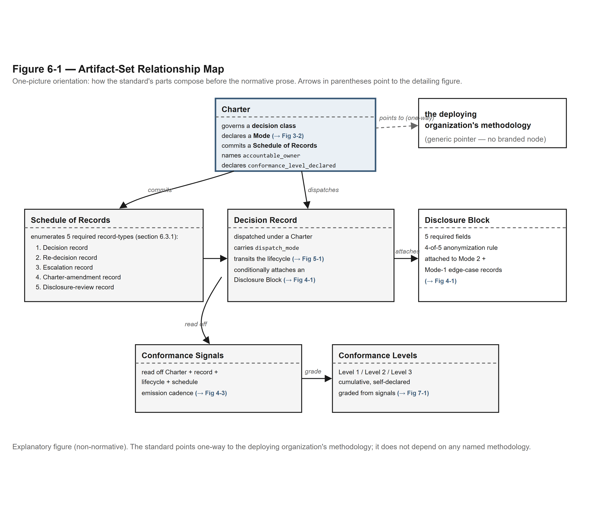
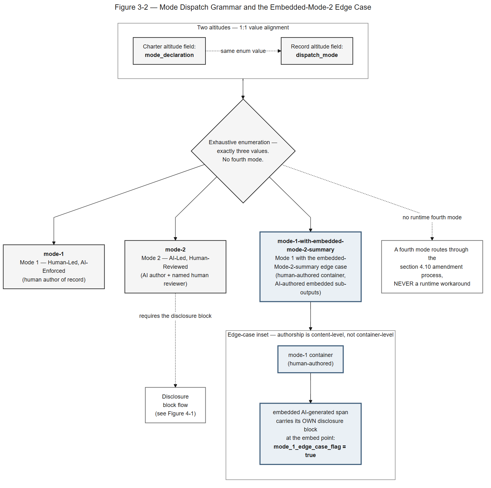
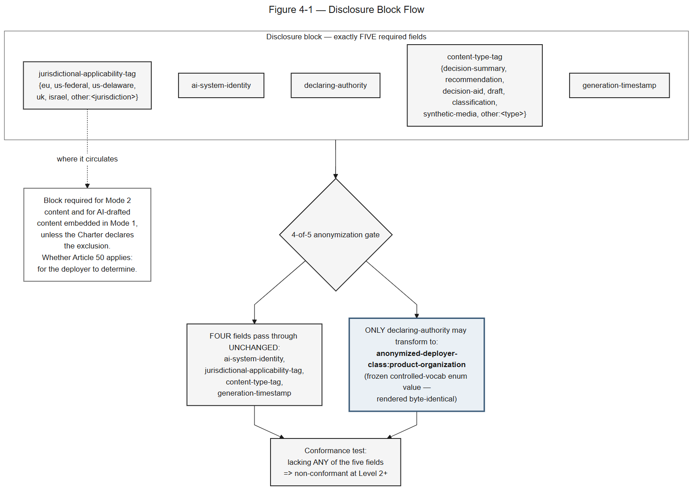
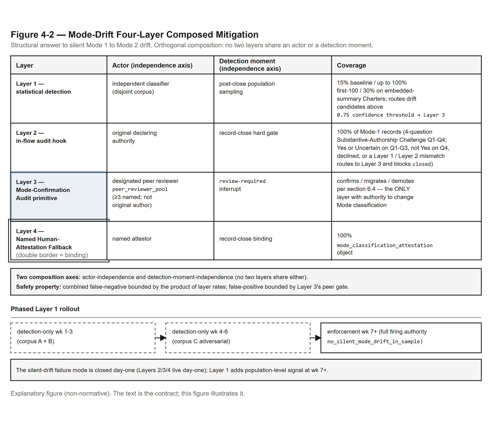
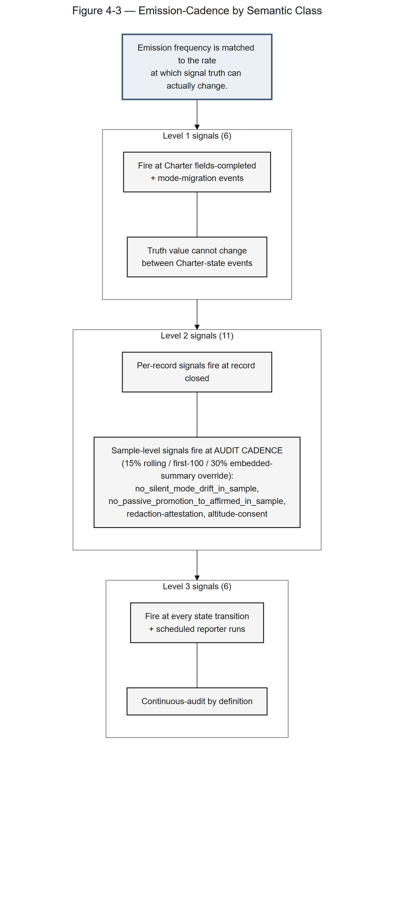
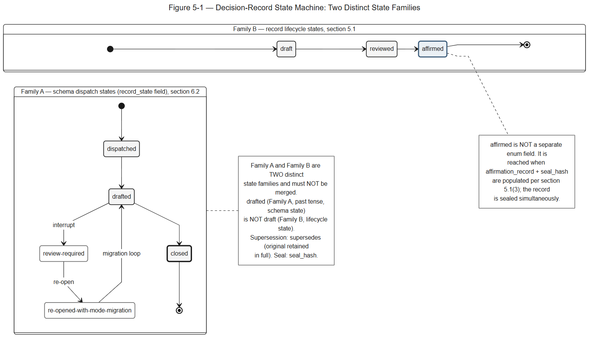
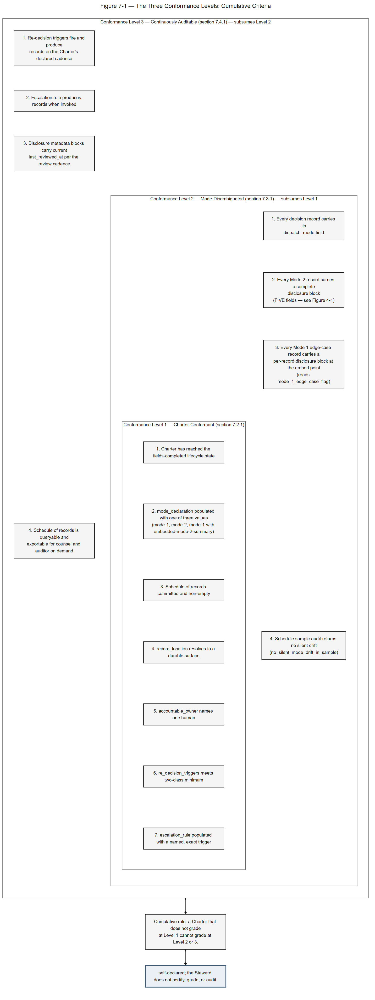

# The Decision Provenance Standard™

**Version**: 1.1 — Reading Edition (rev. 9 — <RELEASE-DATE>)
**Base text (v1.0)**: 2026-04-30
**rev. 4**: 2026-05-06
**rev. 5**: 2026-05-09
**rev. 6**: 2026-05-15
**rev. 6.5**: 2026-05-18
**Reading Edition (rev. 8)**: 2026-05-30. Conformance contract UNCHANGED from v1.0 (no field, lifecycle-state, enum, conformance-level, or signal-definition change). The Standard is restructured into a normative core plus Companion A (Regulatory Cross-References), Companion B (Worked Charter Library), Companion C (Implementation Guidance), and Appendix G (Governance and References).
**Version 1.1, Reading Edition (rev. 9)**: <RELEASE-DATE>. A minor release: no record or Charter valid under rev. 8 becomes invalid. The changes are recorded in the Steward's decision records DR-2026-0001 to DR-2026-0006, published with the text at github.com/decision-provenance-standard/standard.
**Author**: Yohay Etsion (Founding Steward)
**Steward**: Etsion Brands Ltd. (institutional Steward, Israeli holding company)
**License**: Creative Commons Attribution 4.0 International (CC-BY 4.0)
**Status**: Open standard. Not a certified product. Not legal advice. Not a regulatory substitute.

---

> ⚠️ **Not legal advice.** This Standard is a drafting and triage aid produced under the Etsion Brands Ltd. Steward role. It is not counsel. No attorney-client relationship is created by its production, distribution, or use. Jurisdiction-specific questions, contested matters, and any decision with material legal or regulatory consequences require review by a licensed attorney in the relevant jurisdiction. Do not rely on this Standard as the sole basis for any legal, compliance, or employment decision.
>
> **Jurisdiction Assumed**: U.S. federal + Delaware as primary; United Kingdom (England & Wales for litigation framing), the European Union (with the EU AI Act, Regulation (EU) 2024/1689, as the load-bearing AI-specific framework), and the State of Israel as named secondaries. Where a deployer's Charter, decision records, or governance posture concerns a different jurisdiction, every requirement, definition, and conformance signal in this Standard is to be treated as a hypothesis to verify with local counsel.

---

## About This Standard

The Decision Provenance Standard™ is an open standard for the production and maintenance of audit-ready decision provenance in organizations that dispatch consequential decisions through a mix of human and AI authorship. It is an open record format published under the Creative Commons Attribution 4.0 International License (CC-BY 4.0), authored by Yohay Etsion as Founding Steward under the institutional Steward role held by Etsion Brands Ltd.

By design, there is no certification track and no certifying body: every conformance level is self-declared, which keeps the Standard open infrastructure rather than a gated regime (self-declared / no-certifying-body posture treated authoritatively at §7 and §11.2). The trademark on the name is separate from the CC-BY 4.0 license on the text: per the Creative Commons license terms (Section 2(b)(2) of the CC-BY 4.0 legal code: "Patent and trademark rights are not licensed under this Public License"), trademark rights are not licensed with the text, so anyone may use, extend, and fork the text under attribution while the name stays protected against misrepresentation (full trademark convention at §11.1).

Machine-readable reference files (schemas, state machines, the signal list, the reporter contract and a test plan) are published under the MIT License in `standard/v5.0/`. They are not the Standard, and the Standard does not depend on them.

The Standard's central term, "audit-ready decision provenance," is defined and firewalled at §1.4.1; the locked definition and its "is not evidence, certification, or attestation" clause are stated authoritatively there.

### Normative Keywords (RFC 2119)

The key words **"MUST"**, **"MUST NOT"**, **"REQUIRED"**, **"SHALL"**, **"SHALL NOT"**, **"SHOULD"**, **"SHOULD NOT"**, **"RECOMMENDED"**, **"MAY"**, and **"OPTIONAL"** in this document are to be interpreted as described in IETF RFC 2119 (Bradner, S., "Key words for use in RFCs to Indicate Requirement Levels," BCP 14, RFC 2119, March 1997, <https://www.rfc-editor.org/rfc/rfc2119>). Where these keywords appear in normative text, they carry the RFC 2119 meaning. Where they appear in lower-case or in non-normative explanatory prose, they carry their ordinary English meaning. The Standard is otherwise normative throughout, in the sense that every requirement, field definition, lifecycle state, and conformance criterion is structural and binding on a Charter or decision record that claims conformance under §7; the RFC 2119 keyword declaration governs only the explicit-level discipline of "MUST" / "SHOULD" / "MAY" within that normative envelope.

The full RFC 2119 citation appears in Appendix G (References) §12.2.4.

---

## Table of Contents

1. **Section 1** — Preamble and Scope
2. **Section 2** — Definitions
3. **Section 3** — The Charter Mechanism
4. **Section 4** — Authority and Authorship in AI-Mediated Decisions
5. **Section 5** — Record Lifecycle States
6. **Section 6** — The Required Artifact Set
7. **Section 7** — Conformance Levels
8. **Section 8** — Regulatory Cross-References
9. **Section 9** — Worked Examples
10. **Section 10** — Implementation Guidance
11. **Section 11** — Trademark, Governance, and Voluntary Adoption
12. **Section 12** — References

## List of Figures

The figures are explanatory aids, not normative. Each is collected with its full text-alternative in **Companion D — Diagrams**.

| Figure | Title | Illustrates |
|---|---|---|
| Figure 3-1 | Charter Lifecycle State Machine | §3.3 |
| Figure 3-2 | Mode Dispatch Grammar and the Embedded-Mode-2 Edge Case | §3.4 |
| Figure 4-1 | Disclosure Block Flow | §4.6.2 |
| Figure 4-2 | Mode-Drift Four-Layer Composed Mitigation | §4.8.1 |
| Figure 4-3 | Emission-Cadence by Semantic Class | §4.8.2 |
| Figure 5-1 | Decision-Record State Machine: Two Distinct State Families | §5.1 / §6.2 |
| Figure 6-1 | Artifact-Set Relationship Map | §3 (orientation) |
| Figure 7-1 | The Three Conformance Levels: Cumulative Criteria | §7.2 |

---

# Read This First — Executive On-Ramp

> This On-Ramp is a one-screen orientation, not part of the normative Standard. It front-loads the claim and routes each reader to the right section in seconds. Sections 1 through 7 (and the companions) are the Standard; nothing here adds to, removes from, or overrides any requirement, definition, or conformance criterion below.

## What this is, in one line

This Standard gives an organization a way to make its consequential decisions **affirmable, auditable, and resumable** — regardless of whether a human or an AI produced the underlying analysis. That is how the people accountable for a decision stay accountable for it as AI does more of the work underneath. The record of how a decision was made is *input* that counsel and auditors can build on; it is never a stand-in for their judgment.

## The mechanism, in four parts

The whole Standard rests on four primitives. Get these four and you have the thesis:

- **The Charter** — binds a recurring decision class to one named owner, a declared dispatch mode, a schedule of records, and the triggers that reopen the decision when outcomes or the market demand it.
- **The Mode 1 / Mode 2 dispatch grammar** — records who *authored* the analysis and who *reviewed* it. Mode 1 is Human-Led, AI-Enforced; Mode 2 is AI-Led, Human-Reviewed. This is the primitive that carries the AI-authorship claim and the Standard's own disclosure block (§4.6).
- **The affirmation-and-seal lifecycle** — a record only reaches sealed status when a named human affirms it. Nothing is promoted to affirmed by default, by elapsed time, or by silence. This is what separates the Standard from a logging format.
- **Self-declared conformance levels** — the deployer declares which level its Charter meets, and improves against the named criteria over time. No one grades it from outside.

## The firewall

> **Audit-ready decision provenance is *input* to your counsel and your auditors — never a substitute for their judgment. The records produced under this Standard are not evidence, certification, or attestation, and nothing in this Standard is legal advice or a regulatory substitute, and no attorney-client relationship is created by reading, citing, or adopting it. Counsel and auditors convert audit-ready decision provenance into evidence, certifications, or attestations as their professional judgment requires; the artifacts produced under this Standard do not. There is no certifying body and no certification track: every conformance level is self-declared. Where a decision carries material legal or regulatory consequences, a licensed attorney in the relevant jurisdiction must review it. Do not rely on this Standard, or on any record produced under it, as the sole basis for any legal, compliance, or employment decision.**

## The three conformance levels, at a glance

Each level builds on the one before it. All three are self-declared; see §7 for the authoritative self-declared / no-certifying-body statement.

| Level | What it declares | Core criteria (verbatim from §7) |
|---|---|---|
| **Conformance Level 1 — Charter-Conformant** | The Charter is a structurally complete artifact: it names what it governs, who owns it, the mode it dispatches in, where its records live, and what reopens its decisions. | Charter has reached the `fields-completed` lifecycle state; `mode_declaration` populated with one of three enumerated values (`mode-1`, `mode-2`, `mode-1-with-embedded-mode-2-summary`); Schedule of records committed and non-empty; `record_location` resolves to a durable surface; `accountable_owner` names one human; `re_decision_triggers` meets two-class minimum; `escalation_rule` populated with a named, exact trigger. |
| **Conformance Level 2 — Mode-Disambiguated** | The Charter's records are authorship-disambiguated at the per-record level, disclosure metadata is attached where required, and the silent-drift safety net is operating. | Every decision record under the Charter carries its `dispatch_mode` field; Every Mode 2 record carries a complete disclosure block (the five fields of §4.6.2); Every Mode 1 edge-case record carries a per-record disclosure block at the embed point; The schedule-of-records sample audit returns no silent drift findings. |
| **Conformance Level 3 — Continuously Auditable** | The Charter's mechanism has run over time as it declared it would: triggers fire on cadence, escalations produce records, disclosures stay current, and the schedule is queryable on demand. | Re-decision triggers fire and produce records on the Charter's declared cadence; Escalation rule produces records when invoked; Disclosure metadata blocks carry current `last_reviewed_at` per the Charter's review cadence; Schedule of records is queryable and exportable for counsel and auditor review on demand. |

The full criteria, reporter signals, and grading mechanics are in Section 7. A Charter that does not yet grade at Level 1 is in the install phase; Companion C covers the path in.

## Where to start, by role

The Standard is sequential but not linear. Read the sections your role finds load-bearing first; everything else is reference you can reach when you need it.

| You are | Start with | Then | Reference when you need it |
|---|---|---|---|
| **CIO / CAIO / executive deciding whether to adopt** | This On-Ramp, then §1 (Preamble + Scope) and §3 (the Charter Mechanism) | §5 (Record Lifecycle) for how records reach sealed status; §7 (Conformance Levels) for what you commit to | Companion C (Implementation Guidance) for the install path |
| **General Counsel / counsel** | §1.4 (What This Standard Claims — and What It Does Not Claim) | §6 (Required Artifact Set) and §5 (Record Lifecycle) for what the records contain | Companion A (Regulatory Cross-Reference Mapping) for framework-by-framework treatment and the per-framework non-claims |
| **Technical architect** | §3 (the Charter Mechanism), §5 (Record Lifecycle), §6 (Required Artifact Set) | §4 (Authority and Authorship) for the dispatch state machine and §7 for conformance signals | Companion C for sequencing; Appendix G for the reference files |
| **AI-governance researcher** | §1 (Preamble + Scope) and §4 (Authority and Authorship in AI-Mediated Decisions) | §5 (Record Lifecycle) and §7 (Conformance Levels) for the novel contributions | Appendix G (Governance & References, including Related Work) |
| **Board / oversight director** | This On-Ramp, then §1.4 (the claim and the firewall) | §7 (Conformance Levels) for what your organization self-declares | Companion A §A.6 (Caremark / board oversight duties) |

The Standard is open to every reader under CC-BY 4.0. No reading path is privileged over the others; read each section against the role you are reading in at that moment.

---

# Section 1 — Preamble + Scope

> ⚠️ **Not legal advice.** See the disclaimer block at the top of this document for the not-legal-advice notice and Jurisdiction Assumed. This Section inherits both.

---

## 1.1 The Decision Provenance Standard™

The Decision Provenance Standard™ ("the Standard") is an open standard for the production and maintenance of audit-ready decision provenance in organizations that dispatch consequential decisions through a mix of human and AI authorship. The Standard formalizes a single artifact set — Charters, decision records, schedules of records, conformance signals, conformance levels, and disclosure metadata — and a single dispatch grammar — Mode 1 (Human-Led, AI-Enforced) and Mode 2 (AI-Led, Human-Reviewed) — under which a deployer organization commits to a way of deciding that survives leadership transitions and supports counsel and auditors when they prepare evidence, certifications, or attestations.

The Decision Provenance Standard exists first and foremost as measurement infrastructure for decision quality: a structured way to record how decisions are made so the organization can learn from itself. The records also serve as audit-ready substrate that the deployer's counsel and auditors may use as input when preparing evidence, certifications, or attestations — the records inform that work without satisfying any regulatory obligation; whether any obligation applies, and to whom, is for the deployer to determine.

The open Decision Provenance Standard is the bridge between an organization's human custodianship of its decision system and the AI tooling that increasingly participates in it. The Standard makes a deploying organization's decisions affirmable, auditable, and resumable regardless of whether a human or a model produced the underlying analysis. That is what keeps custodianship human-held as AI participation deepens.

The Standard is the load-bearing record-format infrastructure for organizations operating governed decision-making about AI-mediated decisions. It is authored as a standalone normative artifact and is consumed by deployers, counsel, auditors, regulators, vendors, academics, and any party with a stake in the structural shape of audit-ready decision provenance.

## 1.2 Who Authored This

The principal author is Yohay Etsion, who operates as Founding Steward of the Standard under the institutional Steward role held by Etsion Brands Ltd., an Israeli holding company. The Standard is published under the Creative Commons Attribution 4.0 International License (CC-BY 4.0) as an open standard. By design, conformance is self-declared (the self-declared / no-certifying-body posture is stated authoritatively at §7 and §11.2). Etsion Brands Ltd., as Steward, holds the trademark on "Decision Provenance Standard" to prevent misrepresentation of the name, not to gate the text; the Founding Steward operates the Standard's authoring under a Charter consistent with §3 (see §11.1 for trademark convention; see §11.2 for Steward governance and succession). Other terms defined in Section 2 — "Charter," "Mode 1," "Mode 2," "audit-ready decision provenance," and so on — are open vocabulary: a deployer, a tool vendor, a consultancy, a regulator, an academic, or any other party may adopt the terms, extend them, fork them under attribution, or implement them in any product or service consistent with the CC-BY 4.0 license.

This Standard is authored by the Founding Steward under the Etsion Brands Ltd. Steward role. Drafting reflects iterative self-review against published legal, governance, and operational frameworks; it has not been reviewed by retained counsel and is not a substitute for that review. The public version represents the state of the work as published, with future revisions to follow the versioning conventions in Appendix G (References) §12. The drafting discipline is not a substitute for the human professional review every deployer's installation will require. **Where this Standard is read by counsel, auditors, regulators, or downstream deployers as the foundation of an installation, the Standard is the structural input; the human professional's review is what gives any implementation its weight.**

The Standard governs its own text and does not bind any companion implementation, commentary, or reference artifact. Where a third party references the Standard, the cross-reference is a neutral pointer to the structural definitions herein; substantive claims about regulatory state, evidentiary force, or compliance posture are for the deployer to determine, not for the Standard or any third-party artifact.

## 1.3 Who This Is For

This Standard is written for five reading audiences, each with a distinct entry point:

**Deployers** — Chief Product Officers, Chief Operating Officers, Chief Compliance Officers, Heads of Legal, and the executive teams who decide whether to install a Charter under the Standard in their organization. Deployers read Section 1 (this preamble) for scope, Section 3 (the Charter mechanism) for the operational commitment, Section 5 (Record Lifecycle) for how records progress to affirmed-and-sealed status, and Section 10 (Implementation Guidance) for the install path. Whether any legal obligation applies, and who carries it, is for the deployer to determine; the Standard structures inputs and does not discharge any obligation.

**Counsel** — General Counsel, in-house attorneys, outside counsel, employment counsel, privacy counsel, IP counsel, and compliance officers who advise the deployer on whether and how the Standard's records inform regulatory and litigation work. Counsel reads §1.4 ("What This Standard Claims — and What It Does Not Claim") first, then Section 8 (Regulatory Cross-References) for framework-by-framework treatment, then Section 6 (Required Artifact Set) and Section 5 (Record Lifecycle) for what the records actually contain and how they reach sealed status. Counsel converts audit-ready decision provenance into evidence, certifications, or attestations as the matter requires; the Standard does not.

**Auditors** — internal auditors, external auditors, SOC 2 examiners, ISO assessors, and the audit-adjacent professionals who read decision records and Charter states as inputs to their own attestation work. Auditors read Section 6 (the artifact set), Section 5 (the record lifecycle), Section 7 (Conformance Levels), and Section 8 (Regulatory Cross-References) to understand what a deployer self-declares against the Standard. Auditors form their own substantive judgments; the Standard's conformance signals are structured inputs the auditor reads as one input among others.

**Regulators reading and downstream readers of Mode 2 artifacts** — supervisory authorities reviewing a deployer's governance posture, AI Office staff considering Article 50 disclosure compliance, academic and policy researchers studying hybrid human-AI decision systems, and the natural persons who receive Mode 2 outputs as the audience for those outputs. These readers benefit from a stable open vocabulary and a stable open dispatch grammar against which deployers' implementations can be compared. The Standard is open to any regulator who wishes to read it. The Standard does not bind any regulator; no regulator has reviewed or endorsed it; the Standard's claims are the author's, made publicly under CC-BY 4.0.

**Board and oversight directors** — members of the board, audit-committee members, and the oversight directors who hold the organization's governance accountability for how consequential decisions are made. Board and oversight directors read §1.4 ("What This Standard Claims — and What It Does Not Claim") for the claim and the firewall, then Section 7 (Conformance Levels) for what their organization self-declares. Whether and how any board oversight duty is met (the *Caremark* line of cases, cited in Section 8) is for the board and the deployer to determine; the Standard structures the inputs the oversight function reads, and does not discharge the duty itself.

A reader who falls into more than one of the five audiences above reads each section against the role they are reading in at that moment. The Reading Guide in §1.8 enumerates the section-to-audience mapping in tabular form.

## 1.4 What This Standard Claims — and What It Does Not Claim

### 1.4.1 What This Standard Claims

The Standard claims a single thing: that the artifact set defined in Sections 2 through 7, produced and maintained per the requirements herein, constitutes **audit-ready decision provenance**.

The locked one-line definition of the term — load-bearing across every section of the Standard and every reader-facing surface — is reproduced here verbatim:

> **Audit-ready decision provenance is a structured record of how a decision was made — inputs, reviewers, dispatch mode, sign-offs — that counsel and auditors can use as input when preparing evidence, certifications, or attestations; the provenance itself is not evidence, certification, or attestation.**

The "is not evidence, certification, or attestation" clause is the Standard's core non-claim and is non-negotiable on every surface where the term is introduced. **Counsel and auditors convert audit-ready decision provenance into evidence, certifications, or attestations as their professional judgment requires; the artifacts produced under this Standard do not.**

### 1.4.2 What This Standard Does Not Claim

The Standard's claims are structural: the artifacts have a defined shape, the dispatch modes have a defined grammar, the conformance levels have defined criteria. The Standard makes no claim about regulatory state. To make this scope explicit, the following list enumerates what the Standard does **not** claim, in language a regulator or plaintiff's counsel would read against it:

- **Not evidence.** A decision record produced under this Standard is not legal evidence. Evidence is produced by counsel, by litigants, by examiners, and by the rules of the forum that admits it. The Standard's records are structured process records that counsel may use as input when preparing evidence; they are not evidence in themselves.
- **Not certification.** A conformance level declared under this Standard is not certification. No third-party body certifies conformance under this Standard. A deployer self-declares a conformance level using the Section 7 reporter; counsel and auditors read that self-declaration as one input among others when forming their own judgments.
- **Not attestation.** A decision record under this Standard is not an attestation. Attestation is a substantive professional judgment by qualified personnel against an enumerated framework (SOC 2, ISO/IEC 42001, etc.). The Standard structures the inputs an attestation work product consumes; the work product itself is the attesting professional's, not the Standard's.
- **Not a regulatory substitute.** Conformance with this Standard does not satisfy, ensure, certify, or substitute for any regulatory obligation under any framework — including but not limited to the EU AI Act, the EU GDPR, U.S. SOX 404, HIPAA, the Caremark line of fiduciary cases, NYC Local Law 144, Colorado SB 24-205, NIST AI RMF, ISO/IEC 42001, ISO/IEC 27001, SOC 2, or any successor or jurisdictionally analogous framework. Whether any regulatory obligation applies, and to whom, is for the deployer to determine. The Standard structures the inputs that compliance work consumes.
- **Not legal advice.** Nothing in this Standard, in any decision record produced under it, or in any Charter authored against it is legal advice. No attorney-client relationship is created by reading, citing, adopting, or extending this Standard. Jurisdiction-specific questions, contested matters, and any decision with material legal or regulatory consequences require review by a licensed attorney in the relevant jurisdiction.

The verbs the Standard uses are process verbs — *records*, *documents*, *structures*, *binds*, *commits*, *emits*, *informs*, *supports* — not regulatory verbs — *satisfies*, *ensures*, *certifies*, *guarantees*, *proves*. The verb discipline is intentional. A regulatory verb appearing anywhere in this Standard outside of a quoted regulatory framework name (e.g., "Article 50 transparency obligations" where "transparency obligations" is the framework's term, not the Standard's claim) is an editorial defect.

### 1.4.3 Audience Framing — Use Cases the Standard's Records Support

The Standard's records support four use-case audiences, each consuming the same structural substrate for different purposes:

- **Audit-readiness** (counsel, auditors, regulators per §1.3): the records are input substrate for evidence, attestations, and regulatory filings, prepared by qualified personnel under their own professional standards.
- **Deployer-internal optimization**: the records are input substrate for the deployer's own continuous improvement of its decision-making — replay decisions against outcomes, surface patterns across decision classes, identify Charters whose re-decision triggers are firing more often than expected.
- **Organizational learning**: the records are input substrate for the deployer's longitudinal record of how the organization's leaders develop as decision-makers, used in coaching, mentorship, and developmental conversations under the deployer's HR-of-record governance and the per-altitude consent and use-case scope-limit framing of Appendix G §G.11.3.
- **Team-level and (with separate consent) individual-altitude measurement**: the records aggregate at team altitude for team-level decision-quality patterns; at individual altitude they exist if and only if the affirmer has consented to individual-altitude record creation under the Charter's use-case scope-limit declaration (§3) and the deployer's HR-of-record governance.

The four use cases share a substrate. They are not co-equal in the Standard's posture: audit-readiness is the load-bearing claim of §1.4.1, and the firewall language at §1.4.2 (no evidence, no certification, no attestation, no regulatory substitute, no legal advice) governs all four use cases. The deployer's installation determines which use cases are in scope for which altitudes; the Charter's use-case scope-limit declaration (§3) records the deployer's choices.

## 1.5 Use of the Standard Notice

This is the artifact-scoped notice required by the Standard's notice architecture (the "Use of the Standard" notice). It governs the Standard document itself.

### 1.5.1 What Users May Do Under CC-BY 4.0

This Standard is licensed under the Creative Commons Attribution 4.0 International License (CC-BY 4.0). Under that license, any reader, deployer, vendor, consultancy, regulator, academic, or other party may:

- **Read** the Standard freely, in any jurisdiction, without paying any fee or accepting any non-CC-BY-4.0 terms
- **Cite** the Standard in academic work, regulatory submissions, vendor RFPs, internal governance documents, audit-engagement work papers, or any other work product, with attribution as set out below
- **Adopt** the Standard's vocabulary, dispatch grammar, conformance signals, and conformance levels in a deployer's installation, in a vendor's product, or in a consultancy's methodology, with attribution
- **Extend** the Standard with implementation-specific guidance, sector-specific overlays, jurisdiction-specific addenda, or deployer-specific tooling, with attribution and a clear marker that the extension is downstream of, and does not bind, the principal author's Standard
- **Fork** the Standard into a derivative open standard, with attribution, a clear divergence statement, and a different name to prevent confusion with this Standard

**Attribution form.** Where space permits: *"The Decision Provenance Standard, Yohay Etsion, [year], CC-BY 4.0, https://decisionprovenancestandard.org."* Where space is constrained: *"Decision Provenance Standard, CC-BY 4.0."* Where the deployer's installation is grounded in the Standard, the deployer's Charter (Section 3) cites the Standard at the version the Charter was authored against.

### 1.5.2 What Users May Not Do

The CC-BY 4.0 license is permissive on use; it does not authorize misuse. The following are outside the license:

- **Misrepresenting the Standard as certified, attested, or regulator-endorsed.** No certification track exists. No attestation body has reviewed the Standard. No regulator has endorsed it. Any party representing the Standard, or an installation grounded in the Standard, as carrying any of the foregoing forms of external validation is making a false claim, not a CC-BY 4.0 use.
- **Misrepresenting derivative or extended work as authored or endorsed by the principal author.** Forks, extensions, and downstream installations are downstream work. The CC-BY 4.0 attribution requirement protects the upstream author from misattribution; downstream authors are responsible for their own work and must mark their work as their own.
- **Removing the "is not evidence" clause.** The "is not evidence, certification, or attestation" tail on §1.4's locked one-line definition, and the equivalent language at every first use of "audit-ready decision provenance" in derivative or extended work, is part of the Standard's structural integrity. A derivative that strips the firewall language to make stronger claims has departed from the Standard and must mark itself as such.
- **Using the Standard's name to substitute for counsel review.** No reading, citing, adopting, extending, or forking of the Standard substitutes for counsel review of a deployer's specific installation, regulatory posture, contractual exposure, or litigation risk.
- **Misusing the trademark.** The trademark on "Decision Provenance Standard" is separate from the license on the text. Using the trademark to certify, accredit, audit, grade, or otherwise stamp a deployer organization, a tool vendor's customer organization, or any third party as "Standard-compliant" or "certified by the Standard" is a misuse and is not authorized by either the trademark or the CC-BY 4.0 license. See §11 for the trademark, Steward governance, and voluntary-adoption discipline.

### 1.5.3 How to Handle Misuse

Where a reader encounters a use of the Standard that appears to misrepresent its scope (a vendor pitching the Standard as a regulatory substitute; a consultancy claiming the Standard "satisfies" a named framework; a deployer claiming the Standard "ensures compliance"; a third party purporting to certify another organization "against the Standard"), the reader is invited to:

1. Re-read this §1.5, §1.4, and Appendix G §G.11.3 to confirm the scope, then form their own judgment about the claim being made
2. Request from the misusing party the citation in the Standard that supports the claim — there is none, by design, and the request will surface the gap
3. If the misuse is in a regulated context (an audit work paper, a regulatory submission, a contractual representation), bring it to the attention of qualified personnel for handling

Use of the text is governed by CC BY 4.0. The Steward does not monitor how the text is used. Permitted uses of the name are set out in §11.1. The structural protection is the firewall language and the verb discipline, both of which travel with the Standard wherever the Standard goes.

## 1.6 Jurisdiction Assumed

The Standard is authored against an explicit primary jurisdiction with named secondary jurisdictions:

- **Primary jurisdiction**: U.S. federal + Delaware
- **Named secondary jurisdictions**: United Kingdom (England & Wales for litigation framing), the European Union (with the EU AI Act, Regulation (EU) 2024/1689, as the load-bearing AI-specific framework — see §1.6.1 below for the disclosure-block scope), and the State of Israel

A deployer operating exclusively within one of the named jurisdictions reads Section 8's cross-references as pointers to frameworks cited for those jurisdictions. A deployer operating in any other jurisdiction reads the Standard as a hypothesis to verify with local counsel, with two implications:

1. The vocabulary, dispatch grammar, and conformance-signal architecture remain stable across jurisdictions — they are structural, not jurisdictional
2. The regulatory cross-references in Section 8, the audit-framework alignments, and the litigation-framing assumptions in §1.4.2 are jurisdictionally bounded to the named four; in any other jurisdiction, they require local-counsel verification

### 1.6.1 Disclosure Block Scope (Pointer to §4.6)

Section 4 §4.6 sets the Standard's own disclosure block for Mode 2 content. Whether Article 50 of the EU AI Act, Regulation (EU) 2024/1689, applies to a given artifact is for the deployer to determine.

A Charter MAY declare its Mode 2 outputs outside this requirement where the deployer has verified that those outputs are produced outside the European Union and will not reach, and are not reasonably foreseeable to reach, people in the European Union. Without that declaration the requirement applies. This scope is carried over from rev. 8 and is the Standard's own choice; it says nothing about where any law applies. A Charter written before v1.1 (reading edition rev. 9) whose Mode 2 outputs already met this test remains valid without the declaration. Full treatment, including the five required transparency-disclosure metadata fields and the Mode 1 content-level edge case, lives in **Section 4.6** of this Standard.

### 1.6.2 Other Jurisdictions

Deployers operating in jurisdictions outside the named four — including but not limited to Canada, Switzerland, Singapore, Australia, Japan, Brazil, Mexico, India, the Gulf Cooperation Council, and any other jurisdiction not explicitly enumerated above — read the Standard as structural input and verify every regulatory cross-reference, every conformance criterion, and every disclosure-metadata requirement against local counsel. The Standard's vocabulary and dispatch grammar are jurisdictionally portable; the regulatory cross-references and the litigation-framing assumptions are not.

## 1.7 Related Work

The Related Work section — the named academic, standards-body, and authored lineages this Standard converses with (Singh/Cobbe/Norval on decision provenance; W3C PROV-AGENT; AGENTSAFE; Trammell's *Chief Executive Operating System*; Gartner Bimodal IT) — is maintained in **Appendix G §G.1 (Related Work)**, with its supporting citations at Appendix G §12.3.3. The citations are placement, not contestation: the Standard occupies an altitude (open record format for human-judgment decisions at named executive accountability) that none of the cited works occupies, and claims no derivation from them.

## 1.8 Reading Guide

The Standard is sequential but not linear. The following table maps each section to the reading audience that finds it most load-bearing, with a one-line description of why:

| Section | Load-bearing for | Why |
|---|---|---|
| **1 — Preamble + Scope** | All five audiences | Establishes scope, jurisdiction, related work, and what the Standard claims (and does not). Read first. |
| **2 — Definitions** | All five audiences | Binding vocabulary. Every later section refers back. |
| **3 — Charter Mechanism** | Deployers; counsel | The operational commitment. Charters bind organizations to a way of deciding. |
| **4 — Mode Dispatch** | Deployers; auditors; regulators (§4.6) | The dispatch state machine, the Mode 1 / Mode 2 grammar, and the Standard's own disclosure block for AI-drafted content. |
| **5 — Record Lifecycle States** | All five audiences | The sequential lifecycle (draft → reviewed → affirmed) gated on explicit human affirmation; intentional non-coverage of real-time telemetry. |
| **6 — Required Artifact Set** | Auditors; counsel | What the records actually contain at the field level. |
| **7 — Conformance Levels** | Deployers; auditors | The named tiers (1, 2, 3) and the signals each tier requires. **Conformance is self-declared by the adopting organization.** |
| **8 — Regulatory Cross-References** | Counsel; compliance officers | Framework-by-framework treatment (EU AI Act, NIST AI RMF, ISO/IEC 42001, SOC 2, *Caremark*, etc.) — what the Standard **informs** without **satisfying**. |
| **9 — Worked Examples** | Deployers; auditors | Decisions dispatched under representative Charters, end-to-end. |
| **10 — Implementation Guidance** | Deployers | The install path: how to reach Conformance Level 1, then 2, then 3. |
| **11 — Trademark, Governance, and Voluntary Adoption** | All five audiences; counsel especially | Trademark convention; Steward role definition and succession; voluntary-adoption discipline; recognition of self-declaring adopters. |
| **12 — References** | All five audiences | Bibliographic and citation pointers to the frameworks referenced. |

A counsel reader reads §1.4 → Section 8 → Section 6 → Section 5 → §1.5 → Section 11. An auditor reads Section 6 → Section 5 → Section 7 → Section 8. A deployer reads Section 1 → Section 3 → Section 5 → Section 10 → Section 7 → Section 11. A regulator reads Section 1 → §4.6 → Section 5 → Section 8 → Section 11. A board or oversight director reads §1.4 → Section 7 → Section 8. The Standard supports all five reading paths; no path is privileged over the others.

---

# Section 2 — Definitions

> **Disclaimer + Jurisdiction Assumed.** The "Use of the Standard" notice (artifact-scoped) and the "Jurisdiction Assumed" declaration live at the top of this document. Every term defined in this section inherits that disclaimer and that jurisdictional scope. Where a deployer's content concerns a different jurisdiction, every definition below is to be treated as a hypothesis to verify with local counsel.

---

## 2.1 Purpose of this Section

Section 2 establishes the **binding vocabulary** for the Decision Provenance Standard™. The terms defined here carry a single, precise meaning across Sections 3 through 12. Every Charter authored against this Standard, every decision record produced under it, and every conformance grade reported under it refers to the meanings declared here. Where a downstream section needs a refinement of a term (for example, Section 6 enumerating the field-level shape of a decision record, Section 5 enumerating the lifecycle states a record transits, or Section 7 enumerating the level criteria built on conformance signals), the refinement is in addition to the definition declared here, never in place of it.

**Drift introduced in this section propagates everywhere.** That is why the language-discipline rule — that the Standard's artifacts are *audit-ready decision provenance*, never *legal evidence*, *compliance certification*, or *regulatory substitute* — is load-bearing for every definition that follows.

This section does not contain examples; worked examples live in Section 9. This section does not map the terms to named regulatory frameworks; the cross-references to EU AI Act articles, NIST AI RMF, ISO/IEC 42001, *Caremark*, and the other frameworks the Standard speaks to live in Section 8. This section does not specify the lifecycle a decision record transits from creation to sealed status; that is Section 5. Section 2 is the vocabulary spine; Section 5 is the lifecycle layer; Section 7 is the conformance-grading layer; Section 8 is the regulatory-cross-reference layer; Section 9 is the worked-example layer.

---

## 2.2 Defined Terms

The terms below are listed in architectural order rather than alphabetically: Charter (the type) → decision (the instance) → decision record (the artifact) → schedule of records (the contract) → modes (dispatch shape) → audit-ready decision provenance (what the records collectively constitute) → conformance signal and conformance level (how a Charter grades) → mode-declaration field, disclosure metadata block (with disclosure metadata pointer as its reference form), declaring authority, accountable owner, re-decision trigger, dispatch mode, prior-state archive (the structural primitives the first nine compose into), affirmation event, seal, and supersedes (the Section 5 lifecycle primitives). Each term below carries a cross-reference to its operational use in Sections 3–12.

### 2.2.1 Charter

A **Charter** is the artifact that binds an organization to a decision-making mechanism for a recurring decision class. The Charter names the decision class, the accountable owner, the inputs the decision requires, the cadence on which the decision is made, the success criteria the decision is held against, the escalation rule the decision invokes when its scope is breached, and the re-decision trigger that reopens the decision when outcome or market evidence demands. A Charter is not a contract. A Charter is not a regulatory filing. A Charter is the operational commitment an organization makes to a way of deciding, recorded in a form that survives leadership transitions.

The Charter is the Standard's own structural unit of state on which the rest of the Standard's machinery operates: a decision dispatches under a Charter; a decision record is bound to the Charter under which the decision was made; a record progresses through the lifecycle of Section 5 under a Charter; a schedule of records is committed by a Charter; a conformance level grades a Charter.

*Operational use.* Section 3 specifies the Charter mechanism, including the lifecycle states a Charter transits and the fields a Charter carries at each state. Section 4 specifies which actor reads which Charter state at decision-open and decision-close, and the mode-declaration field the Charter must carry before any decision may dispatch under it. Section 5 specifies the lifecycle states a record produced under a Charter transits from `draft` through `reviewed` to `affirmed`. Section 6 specifies the schedule of records the Charter commits to maintain and the field-level decision-record schema. Section 7 specifies the conformance levels at which a Charter satisfies the Standard's structural requirements. Section 10 specifies installation guidance for the Charter mechanism in a deployer's organization.

### 2.2.2 Decision

A **decision** is a single instance of decision-making governed by a Charter. The Charter is the type; the decision is the instance. A decision opens under a Charter, transits a dispatch sequence under one of the modes the Charter declares, and closes with a decision record that progresses through the lifecycle states defined in Section 5. Decisions made outside a Charter are outside the scope of this Standard.

A decision in the sense of this Standard is a recurring, consequential, cross-functional decision — for example, launch readiness, pricing exceptions, platform intake, portfolio stop-continue. It is not a routine operational task, an individual tactical call, or a meeting outcome that does not warrant a record. The Charter governs which decision classes warrant Charter discipline; this Standard does not enumerate them.

*Operational use.* Section 4 specifies the dispatch states a decision transits and the actors who read and write at each state. Section 5 specifies the lifecycle states (`draft` → `reviewed` → `affirmed`) the decision's record transits from creation to sealed. Section 6 specifies the decision-record schema the record carries. Section 7 specifies the conformance signals that a properly dispatched and properly sealed decision record emits. Section 9 contains worked examples of decisions dispatched under representative Charters.

### 2.2.3 Decision Record

A **decision record** is a single instantiated, persistent, findable artifact that captures one decision. The decision record carries:

- a stable decision identifier;
- a single named accountable owner at the time of decision;
- a date decided;
- a pointer to the Charter under which the decision was made;
- the decision statement in plain language;
- the context at the time of decision;
- the options considered and the rationale for the option chosen;
- the inputs used (with version or date);
- the assumptions the decision depends on;
- the success criteria the decision is held against (with leading, mid, and lagging indicators);
- the re-decision trigger that reopens the decision;
- related decisions (parent, sibling, superseded);
- a record location that is durable, searchable, and linkable from the Charter that governs the decision class;
- the dispatch mode under which the decision was made; and
- the lifecycle state the record currently occupies (`draft`, `reviewed`, or `affirmed` per Section 5), with affirmation event and seal hash recorded at the moment the record reaches `affirmed`.

The decision record is the Standard's unit of audit-ready decision provenance: a decision record is what counsel and auditors read when they wish to understand how a decision was made, by whom, against which inputs, with what review, and with what affirmation. The decision record is not evidence in the legal sense; it is the structured record from which counsel and auditors prepare evidence, certifications, or attestations as their professional judgment requires.

The findability hygiene rule under this Standard: a decision record that cannot be found in 30 seconds by someone who was not in the room is not a decision record; it is a meeting note. The Standard's record location and findability requirements (Sections 6 and 7) operationalize the rule.

*Operational use.* Section 5 specifies the lifecycle states the record transits and the affirmation event and seal that gate `affirmed`. Section 6 specifies the decision-record schema and the schedule of records the Charter commits. Section 4 specifies the dispatch-mode field that every decision record carries. Section 7 specifies the conformance signals a complete decision record emits. Section 8 specifies the regulatory cross-references that a decision record may inform (without satisfying). Section 9 contains worked examples of decision records produced under representative Charters.

### 2.2.4 Schedule of Records

A **schedule of records** is the enumerated set of decision-record types a Charter commits to produce and maintain. The schedule names each record type, the trigger that opens a record of that type, the location at which records of that type live, and the retention discipline records of that type are held to. The schedule is the contract the Charter makes with its consumers — the deployer's executive line, the deployer's counsel and auditors, and any third party permitted to review under the deployer's policies — about what records will exist and where they will be findable.

The schedule of records is governed by the Standard's findability hygiene rule (the 30-second findability rule) and by the Charter's `record_location` field. The Standard formalizes the schedule as the level-1 commitment the Charter must make at the `fields-completed` lifecycle state (per Section 3), as the level-2 commitment that every record under the schedule carries its mode-declaration (per Section 4) and reaches `affirmed` per the Section 5 lifecycle, and as the level-3 commitment that the schedule is queryable and exportable for review (per Section 7).

*Operational use.* Section 6 specifies the schedule's field-level shape, including the per-record-type fields the schedule names. Section 7 specifies the conformance-level criteria that read against the schedule. Section 10 specifies installation guidance for committing and maintaining a schedule.

### 2.2.5 Mode 1 — Human-Led, AI-Enforced

**Mode 1 — Human-Led, AI-Enforced** is the canonical name for the dispatch mode in which a human authors the decision and an AI worker checks the human's work against the Charter. The human is the author of record. The AI worker is the discipline mechanism: it reads the Charter state, monitors decision-record completeness against the Charter's required fields, and emits conformance signals on the decision record. The AI worker does not author the substantive decision content under Mode 1.

*Operational use.* Section 4 specifies the Mode 1 dispatch state machine, including the read and write boundaries between the human author and the AI worker, and the conformance signals Mode 1 emits at each dispatch state. Section 5 specifies how a Mode 1 record progresses through `draft` → `reviewed` → `affirmed`. Section 6 specifies the Mode 1 fields the decision record carries. Section 7 specifies the Mode 1 conformance signals at level 2 and level 3.

### 2.2.6 Mode 2 — AI-Led, Human-Reviewed

**Mode 2 — AI-Led, Human-Reviewed** is the canonical name for the dispatch mode in which an AI worker authors the decision (analysis, options framing, recommendation) and a human reviews the AI-authored draft before action. The AI worker is the author of record. The human is the reviewer of record. The human reviewer signs off, requests revision, or invokes Mode 2 → Mode 1 demotion when the AI-authored draft requires substantive human re-authoring rather than revision.

A Mode 2 decision may fall within disclosure laws; whether any applies is for the deployer to determine. The structural input the deployer needs for any such obligation is captured in the disclosure-metadata block (Section 2.2.11 below). The cross-reference to specific regulatory frameworks (including EU AI Act Article 50) lives in Section 8. **Nothing in this definition or in the disclosure-metadata block satisfies, ensures, or certifies any regulatory obligation.** Who carries any such obligation is for the deployer to determine; the Standard structures the inputs.

*Where the human reviewer of a Mode 2 draft is also the Charter's `accountable_owner`, the reviewer's affirmation gates the record into `affirmed` directly. Where the human reviewer is a named delegate of the `accountable_owner` per the Charter's authorized-delegation declaration, the delegate's affirmation gates the record into `affirmed` and the affirmation event records the delegate's identity per §5.1(3); the `accountable_owner` remains the single named human accountable for the Charter under §2.2.13.*

*Operational use.* Section 4 specifies the Mode 2 dispatch state machine, including the read and write boundaries between the AI worker, the human reviewer, and the disclosure-metadata block. Section 5 specifies how a Mode 2 record progresses through `draft` → `reviewed` → `affirmed`, with the human reviewer's affirmation as the load-bearing event. Section 6 specifies the Mode 2 fields the decision record carries. Section 7 specifies the Mode 2 conformance signals at level 2 and level 3. Section 8 specifies the regulatory cross-references that Mode 2 decisions may inform.

### 2.2.7 Audit-Ready Decision Provenance

**Audit-ready decision provenance** is a structured record of how a decision was made — inputs, reviewers, dispatch mode, sign-offs — that counsel and auditors can use as input when preparing evidence, certifications, or attestations. **The provenance itself is not evidence, certification, or attestation.** Counsel and auditors convert audit-ready decision provenance into evidence, certifications, or attestations as their professional judgment requires; the artifacts produced under this Standard do not.

This term is the load-bearing object across the Standard. It is the term the Standard uses where a less-disciplined drafter might write "evidence," "compliance record," or "audit defense." Each of those drift terms imports a regulatory or legal-force claim the Standard cannot make. "Audit-ready decision provenance" is true, defensible, and useful. It describes what the Standard's records *are* (structured process records) without describing what they *do to a regulatory state* (which only counsel, auditors, and regulators determine).

The one-line locked definition of this term is: *"Audit-ready decision provenance is a structured record of how a decision was made — inputs, reviewers, dispatch mode, sign-offs — that counsel and auditors can use as input when preparing evidence, certifications, or attestations; the provenance itself is not evidence, certification, or attestation."* This sentence (or its verbatim first clause) is the Standard's first-use definition of the term across every section that introduces it. The "is not evidence, certification, or attestation" tail is the Standard's core non-claim and is non-negotiable on every surface where the term is introduced.

*Operational use.* Section 1 (Preamble) introduces the term and the firewall tail. Section 5 specifies the lifecycle states the record transits (and the affirmation event and seal that lock the record into a state useful for audit work). Section 6 specifies the field-level shape of the records that collectively constitute audit-ready decision provenance for a Charter. Section 7 specifies the conformance levels at which a Charter's records meet the structural requirements that the term names. Section 8 specifies the regulatory frameworks the term informs (without satisfying). Section 10 specifies installation guidance for producing audit-ready decision provenance from day one of a Charter install.

### 2.2.8 Conformance Signal

A **conformance signal** is a named, machine-readable field on a Charter or decision record that records whether a structural requirement of the Standard is met. A signal is a field-level fact: a state has been reached, a field is populated, a sample has been audited, a cadence has fired on schedule. A signal is not a narrative claim. A signal does not record that a Charter "is compliant," "satisfies regulation," or "ensures governance"; those verbs belong to counsel, auditors, and regulators, not to a metadata field.

Conformance signals are the inputs the conformance-level grading in Section 7 reads. Signals are emitted by the dispatch state machine (per Section 4) when a decision transits a state, by the lifecycle state transitions (per Section 5) when a record reaches `reviewed` and `affirmed`, by the Charter lifecycle (per Section 3) when a Charter reaches a state, and by the schedule-of-records audit (per Section 6) when records are sampled. The Standard binds a small set of named signals to each conformance level, listed in Section 7.

*Operational use.* Section 4 specifies the dispatch states at which signals emit. Section 5 specifies the lifecycle transitions at which signals emit. Section 6 specifies the schedule-of-records audit that reads signals on sampled records. Section 7 specifies the conformance-level criteria that read signals into a level grade.

### 2.2.9 Conformance Level

A **conformance level** is the named tier (1, 2, or 3) at which a Charter or decision record satisfies the structural requirements of the Standard. Section 7 defines the criteria for each level. The level is a structured fact: it is the function the conformance-level reporter computes from the conformance signals read against a Charter and its schedule of records.

A conformance level is **not certification.** No third-party certifying body grades conformance levels under this Standard, because the Standard is published as an open standard and not as a certified product. **Conformance Levels are self-declared by the adopting organization.** The Standard's Steward (see §11.2) does NOT certify, grade, or audit conformance. A deployer self-declares a Charter's level using the conformance-level reporter; counsel and auditors read the level grade as one input among others when preparing their own work. A regulator's determination of compliance with any named regulatory framework is a separate determination, made by the regulator against the deployer's actual implementation, with the conformance level grade serving (where the regulator chooses to read it) as one structural input among others.

*Operational use.* Section 7 specifies the level criteria, including the named signals each level requires. Section 10 specifies installation guidance for reaching level 1, then level 2, then level 3. Section 8 specifies how a level grade may inform (without satisfying) regulatory cross-references. Section 11 specifies the trademark and governance posture that distinguishes self-declaration from certification.

### 2.2.10 Mode-Declaration Field

The **mode-declaration field** is the required field on a Charter's state, and on each decision record produced under a Charter, that declares the dispatch mode in use. The field's value is one of three enumerated states: `mode-1`, `mode-2`, or `mode-1-with-embedded-mode-2-summary` (the last names the structural edge case in which a human-authored decision incorporates an AI-generated summary as a sub-output).

The mode-declaration field is required at any Charter state past the initial `open` lifecycle state (per Section 3), and at every decision-record state past `dispatched` (per Section 4). Without the field declared at the Charter level, no decision may dispatch under the Charter; without the field declared at the decision-record level, no record may close. The field is enumerated, not free-text, to prevent drift into invented modes, hybrid descriptors, or marketing labels.

*Operational use.* Section 3 specifies the Charter lifecycle gating on this field. Section 4 specifies the per-decision-record requirement and the dispatch state machine that reads the field. Section 7 specifies the level-2 conformance signal `every_record_carries_mode_declaration` that reads against the schedule of records.

### 2.2.11 Disclosure Metadata Block

The **disclosure metadata block** is the structured input attached to a Charter or decision record under which a Mode 2 decision (or a Mode 1 decision incorporating an AI-generated summary as a sub-output) has been made. The block carries: the declaring authority (the person who prepares the disclosure and the organization they act for, §4.6.2); the AI system identity (system name, version, model provider, deployment context, model-card pointer); the jurisdictional applicability the disclosure is scoped against; the Mode 1 edge-case flag where applicable; a pointer to the disclosure text the declaring authority has approved; timestamps for attachment and last review; and the disclosure provenance (who approved, on what review, against which Charter version).

The disclosure metadata block **structures the inputs** the declaring authority needs to prepare a disclosure. The block does not generate disclosure text. The block does not satisfy a disclosure obligation. The block does not certify that a disclosure was adequate. Who carries any disclosure obligation is for the deployer to determine; the block records the structural inputs the declaring authority's work consumes.

The cross-reference to specific regulatory frameworks (including EU AI Act Article 50 disclosure obligations) lives in Section 8. The block's field-level shape is specified in this Standard at §4.6.2; the Standard's normative wrapper in Section 4 specifies the prose around the block.

*Operational use.* Section 4 specifies the conditions under which the block attaches to a Charter or decision record, the field-level schema, and the Mode 1 edge-case handling. Section 6 specifies the per-record presence of a disclosure block on Mode 2 records. Section 7 specifies the level-2 conformance signal `every_mode_2_record_has_disclosure_block`. Section 8 specifies the regulatory cross-reference (EU AI Act Article 50 and adjacent frameworks).

The **disclosure metadata pointer** is the reference-form of the Disclosure Metadata Block as it appears on the Charter and on individual decision records. Where the block is the structured input (this section's primary definition above), the pointer is the field name (`disclosure_metadata_pointer`) under which the Charter or decision record references the block. Section 3 specifies the Charter-level pointer (required at `fields-completed` when `mode_declaration` is `mode-2` or `mode-1-with-embedded-mode-2-summary`). Section 6 specifies the per-decision-record pointer (required at decision-record state `drafted` when `dispatch_mode` is `mode-2` or `mode-1-with-embedded-mode-2-summary`).

### 2.2.12 Declaring Authority

The **declaring authority** is the person who prepares the disclosure for a Mode 2 decision (or for a Mode 1 decision incorporating an AI-generated summary as a sub-output), named together with the organization they act for (§4.6.2). A record that names only the person, or only the organization, remains valid. New records SHOULD name both. The declaring authority is not the AI system and not the Charter. Who carries any legal duty attached to a disclosure is for the deployer to determine.

The Charter's accountable owner (Section 2.2.13 below) is a single named human; the declaring authority is named as §4.6.2 sets out. The two roles may or may not be the same person, depending on the deployer's role design and the disclosure framework's requirements; both are individually named in the relevant artifact. **No Charter and no disclosure metadata block authorizes an AI system, or an unnamed party, as the declaring authority.**

*Operational use.* Section 4 specifies the declaring-authority field on the disclosure metadata block. Section 6 specifies the per-record reference to the declaring authority on Mode 2 records. Section 8 specifies how the declaring authority's role maps to regulatory frameworks that name a disclosure obligation.

### 2.2.13 Accountable Owner

The **accountable owner** is the single named human accountable for a Charter. Each Charter names one and only one accountable owner at any one time. The accountable owner is the human role at which Charter authorship and Charter ownership reside in the deployer's organization, regardless of reporting line. **The accountable owner is also the human whose explicit affirmation event (Section 5) gates a record into the `affirmed` state.**

The single-named-accountability discipline is a requirement of this Standard: one and only one named human is accountable for a Charter at any one time. The Standard formalizes single-name accountability as a level-1 conformance signal (`accountable_owner_named`).

*Operational use.* Section 3 specifies the accountable-owner field on the Charter. Section 5 specifies the accountable owner's load-bearing role in the affirmation event that gates `affirmed`. Section 6 specifies the per-record reference to the accountable owner at the time of decision. Section 7 specifies the level-1 signal that reads against the Charter.

### 2.2.14 Re-Decision Trigger

A **re-decision trigger** is a named outcome condition or market condition declared up-front on a Charter that, when fired, reopens the decision class the Charter governs, regardless of decision status. The Charter's re-decision triggers are at minimum: one outcome-evidence trigger (for example, a metric miss against a guardrail) and one market-evidence trigger (for example, a competitor launches a substitute in the target segment, a new entrant redefines the category, or a pricing move compresses the premium).

The re-decision trigger is a requirement of this Standard: a Charter declares the conditions that reopen its decision class before decisions begin to dispatch. The Standard formalizes the re-decision trigger as a level-1 structural requirement (the Charter must declare at least one outcome-evidence and one market-evidence trigger to reach the `fields-required` lifecycle state) and as a level-3 operating signal (re-decision triggers fire and produce records on schedule).

*Operational use.* Section 3 specifies the re-decision-trigger field on the Charter. Section 6 specifies the per-record reference to the re-decision trigger that closes the decision. Section 7 specifies the level-1 signal `re_decision_triggers_minimum_met` and the level-3 signal `re_decision_triggers_firing_on_schedule`.

### 2.2.15 Dispatch Mode

The **dispatch mode** is the field on a decision record that records the mode under which the specific decision dispatched. Its enumeration is identical to the Charter-level mode-declaration field (`mode-1`, `mode-2`, or `mode-1-with-embedded-mode-2-summary` per §2.2.10); the Charter declares the mode it authorizes (per §2.2.10) and the decision record records the mode it dispatched under. The two fields carry the same enumeration at different altitudes: `mode_declaration` is the field on the Charter, `dispatch_mode` is the field on the decision record. The Charter can authorize a mode without a specific decision having dispatched yet; a decision record carries its dispatch fact independent of any subsequent Charter amendment. The two fields are paired-but-distinct primitives, defined separately so that downstream sections may bind to either altitude without ambiguity.

The dispatch-mode field is specified in this Standard at Section 4 §4.4 (the paired mode-declaration / dispatch-mode fields) and §4.5 (Mode 2 → Mode 1 demotion semantics the field's enumeration must support).

*Operational use.* Section 4 specifies the dispatch state machine that writes this field at decision-record state `dispatched`. Section 6 specifies the field as required at decision-record state `dispatched` per the schema. Section 7 specifies the level-2 conformance signal `every_record_carries_mode_declaration` that reads this field across the schedule of records.

### 2.2.16 Prior-State Archive

The **prior-state archive** is a structured field on a decision record that captures the prior Mode 2 draft or audit finding when the decision results from a Mode 2 → Mode 1 demotion. The archive is required when the demotion produced the record; it is nullable otherwise. The field's structured shape carries a `demotion_path` enum tag whose values are `review-driven` (Mode 2 reviewer determines re-authoring needed), `audit-driven` (post-close audit/regulator/counsel finding on disclosure incompleteness), or `escalation-driven` (Charter escalation rule fires). The structured shape additionally carries a `prior_record_pointer` (reference to the prior Mode 2 decision record), a `trigger_reference` (review note, audit finding, or escalation record), a `demotion_reason` (string), and a `demoted_at` timestamp.

The prior-state archive is defined by this Standard's Mode 2 → Mode 1 demotion semantics (Section 4 §4.5). The field is the structural primitive that prevents silent re-moding: a Mode 2 → Mode 1 demotion produces a new decision record carrying the demotion's prior-state archive, not a quiet field mutation on the existing record. The original Mode 2 record persists, immutable (sealed per Section 5), in the schedule of records; the new Mode 1 record references the original via `prior_record_pointer` and records the demotion path discretely so the conformance reporter does not have to infer the path from `trigger_reference` contents.

*Operational use.* Section 4 specifies the demotion semantics (the substrate event the field records). Section 5 specifies how the supersedes mechanism interacts with affirmed/sealed records (a demotion produces a new record that supersedes the prior affirmed record via `supersedes`, with the prior record retained in full). Section 6 specifies the field as required at decision-record state `closed` when the record is a demotion record, with the `demotion_path` enum tag surfaced inside the structured field. Section 7 specifies the level-3 conformance signal `demotion_records_carry_prior_state_archive`.

### 2.2.17 Affirmation Event

An **affirmation event** is the discrete, time-stamped, actor-identified event that records the named decision owner's explicit affirmation of a decision record per Section 5. The event is captured in the `affirmation_record` field with three load-bearing properties: (i) a timestamp, (ii) the identity of the affirming actor (who must be the record's `accountable_owner` or, where the Charter authorizes delegation, a named human delegate of the accountable owner), and (iii) the affirmation method (signature, approval token, or equivalent human-actor signal — never a passive signal such as time elapsed or absence of objection).

The affirmation event is the load-bearing event of the lifecycle: a record cannot reach `affirmed` without one, and the act of affirmation is itself a recorded event with audit-relevant properties. Section 5.2 enumerates the requirement.

*Operational use.* Section 5 specifies the affirmation event's role in gating the `affirmed` state. Section 6 specifies the field-level schema. Section 7 specifies the conformance signal `every_affirmed_record_carries_affirmation_event`.

### 2.2.18 Seal

A **seal** is the cryptographic hash of an affirmed decision record, computed at the moment the record reaches `affirmed` and stored in the `seal_hash` field. The seal is the structural primitive that converts the affirmation event into a tamper-evident sealing of the record's content. The seal does not prevent corrections; corrections are made through the **supersedes** mechanism (§2.2.19 below) that produces a new record referencing the prior sealed record, with the original retained in full.

The seal does NOT claim cryptographic immutability against all attack surfaces — it is a hash, not a blockchain commitment, and the deployer's storage and access-control posture governs the record's integrity in operation. The seal claims only that an unaltered seal hash on a stored record means the stored record matches the record content at the moment of affirmation; tampering with both the record and the hash simultaneously is outside the seal's structural protection and is the deployer's responsibility to address through its broader integrity controls.

**Baseline algorithm.** The seal SHALL be computed using SHA-256, a NIST-approved hash function in the SHA-2 family with FIPS-validated implementations broadly available across the deployer ecosystems this Standard targets. SHA-256 is selected as the v1.0 baseline because the cryptographic strength it provides is appropriate to the integrity altitude at which the seal operates: tamper-evidence on a stored, access-controlled decision record under a deployer's broader integrity controls. The seal is a record-integrity primitive, not an adversarial-security boundary, and SHA-256 sits comfortably above the strength threshold that record-integrity at this altitude requires while carrying a long deprecation runway and mature tooling across implementation languages.

**Deprecation conditions.** SHA-256 MAY be deprecated and replaced as the baseline seal algorithm under any of the following conditions: (i) NIST formally weakens, withdraws, or recommends migration away from SHA-256; (ii) published cryptanalytic results reduce the effective collision-resistance of SHA-256 below the strength threshold this Standard's integrity altitude requires, as determined by the Standard's Steward in consultation with qualified cryptographic counsel; or (iii) a successor algorithm — including, but not limited to, members of the SHA-3 family or BLAKE3 — reaches ecosystem maturity comparable to SHA-2's at the time of this v1.0 nomination, defined as broad availability of validated implementations across the deployer-runtime surfaces in use by Standard installations. A deprecation decision is itself a Standard revision and follows the §G.7.5 minor-release-or-major-release versioning rule per the change's field-shape impact. A deprecation announcement carries a migration window of no less than twelve months from announcement to deprecation effective date, matching the §G.7.5 backwards-compatibility commitment.

**Algorithm rotation and corpus migration.** Because the Standard anticipates algorithm rotation across the lifetime of long-lived record corpora, the seal field carries an algorithm-identifier sub-structure (per the §6.2.3 `seal_algorithm` schema row) that names the hash algorithm under which each individual record's seal was computed. A deployer rotating from SHA-256 to a successor algorithm SHALL hold the prior corpus under the prior algorithm-identifier and seal new records under the new algorithm-identifier from the rotation date forward; the prior corpus is not re-sealed under the new algorithm in place. Where a deployer chooses to recompute seals against the migrated corpus — for example, to unify the corpus under a single algorithm at a future migration boundary — the original `seal_hash` and original `seal_algorithm` SHALL be retained in the record's `revision_history` per §6.2.3, preserving the audit trail of the prior algorithm's seal alongside the recomputed seal. Mixed-algorithm corpora are an expected operational state during a migration window and are conformant against this Standard.

*Operational use.* Section 5 specifies seal computation at the moment of affirmation. Section 6 specifies the `seal_hash` and `seal_algorithm` fields. Section 7 specifies the conformance signal `every_affirmed_record_carries_seal_hash`.

### 2.2.19 Supersedes

The **supersedes** field on a decision record is the reference to a prior affirmed record that the current record corrects, replaces, or otherwise updates. The supersedes mechanism is the only path by which a deployer makes a substantive change to a decision after the prior record reached `affirmed`. The new record is itself a decision record with its own lifecycle (it transits `draft` → `reviewed` → `affirmed` per Section 5); the prior record is retained in full in the schedule of records, immutable from its own affirmation moment forward.

The supersedes mechanism is the structural primitive that preserves the audit trail across corrections: a reader walking the schedule of records can always reconstruct the full decision history by following supersedes pointers from current state back to the original record. There is no path under the Standard by which an affirmed record is silently modified, deleted, or replaced without leaving a supersedes trace.

*Operational use.* Section 5 specifies the supersedes mechanism's role in the lifecycle. Section 6 specifies the `supersedes` field. Section 7 specifies the conformance signal `superseded_records_retained_in_full`.

---

## 2.3 Vocabulary Discipline

The defined terms in this section follow the verb discipline that governs every artifact across the Decision Provenance Standard surface. **Definitions describe what an artifact *is* and what an actor *does*; definitions do not describe what an artifact *does to a regulatory state*.** A Charter *binds an organization to a decision-making mechanism*; a Charter does not *ensure compliance*. A decision record *captures how a decision was made*; a decision record does not *prove regulatory adequacy*. A conformance level *grades structural conformance to this Standard*; a conformance level does not *certify regulatory conformance*. The disclosure metadata block *structures the inputs a declaring authority needs*; the block does not *discharge a disclosure obligation*. An affirmation event *records the named owner's explicit affirmation*; the event does not *certify the substantive correctness of the decision*. A seal *captures the record's content at the moment of affirmation*; the seal does not *prove the record's legal admissibility*.

The seven drift patterns apply to the use of the terms above across Sections 3–12:

1. *"produces evidence"* drift → Use *"produces audit-ready decision provenance"* (per §2.2.7).
2. *"satisfies oversight obligations"* drift → Use *"supports the human reviewer's oversight obligation"* (per §2.2.6 and §2.2.12).
3. *"ensures compliance"* drift → Use *"facilitates the compliance review qualified personnel conduct"* (the compliance review is not a verb the Standard performs).
4. *"certifies the decision is sound"* drift → Use *"records the decision-making process per the Charter"* (per §2.2.3).
5. *"replaces the legal review"* drift → Use *"structures the inputs the legal review consumes"* (the Standard never replaces a review).
6. *"proves the decision met regulatory requirements"* drift → Use *"documents that the decision followed the Charter"* (we make process claims; regulators make regulatory claims).
7. *"the Charter is a legally binding governance document"* drift → Use *"the Charter binds the organization to a decision-making mechanism"* (per §2.2.1; "legally binding" pulls in contract and fiduciary law the Standard does not opine on).

### 2.3.1 Canonical names only in this Section

Mode 1 and Mode 2 are the canonical names declared in §2.2.5 and §2.2.6. The accessible-alias pair does not appear in this section and does not appear anywhere in the Standard. The aliases are reserved for surfaces outside the Standard's normative envelope. Any Standard surface that introduces Mode 1 or Mode 2 uses the canonical names alone; any deployer-facing artifact (a Charter, a decision record, a conformance-level report) likewise uses the canonical names alone.

### 2.3.2 Vocabulary escalations and the consumer relationship with Section 6

This section is the consumer-facing vocabulary spine for downstream sections. Section 6 (the "Required Artifact Set") consumes this vocabulary verbatim: where Section 6 names a decision-record field, the field name and its meaning come from this section; where Section 6 commits a Charter to a schedule of records, the schedule's structure comes from this section. **Where Section 6 needs a term not yet defined in this section, the resolution is to add the term through the Standard's governance process, not by silent invention.**

One candidate term is flagged here: the *disclosure-text generator output* (a draft disclosure-text producer the declaring authority reviews and approves) is not a defined term in this section. If Section 4 or Section 6 needs to bind a term to the generator's output, separate from the disclosure metadata block, the term would be added through governance. The disclosure metadata block records the *pointer* to the approved text, not the text itself. No other vocabulary gaps are anticipated.

---

## 2.4 Non-Claim — Section 8 Maps Terms onto Regulatory Frameworks; Nothing in Section 2 Attempts a Regulatory-Substitute Claim

Nothing in this section maps any defined term onto a named regulatory framework; Section 8 (Regulatory Cross-References, maintained in Companion A) is where the terms defined here are mapped onto named frameworks. No defined term in this section substitutes for counsel review, regulatory determination, or auditor attestation — see §1.4.2 for the global non-claim set.

---

# Section 3 — The Charter Mechanism

> **Disclaimer pointer.** The "Use of the Standard" notice and the Jurisdiction Assumed declaration governing this Section live at the top of the Decision Provenance Standard™. Readers arriving at this Section directly should read Section 1 first; the artifact-scoped notice is load-bearing for everything that follows.

---

## 3.1 Purpose of the Charter Mechanism

The Charter is the structural unit at the foundation of the Decision Provenance Standard™. A Charter binds an organization to a decision-making mechanism for a recurring decision class — a class of decisions that arise on a cadence (launch readiness, pricing exceptions, platform intake, portfolio stop-continue calls, partnership architecture, customer-outcome reads, and so on) rather than as one-off events. Where the Standard's other sections describe how a single decision's record progresses to sealed status (Section 5), what fields the record carries (Section 6), how authority and authorship are assigned to a single decision (Section 4), and what conformance level a Charter or decision record reaches (Section 7), this Section describes the artifact that makes a recurring decision class governable in the first place. How these artifacts compose is illustrated by the orientation map in **Figure 6-1** (see **Companion D**).

*Figure 6-1 — Artifact-Set Relationship Map. Explanatory, non-normative. (Full text-alternative: Companion D.)*

The Charter mechanism exists because an organization that does not bind its recurring decisions to a named mechanism lets authorship, dispatch mode, and record location drift. That drift stays invisible until counsel or an auditor asks where a particular decision was made. The answer then requires reconstruction from email threads, calendar invitations, and the memories of people who happened to be in the room. The Charter prevents that reconstruction. It commits, in writing and before decisions begin to dispatch under it, to a named accountable owner, a declared dispatch mode, a schedule of records, and a set of triggers that reopen the decision class when the conditions the Charter assumed have changed.

Section 3 is the architectural backbone of the Standard. Sections 4, 5, 6, 7, and 9 all rest on the Charter mechanism this Section establishes. Section 4 describes how authority and authorship are assigned to decisions made under a Charter; the Charter is the substrate Section 4 binds against. Section 5 describes the lifecycle states a record produced under the Charter transits; the Charter authorizes the lifecycle. Section 6 describes the schedule of records a Charter commits to maintain; the schedule is a Charter field. Section 7 grades conformance levels at the Charter and decision-record altitude; the Charter is the unit of grading. Section 9 presents worked examples of Charters across functional surfaces; the examples are instances of the mechanism Section 3 codifies.

The Charter is the Standard's own structural mechanism: a binding artifact whose required fields, lifecycle states, and binding properties this Section fixes so that conformance can be assessed. Where a Charter is the signature artifact of the decision system a deploying organization installs and runs, this Section makes its required fields, lifecycle states, and binding properties normative.

**Charter cadence calibration by altitude.** A Charter's cadence is calibrated to the altitude at which the Charter operates. That cadence covers three things: the rate at which the recurring decision class fires, the cadence at which review and affirmation events occur, and the cadence at which re-decision triggers are evaluated. Executive-altitude Charters (CEO, CPO, CFO, CIO, CHRO, GC, board-oversight) operate on quarterly to annual cadences. Function-leader-altitude Charters (Directors of Product, Engineering, Design, ProdOps, PMM, and equivalents) operate on monthly to quarterly cadences. Team-leader and individual-professional altitude Charters operate on faster cadences appropriate to their decision class. The Standard does not specify a single cadence. The Charter's cadence is declared per Charter and is consumed by the §6.4 discoverability and retention discipline. A Charter that mismatches its cadence to its altitude (an executive Charter with weekly cadence; an IC-altitude Charter with annual cadence) is a Charter whose accountable owner has misread the altitude. The Charter mechanism is silent on the mismatch, but the deployer's decision-quality work product surfaces it.

**Works-council cadence vs Charter cadence — independent clocks.** Where the Charter operates in a works-council jurisdiction per Appendix G §G.11.3 paragraph 4, the works-council consultation cadence and the Charter cadence are independent clocks. The Charter's altitude-calibrated cadence governs the rate at which the recurring decision class fires, the cadence at which review and affirmation events occur, and the cadence at which re-decision triggers are evaluated; the works-council consultation cadence follows whatever timelines apply to the deployer (the regimes listed in Appendix G §G.11.3 paragraph 4). The Charter advances at the slower of the two clocks: where the works-council consultation cadence is longer than the Charter's altitude-calibrated cadence, the Charter's `fields-completed` advance and any subsequent material amendment to the dispatch class SHALL await consultation completion per the named regime; where the Charter's altitude-calibrated cadence is longer, the consultation cadence is not accelerated by the Charter. The Standard does not adjudicate which clock is slower in any given installation; the deployer's HR-of-record and local works-council counsel govern the determination per Appendix G §G.11.3 and the `works_council_consultation_record` Charter sub-field below.

**Charter use-case scope-limit declaration.** A Charter that creates records describing natural persons (the Charter's `accountable_owner`, the Charter's named human reviewers, and — at lower altitudes per Appendix G §G.11.3 — the affirmers and named participants in the underlying decisions) declares the use cases for which records under the Charter are in scope. The use-case scope-limit declaration is a required field at the Charter's `fields-completed` lifecycle state (per §3.3) where any record under the Charter would describe a natural person below executive altitude. The declaration's enumerated scope MUST be one of the values defined here; free-text or hybrid scopes are not conformant.

**Default-permitted scopes — exhaustive enumeration.** A Charter MAY default-permit, without additional declaration, only: (i) `audit-readiness` — records used as input to the deployer's internal audit, regulatory-readiness, or external-auditor work; (ii) `internal-optimization` — records used as input to process-improvement, decision-quality, or operational-cadence work, aggregated above the individual-professional altitude before any consumption decision. `team-level-measurement` is default-permitted only at `altitude: team-leader` and above, and only where individual contributions are not derivable from the team-level record without re-authoring.

**`individual-development-coaching` — explicitly conditional, not default.** This scope is permitted at `altitude: individual-professional` only where ALL three Charter sub-fields below are populated and verifiable by the access-policy layer at Charter advance per §6.2.3.1: (a) `affirmer_consent.coaching_consent_record_pointer` — a pointer to the data subject's separately-obtained, revocable, use-case-scoped consent recorded as a record-field per Appendix G §G.11.3; the consent record MUST name `individual-development-coaching` as the in-scope use case and MUST NOT be bundled with any offer letter, employment-handbook acknowledgment, or general data-processing notice; (b) `excluded_downstream_uses` — an explicit declared set listing, at minimum, `performance-management`, `compensation-calibration`, `retention-decision`, `termination-decision`, and `disciplinary-action` as out-of-scope; the access-policy layer SHALL reject any read principal whose role under the deployer's IAM resolves to a function whose primary purpose is one of the excluded uses; (c) `hr_of_record_charter_scope_confirmation` — written confirmation by the deployer's HR-of-record (per Appendix G §G.11.3) that the Charter's scope is bounded to coaching and that no operational pathway exists by which records under this Charter become inputs to performance-management, compensation, retention, or termination decisions; the confirmation is itself an affirmed record at `altitude: function-leader`. A Charter that omits any of the three sub-fields SHALL NOT advance to `fields-completed` with `individual-development-coaching` enumerated; records dispatched under such a Charter are non-conformant.

**Scope expansion — separate Charter required.** A deployer that wishes to use records authored under an `individual-development-coaching` Charter as input to performance management, compensation calibration, retention decisions, termination decisions, disciplinary action, or any decision class outside the original Charter's enumerated scope SHALL author a NEW Charter under §3 with the new use-case scope-limit declaration explicitly populated. The new Charter SHALL: (i) name the deployer's employment counsel of record per Appendix G §G.11.3; (ii) complete works-council pre-consultation per Appendix G §G.11.3 paragraph 4 where the local regime requires it; (iii) obtain explicit, separately-recorded re-consent from each affirmer whose prior records would be consumed under the new scope; (iv) populate a fresh `excluded_downstream_uses` set. Records authored under the prior Charter are sealed at their prior `seal_hash` per §5.1(3) and are not retroactively re-scoped; the new Charter governs records authored under it from `fields-completed` forward only.

The Standard does not authorize, validate, or recommend any scope expansion beyond what the Charter explicitly enumerates. The Charter is the operational surface where the deployer's HR-of-record, employment counsel, and works councils (where applicable) govern which use cases are in scope at which altitudes; §6.2.3.1 is where that governance becomes architecturally enforced rather than policy-asserted.

*"Where the Charter authorizes records at function-leader altitude or below in EU/UK jurisdictions with works-council co-determination or consultation regimes, the deployer SHALL complete works-council pre-consultation per Appendix G §G.11.3 before the Charter advances past `fields-completed` to operational dispatch."*

**Works-council consultation record — Charter sub-field.** Where a Charter under this Section operates in a jurisdiction listed in Appendix G §G.11.3 paragraph 4 (German Betriebsverfassungsgesetz §87, French Code du travail Article L. 2312-26, Dutch Wet op de ondernemingsraden, or analogous EU/UK consultation or co-determination regime) and authorizes records at `altitude: function-leader` or below, the Charter SHALL carry the `works_council_consultation_record` field at the Charter's `fields-completed` lifecycle state per §3.3 and §6.2.3. The field records: the consultation jurisdiction (enum: `de-betriebsrat` / `fr-cse` / `nl-or` / `eu-uk-other-with-free-text`); the council's identity (council name + legal seat per the named regime); the consultation completion date (which SHALL be on or before the Charter's `fields-completed` date); the outcome class (enum: `agreement-reached` / `consultation-completed-without-agreement` / `consultation-completed-with-conditions` / `consultation-pending-with-good-faith-progress`); and, where `outcome_class` is `agreement-reached` or `consultation-completed-with-conditions`, a pointer to the deployer's HR-of-record-maintained outcome document. Where the deployer selects `eu-uk-other-with-free-text`, the free-text statement SHALL name a specific consultation or co-determination regime by statute, code section, or analogous statutory citation; the Standard does not adjudicate whether the named regime is the correct regime for the deployer's installation, and the deployer's local counsel governs that determination. Free-text entries that do not name a specific consultation or co-determination regime SHALL be rejected by the access-policy layer at Charter advance. The deployer's qualified personnel — HR-of-record + local counsel — govern the substantive determination of whether the deployer's selected outcome class is correct under the named regime; the Standard records the deployer's selection and binds the access-policy layer per §6.2.3.1 to enforce the deployer's local-regime determination. Where the `outcome_class` is `consultation-completed-without-agreement`, the deployer's qualified personnel determine whether the Charter advances and at what altitude under the deployer's local regime; the Standard records the outcome class and does not authorize Charter advancement on a `without-agreement` outcome. Where the deployer's local regime requires agreement as a precondition for the Charter's authorized altitude, advancement without agreement is the deployer's compliance posture to defend, not the Standard's structural permission. The works-council consultation outcome is co-determinative with the Charter's `use_case_scope_limit_declaration` (§3.1): where the outcome is `consultation-completed-with-conditions`, the use-case scope-limit declaration SHALL reflect those conditions. Where a Charter is populated post-advance with this field — for example, where the deployer in good faith discovers a missed consultation, completes it, and back-fills — the post-advance population is recorded in the Charter's `revision_history` per §6.2.3, and the Charter SHALL self-declare at Conformance Level 1 only until re-authored under §11.2 versioning with the consultation record populated at `fields-completed` of the new version. The original Charter version is retained in full per §5.1(3). The Standard's records inform the deployer's pre-consultation work; they do not satisfy any consultation obligation. Whether one applies, and who carries it, is for the deployer to determine.

### What the Charter is not

Three explicit non-claims govern this Section.

A Charter is **not a contract**. Contract law fixes obligations between parties through offer, acceptance, consideration, and the doctrines of contract formation; a Charter does none of those things. A Charter is an internal organizational artifact that binds the organization to a decision-making mechanism. It does not create rights or obligations that a counterparty could enforce in court, and the Standard does not opine on whether any clause of a Charter could be construed as contractually binding under any jurisdiction. Deployers seeking contractual force for any commitment a Charter describes must contract for that force separately; the Charter is not the instrument.

A Charter is **not a regulatory filing**. No regulator certifies, accepts, or recognizes a Charter as discharging a regulatory obligation. The Charter mechanism is published under CC-BY 4.0 as an open standard; it is not a certification track, and no regulatory body has signed off on it. Where a Charter under this Standard touches a regulated decision class — Mode 2 dispatches where EU AI Act Article 50 disclosure may apply, board-oversight decisions touching Caremark-line duties, decisions implicating SOX 404 internal controls — whether any regulatory obligation applies, and who carries it, is for the deployer to determine, and the Charter structures inputs rather than discharging any obligation.

A Charter is **not a certification**. No third-party certifying body certifies a Charter against the Standard. Section 7 (Conformance Levels) defines named tiers — Level 1, Level 2, Level 3 — at which a Charter's structural requirements are met, and a deployer's conformance-level reporter declares the level the Charter has reached. The declaration is a structured fact about field population and structural completeness; it is not a certification, and no field on a Charter authorizes the use of the word "certified" in connection with the Charter or any decision record produced under it. **Conformance Levels are self-declared by the adopting organization** (per §7 lead and Appendix G §G.11.3 voluntary-adoption discipline).

The Charter binds the **organization** to a **decision-making mechanism**. It does not bind individuals to obligations beyond those the individuals' role definitions, employment agreements, or fiduciary duties already create. Where a Charter names an `accountable_owner`, the naming records that the organization has assigned accountability for the Charter to a single named human; the obligations that human carries to the organization remain governed by the human's role definition and the organization's policies. The Charter records the assignment; it does not create the underlying obligation.

This non-claim is structurally important. A Charter that drifted into "creates an obligation on the executive" or "binds the executive to oversight" language would be reaching for legal force the artifact does not carry, and would expose the deployer to claims that the Charter substitutes for or alters the underlying role obligations. The corrected formulation, used throughout this Section, is that the Charter **binds the organization to a decision-making mechanism**.

---

## 3.2 Charter Required Fields

A Charter under this Standard is a structured artifact carrying the fields enumerated below. Field names are the binding identifiers; serializations may be JSON, YAML, typed objects, or human-readable prose so long as the field semantics align with the definitions in this subsection. Where a deployer's existing artifact set carries an analogous field under a different name, the Standard does not require renaming, but the deployer's conformance-level reporter (Section 7) must map the existing field to the binding identifier this Subsection defines.

The required-at-state column declares the lifecycle state at which the field becomes required. Lifecycle states are defined in §3.3.

| Field | Required at state | Definition |
|---|---|---|
| `charter_id` | `open` | A stable identifier for the Charter that survives ownership changes, renames, and amendments. The identifier is a slug or comparable durable token; it is not the human-readable name. |
| `charter_name` | `open` | The human-readable name of the Charter (e.g., "PMM Decision Interface Charter," "Launch Readiness Charter"). |
| `decision_class` | `open` | The recurring decision class the Charter governs (e.g., "positioning lock before build-lock," "platform intake prioritization," "quarterly portfolio stop-continue"). The Charter governs decisions of this class and does not authorize dispatches outside it. |
| `accountable_owner` | `open` | A single named human accountable for the Charter. One and only one. The accountable owner is a person, not a role, a team, an agent, or an organizational unit. Where role-based language is appropriate in deployer-facing surfaces, the Charter must still record a person's name in this field. |
| `inside_decisions` | `mode-declared` | The list of decisions made inside this Charter's interface — what the Charter explicitly governs. The Inside / Outside pairing is the Standard's mechanism for giving a Charter a defensible boundary. |
| `outside_decisions` | `mode-declared` | The list of decisions explicitly pushed back from this interface — what the Charter does not govern. The pairing of `inside_decisions` and `outside_decisions` is what gives the Charter a defensible boundary; an unbounded Charter is a Charter that drifts into adjacent decision classes. |
| `mode_declaration` | `mode-declared` | **Required at any state past `open`.** An enumerated value declaring the dispatch mode the Charter authorizes for decisions made under it. The enumeration is exhaustive: `mode-1` (Mode 1 — Human-Led, AI-Enforced), `mode-2` (Mode 2 — AI-Led, Human-Reviewed), or `mode-1-with-embedded-mode-2-summary` (Mode 1 with the embedded-Mode-2-summary edge case). See §3.4 for the failure mode this field prevents. |
| `cadence` | `fields-required` | The decision cadence the Charter operates on — weekly, monthly, quarterly, on-trigger, or a structured combination. The cadence is a structural commitment, not a calendar suggestion; a Charter whose cadence is "when calendars align" is a Charter that has not declared a cadence. |
| `record_location` | `fields-required` | A URL or path locating the schedule of records the Charter maintains. The location must satisfy the Standard's findability hygiene rule (§6.3.2): a record under the Charter is reconstructable in thirty seconds by someone who was not in the room. |
| `re_decision_triggers` | `fields-required` | A list of trigger conditions that automatically reopen decisions made under the Charter. At minimum, the Charter declares one outcome-evidence trigger (e.g., "metrics miss guardrails for two consecutive cycles") and one market-evidence trigger (e.g., "a competitor ships a substitute in the target segment, a new entrant redefines the category, or a pricing move compresses the premium"). The two-class minimum (one outcome-evidence + one market-evidence trigger) is a requirement of this Standard. |
| `escalation_rule` | `fields-required` | A reference to the Charter's escalation rule — the named, exact trigger (not feelings, not "when it feels stuck") that elevates a decision out of the Charter's standing forum. |
| `schedule_of_records` | `fields-completed` | The committed enumerated set of decision-record types the Charter will produce. The schedule is the contract the Charter makes with its consumers about what records will exist and where they will be findable. Section 6 of the Standard defines the schedule's structural requirements. |
| `conformance_level_declared` | `fields-completed` | An enumerated value declaring the Charter's targeted conformance level — `1`, `2`, or `3` — per Section 7. The declaration is the deployer's commitment; the Section 7 conformance-level reporter assesses whether the structural facts at the Charter and decision-record altitude bear out the declaration. |
| `disclosure_metadata_pointer` | `fields-completed` | A reference to the Article 50 disclosure metadata block (Section 4). Required when `mode_declaration` is `mode-2` or `mode-1-with-embedded-mode-2-summary`. Not required when `mode_declaration` is `mode-1` and no per-decision-record AI-authored sub-output is anticipated. |
| `created_at` | `open` | The timestamp of Charter creation. |
| `closed_at` | `closed` | The timestamp of Charter closure (e.g., when the decision class is subsumed by another Charter, the organization dissolves the interface, or the Charter is explicitly retired). Nullable until closure. |

The field schema above is the Standard's normative definition of the Charter state model. A reference implementation of the Standard that serializes these fields as a runnable schema MUST align field-for-field with this Section: where this Section declares a field's binding meaning and required-at-state, the implementation reflects the same field's runtime properties. A cross-stream conformance check (run by any implementation against this Section) verifies the alignment, and any divergence is a finding the implementation resolves against this Section, which is authoritative.

A Charter that omits any required field at the field's required-at-state has not reached that state. A Charter that has not reached `fields-completed` cannot be assessed for conformance against Section 7, cannot publish its schedule of records as Section 6 requires, and cannot dispatch decisions whose records the deployer wishes to claim conformance for. The required-field discipline is a structural primitive: Section 7 grades against field facts, and missing fields produce missing grades.

---

## 3.3 Charter Lifecycle States

A Charter transits five named lifecycle states. Each state has a named entry condition and a named exit condition; transitions between states happen when the exit condition is satisfied. The required mode-declaration field (§3.4) gates the transition out of the first state, and no Charter can dispatch decisions before reaching `fields-completed`. The lifecycle is sequential — Charters do not skip states — and the closed terminal state is irreversible. The forward-only lifecycle is illustrated by **Figure 3-1** (see **Companion D**).

*Figure 3-1 — Charter Lifecycle State Machine. Explanatory, non-normative. (Full text-alternative: Companion D.)*

| State | Entry condition | Exit condition (next state) |
|---|---|---|
| **`open`** | The Charter has been created with `charter_id`, `charter_name`, `decision_class`, `accountable_owner`, and `created_at`. No decisions may be dispatched yet. The Charter exists as an artifact but has not declared its dispatch mode. | `mode_declaration` populated with one of the three enumerated values; `inside_decisions` and `outside_decisions` enumerated. |
| **`mode-declared`** | The dispatch mode is declared. `inside_decisions` and `outside_decisions` enumerate the Charter's governed and explicitly-not-governed scopes. The Charter has named what it is for and what it is not for, but has not yet committed to cadence, record location, re-decision triggers, or escalation. | `cadence`, `record_location`, `re_decision_triggers` (at minimum one outcome-evidence + one market-evidence trigger), and `escalation_rule` populated. |
| **`fields-required`** | All fields required for dispatch authorization are populated. The Charter may dispatch decisions of its declared class at its declared cadence under its declared mode. The schedule of records and conformance level are not yet committed. | `schedule_of_records` populated as an enumerated set; `conformance_level_declared` populated; if `mode_declaration` is `mode-2` or `mode-1-with-embedded-mode-2-summary`, `disclosure_metadata_pointer` populated. |
| **`fields-completed`** | All Charter fields are populated. The Charter is fully committed; the Section 7 conformance-level reporter can grade it; the schedule of records is published and discoverable per the Standard's findability rule (§6.3.2). | A decision-class subsumption event (the Charter's decision class is absorbed into another Charter), an organizational-dissolution event (the interface is dissolved), or an explicit closure event by the accountable owner with `closed_at` populated. |
| **`closed`** | The Charter is retired. `closed_at` is populated. Existing decision records produced under the Charter remain bound to the Charter and remain in the schedule of records. No new decisions may dispatch under the Charter. | Terminal. A closed Charter is not reopened; a successor Charter, if one is created, is a new Charter with a new `charter_id`. |

### Why a state machine, not a checklist

Two design choices in this lifecycle warrant explicit explanation.

The first is the choice to model Charter completion as a sequence of states rather than a checklist of fields. A checklist permits a deployer to populate fields in any order and declare the Charter "complete" at the moment the last field is populated. The state-machine model forecloses that path: the mode-declaration field must be populated before `inside_decisions` and `outside_decisions` can be enumerated as the Charter intends; the cadence and record location must be populated before the schedule of records can be committed; the schedule of records must be committed before the conformance level can be declared. The sequencing produces a Charter whose internal consistency is structurally enforced rather than reviewed after the fact.

The second is the choice to disallow Charters from transiting backward. A Charter that needs to amend an already-populated field — change the cadence, revise the re-decision triggers, update the schedule of records — does so through a named amendment that produces a decision record under the Charter, not through a state regression. The amendment is itself a decision the Charter governs: it has an accountable owner (the same human in `accountable_owner`), it dispatches under the Charter's `mode_declaration`, and it produces a record per the schedule. A Charter that quietly mutates fields without producing amendment records breaks the audit-readiness of the schedule and is non-conformant against Section 7 Level 3 by construction.

---

## 3.4 The Required Mode-Declaration Field

The `mode_declaration` field is required at any Charter state past `open`. The requirement is the structural primitive that prevents the failure mode this Subsection names. The two-altitude dispatch grammar and the embedded-Mode-2 edge case are illustrated by **Figure 3-2** (see **Companion D**).

*Figure 3-2 — Mode Dispatch Grammar and the Embedded-Mode-2 Edge Case. Explanatory, non-normative. (Full text-alternative: Companion D.)*

### The failure mode

A Charter that transitions out of `open` without declaring its dispatch mode is the failure mode that produces unauthored Mode 2 outputs in the wild. The pattern is mechanical: a deployer creates a Charter, populates `cadence` and `record_location` and `re_decision_triggers` and `escalation_rule`, begins dispatching decisions under the Charter, and the question of whether decisions under the Charter are authored by humans (Mode 1) or by AI workers with human review (Mode 2) is never explicitly answered. The result is decisions that bear neither Mode 1 nor Mode 2 metadata, that may or may not carry Article 50 disclosure metadata when disclosure is required, and that downstream counsel and auditors cannot reconstruct because the Charter was silent on the question of authorship at the Charter altitude.

The required mode-declaration field forecloses this pattern. A Charter cannot exit `open` without declaring its mode; the dispatch state machine (Section 4, with record states defined in Section 6 §6.2) refuses to authorize a decision under a Charter still in `open`; the schedule of records cannot be committed at `fields-completed` until the mode is known; and the conformance-level reporter cannot grade a Charter whose mode is undeclared. The field is the structural primitive that converts an implicit, drift-prone authorship question into an explicit, structurally-enforced one.

### The enumeration

The `mode_declaration` field's enumeration is exhaustive. The three values are:

**`mode-1`** — Mode 1, Human-Led, AI-Enforced. Decisions made under this Charter are authored by humans. AI workers may participate in the decision flow as enforcers — checking the human's work against the Charter's structural requirements, validating that required inputs are present, flagging conformance-signal gaps — but the AI does not author the substantive decision content. The author of record is a human; the AI is the discipline mechanism.

**`mode-2`** — Mode 2, AI-Led, Human-Reviewed. Decisions made under this Charter are authored by AI workers. The AI produces the substantive decision content (analysis, options framing, recommendation), and a human reviews the AI's work before action. The author of record is the AI system, identified by the Article 50 disclosure metadata block (Section 4). The reviewer of record is a human, also identified by the disclosure block as the `declaring_authority`.

**`mode-1-with-embedded-mode-2-summary`** — Mode 1 with the embedded-Mode-2-summary edge case. Decisions made under this Charter are authored by humans (Mode 1), but specific decisions under the Charter incorporate AI-generated summaries embedded within the human-authored decision. The Charter's overall dispatch is Mode 1; the embedded summary carries the disclosure block at the per-decision-record altitude through the Mode-1 edge-case flag (Section 4). This is the structural handling for the case where a Mode 1 Charter occasionally surfaces a substantive AI-authored sub-output.

The enumeration is exhaustive. If a deployer believes a fourth mode is needed, the gate is a Section 4 normative-text amendment with substantive review by counsel, not a runtime workaround that invents a new value. The enumeration is fixed by design to prevent drift into hybrid descriptions, marketing labels, or invented modes that would leave conformance-level grading undefined.

### Why enumerated, not free-text

The choice to enumerate `mode_declaration` rather than accept free-text is a choice to prevent semantic drift. A free-text field permits "human-led with some AI assistance," "AI-supported decision-making," "hybrid mode," "human-AI partnership," and an unbounded set of variants whose dispatch behavior, disclosure metadata requirements, and conformance-grading consequences would each need to be interpreted on its own terms. The enumerated field forecloses interpretation: the three values map, one-to-one, to the dispatch behavior Section 4 specifies and to the disclosure metadata schema (Section 4 §4.6.2) the Standard binds.

The canonical names pair with an accessible-alias pair used outside this text. In the Standard's normative text, including this Section, the canonical names are used. The accessible-alias pair is reserved for surfaces outside the Standard's normative envelope; it does not appear in normative documents, including this section.

---

## 3.5 The Charter as Binding Artifact

The Charter binds the organization to a decision-making mechanism. This Subsection makes the binding explicit and names what the binding is not, so that no reader confuses the Charter mechanism for an instrument it is not.

### What the Charter binds

A Charter at `fields-completed` records four binding properties of the organization's commitment:

**A named accountable owner.** A single human is named in `accountable_owner` as the human accountable for the Charter. The accountable owner is the person against whom the organization records the assignment of accountability for the recurring decision class the Charter governs. The owner's accountability extends to: ensuring the Charter is operated at its declared cadence, ensuring the schedule of records is maintained per Section 6, ensuring re-decision triggers are honored when they fire, and authorizing amendments to the Charter when amendment is the appropriate response to a triggered re-decision. The owner does not personally author every decision under the Charter; the owner is accountable for the Charter as a mechanism.

**A declared dispatch mode.** The `mode_declaration` field commits the Charter to one of the three enumerated dispatch modes. The commitment is structural: decisions that dispatch under the Charter dispatch in the declared mode, and a decision whose substantive authorship departs from the declared mode is a triggering event for either a Mode 1 → Mode 2 migration (the Charter's mode is amended through a decision record) or a Mode 2 → Mode 1 demotion (the specific decision is re-dispatched, and the Charter's mode remains as declared). Either path produces a record; neither permits silent re-moding.

**A schedule of records.** The `schedule_of_records` field commits the Charter to a specific enumerated set of decision-record types it will produce. The schedule is the Charter's contract with its consumers — counsel, auditors, the accountable owner's leadership chain, and downstream Charters that read this Charter's records as inputs — about what records will exist and where they will be findable. A Charter whose decisions produce records absent from the schedule, or whose schedule names record types that no decisions have produced, is non-conformant against Section 7 Level 1 by construction.

**A set of re-decision triggers.** The `re_decision_triggers` field commits the Charter to specific conditions that will reopen decisions made under it. The triggers are pre-declared, not invented after the fact. When a trigger fires — outcome evidence misses the threshold, market evidence invalidates an assumption — the decision the trigger applies to returns to the Charter for reconsideration. The trigger commitment is the structural primitive that prevents decision drift: a Charter without pre-declared triggers permits decisions to be reopened only on political cost (the loud objection, the executive intervention, the customer escalation), and the cost of reopening rises with the loudness rather than with the evidence.

### What the Charter does not bind

The Charter binds the organization to the four properties above. It does not bind anything else. Three explicit non-bindings:

**The Charter does not bind individuals to obligations beyond their role definitions.** The accountable owner's accountability is recorded in the Charter; the underlying obligation belongs to the role definition, the employment agreement, and the organization's policies. A Charter that purported to create an obligation on a named individual independent of the individual's role would be reaching for legal force the artifact does not carry, and the Standard rejects that reach. The Charter records the assignment; the role definition creates the obligation; the assignment is enforceable through the organization's normal accountability mechanisms (performance review, role redefinition, role exit), not through the Charter.

**The Charter does not bind the organization to outcomes.** A Charter binds the organization to a mechanism — to the cadence, the record-keeping, the dispatch mode, and the trigger discipline. It does not bind the organization to specific outcomes a decision under the Charter is meant to produce. Outcome thresholds are recorded in the Business-Case / Continuation-Threshold artifact (Section 6 of this Standard), and the outcome obligation flows through that artifact's accountable owner, not through the Charter.

**The Charter does not bind external counterparties.** The Charter is internal. Where a Charter governs a decision class that touches an external counterparty — a partnership-architecture decision, a partner-mediated GTM motion, a Mode 2 dispatch whose output reaches a counterparty in a regulated jurisdiction — the obligation to the external counterparty is contracted for separately or arises from the regulatory regime, not from the Charter. The Charter records the organization's mechanism for making the decision; the contract or regulation governs the obligation to the counterparty.

### Why "binds the organization to a mechanism" is the corrected formulation

Drift pattern 7 in the vocabulary discipline (§2.3) names the failure mode this Subsection's framing prevents. Drafters under deadline pressure tend to write "the Charter is a legally binding governance document," or "the Charter creates an obligation on the executive," or "the Charter binds the executive to oversight." Each of these formulations reaches for legal force the Charter does not carry. "Legally binding" pulls in contract law and fiduciary law the Standard does not opine on. "Creates an obligation" reaches for tort or contract liability against a named individual. "Binds the executive to oversight" reaches for the Caremark line of oversight cases, which the Standard does not characterize.

The corrected formulation, used throughout this Section and binding for Standard-side text, is that the Charter **binds the organization to a decision-making mechanism**. The verb "binds" describes the operational commitment without reaching for legal force. The object "the organization" places the binding at the entity level, not the individual level. The complement "to a decision-making mechanism" names what is bound: a set of structural commitments — owner, mode, schedule, triggers — that the organization commits to operating. The formulation is true, defensible, and useful; it describes what the Charter does without claiming what the Charter is not.

---

## 3.6 Charter Operation Across Conformance Levels

The Charter mechanism this Section establishes is graded by Section 7 of the Standard at three named conformance levels: Level 1 (Charter-conformant), Level 2 (mode-disambiguated), and Level 3 (continuously auditable). Section 3 does not define the levels; Section 7 does. Section 3's contribution to the grading is the substrate the levels grade against — the Charter's required fields (§3.2), lifecycle states (§3.3), required mode-declaration field (§3.4), and binding-artifact properties (§3.5). Section 7 reads field facts off this substrate and grades them; Section 3 establishes the substrate. A reader looking for the level criteria reads Section 7.

---

## 3.7 Cross-References to Subsequent Sections

The Charter mechanism this Section establishes is consumed by the subsequent Sections of the Standard.

**Section 4 (Authority and Authorship)** binds against the Charter's `mode_declaration`, `accountable_owner`, and `disclosure_metadata_pointer` fields. The dispatch state machine Section 4 specifies reads the Charter's declared mode to determine which actor authors which decision-record state and which actor reviews. Section 4's normative text is the consumer of Section 3's Charter substrate.

**Section 6 (Required Artifact Set)** binds against the Charter's `schedule_of_records` field. The decision-record schema Section 6 specifies is the per-record form; the Charter's schedule is the per-Charter commitment to which records will exist. Section 6 reads from Section 3 and produces records at the altitude the Charter scopes.

**Section 7 (Conformance Levels)** grades the Charter at three named tiers, as summarized in §3.6 above. The grading reads field facts off the Charter and decision-record altitudes; Section 3 specifies what the field facts are. Section 7 specifies what they grade to.

**Section 9 (Worked Examples)** presents instances of Charters across functional surfaces: PMM, Design, Engineering, Data, CS / Value Realization, Business Development, and ProdOps. Each example is an instantiation of the mechanism this Section codifies, presented in the Standard's normative register.

---

# Section 4 — Authority and Authorship in AI-Mediated Decisions

## 4.1 Authority and Authorship — Purpose

> ⚠️ **Not legal advice.** This Section of the Decision Provenance Standard™ is a normative document produced under the Etsion Brands Ltd. Steward role. It is not counsel. No attorney-client relationship is created by its production or use. Jurisdiction-specific questions, contested matters, and any decision with material legal or regulatory consequences require review by a licensed attorney in the relevant jurisdiction.
>
> **Jurisdiction Assumed:** U.S. federal + Delaware as primary; United Kingdom (England & Wales), European Union (Regulation (EU) 2024/1689 — the EU AI Act, particularly Article 50), and Israel as named secondaries. §4.6 carries its own Jurisdiction Assumed note.

---

Section 4 of this Standard establishes the **Mode taxonomy** that governs the relationship between a human author or reviewer and an AI worker participating in a decision made under a Charter. The Mode taxonomy is exhaustive: every decision a Charter dispatches is Mode 1 (Human-Led, AI-Enforced), Mode 2 (AI-Led, Human-Reviewed), or Mode 1 with the embedded-Mode-2-summary edge case. The three values fix the dispatch behavior the Standard's other Sections grade against: Section 6's per-record `dispatch_mode` field reads the Mode declaration the Charter authorizes, Section 5's lifecycle states (`draft` → `reviewed` → `affirmed`) apply uniformly across all Modes with the human affirmation event preserved as the load-bearing gate, Section 7's conformance signals key off Mode-disambiguated record samples, and Section 9's worked examples each carry an explicit Mode tag.

The Mode taxonomy is the load-bearing primitive for the Standard's regulatory cross-references. Section 4 sets the Standard's own disclosure block for Mode 2 outputs and for the Mode 1 edge case (§4.6, §4.7); whether Article 50 of the EU AI Act applies to an output is for the deployer to determine. Section 4 also states the Mode-Drift Composed Mitigation, the four-layer architectural answer to silent Mode 1 to Mode 2 drift, governing Charter operation under both Modes (§4.8).

Three structural commitments govern this Section. First, the canonical names "Mode 1 — Human-Led, AI-Enforced" and "Mode 2 — AI-Led, Human-Reviewed" are used in normative text. Second, the dispatch behavior the Mode declaration governs is specified by this Standard in Section 4 (the dispatch state machine across Modes, §4.2–§4.5) and Section 7 (the conformance-signal vocabulary the reporter reads). Third, the regulatory framing in this Section is process-claim discipline. The Mode taxonomy **records** which actor authored which artifact; it does not **certify**, **ensure**, or **satisfy** any regulatory obligation. The disclosure metadata schema **structures** disclosure inputs; it does not **discharge** any disclosure obligation. The Mode-Drift Composed Mitigation (§4.8) **provides** an architectural safety net against silent drift; counsel and auditors **convert** the resulting audit-ready provenance into evidence.

## 4.2 Mode 1 — Human-Led, AI-Enforced

A decision dispatched under a Charter whose `mode_declaration` is `mode-1` is authored by a human. The human is the **author of record**: the substantive decision content — the analysis, the options framing, the recommendation, the rationale, the sign-off — is produced by the named human author and signed off by that author at the decision's `closed` state. The AI worker participating in the decision flow is the **enforcement mechanism**: it reads the Charter state, validates that the human author's draft satisfies the Charter's structural requirements, and flags conformance-signal gaps the human must address before the dispatch state machine permits the record to close. The framing is succinct, and has an accessible form: **"Human-Led mode: AI checks the human."** That accessible-alias formulation is reserved for surfaces outside the Standard's normative envelope. In this Section and in every other normative document under this Standard, the canonical name is used.

Mode 1 dispatch authorizes the AI worker to write to a delimited set of fields on the decision record, and to no others. Per Section 6 §6.2, the AI worker in Mode 1 reads Charter state and decision-record draft state, and writes only conformance-signal fields — never the substantive decision content. The boundary is structural: an AI worker that wrote substantive content into a Mode 1 record would have departed from Mode 1 dispatch behavior and triggered the silent-drift failure mode that the Mode-Drift Composed Mitigation (§4.8) addresses. A Charter that intends AI authorship of substantive content declares Mode 2 (or, for the embedded-summary case, the third enumerated value). It does not run AI authorship under a Mode 1 Charter.

Mode 1 dispatch is the default register for Charters whose decision class is human-authored at Director or Executive altitude — positioning locks, design-system stewardship calls, partnership-architecture commitments, and executive-altitude decision interfaces. The Standard does not mandate Mode 1 as default; it permits Mode 1, Mode 2, and the Mode 1 edge case as exhaustive options at the Charter altitude, and the Charter's accountable owner declares which Mode the Charter authorizes. The default that holds in deployer practice is an empirical observation about where deployers are starting, not a normative requirement.

The Mode 1 dispatch state machine is specified in Section 6 §6.2 (the `dispatched` / `drafted` / `review-required` / `closed` record states) and §4.5 (Mode migration triggers). At `dispatched`, the human author opens the decision under a Charter at `fields-completed`, and the AI worker prepares the conformance-signal scaffold. At `drafted`, the human writes substantive content and the AI worker monitors conformance-signal completeness. At `review-required`, the AI worker holds the decision open if any Charter-required field is missing, and the human author addresses the gap. At `closed`, the human author signs off, the AI worker writes final conformance signals, and the record archives to the schedule of records. The state sequence is forward-only at the record altitude; amendments to a closed record are themselves new decisions producing their own records (per Section 6 §6.4 on amendment-as-decision).

The §4.6 disclosure block does not attach to Mode 1 records as a baseline matter, because the artifact reaching the reader is human-authored and the AI's contribution is internal to the production process rather than externalized in the output. The Mode 1 edge case at §4.7 governs the narrow circumstance in which AI-generated content is embedded inside an otherwise Mode 1 decision; that case carries the disclosure block at the embed point per the §4.6 metadata schema, even though the surrounding container is Mode 1.

---

## 4.3 Mode 2 — AI-Led, Human-Reviewed

A decision dispatched under a Charter whose `mode_declaration` is `mode-2` is authored by an AI system. The AI system is the **author of record**: the substantive decision content — the analysis, the options framing, the recommendation, the supporting rationale — is produced by the named AI system identified in the Article 50 disclosure metadata block (§4.6). A named human reviews the AI-authored draft before action is taken. The human is the **reviewer of record** and the **declaring authority** for the disclosure block that §4.6 requires on Mode 2 outputs. The framing is succinct, and has an accessible form: **"AI-Led mode: human checks the AI."** That accessible-alias formulation is reserved for surfaces outside the Standard's normative envelope. In this Section and in every other normative document under this Standard, the canonical name is used.

Mode 2 dispatch authorizes the AI worker to write the substantive decision content. Per Section 6 §6.2, the AI worker in Mode 2 reads Charter state, decision context, and prior decision records, and writes decision-record fields including substantive content and the disclosure metadata pointer that attaches the Article 50 block to the record. The reviewer of record reads the Charter state, the AI-authored decision-record draft, and the disclosure metadata block, and writes the reviewer sign-off, the dissent field if invoked, and the Mode 2 → Mode 1 demotion trigger if review determines the record requires substantive human re-authoring rather than revision. Mode 2 dispatch does not authorize the AI worker to sign off on its own output; sign-off is the human reviewer's responsibility, and the dispatch state machine refuses to close a Mode 2 record without the reviewer's recorded sign-off.

Mode 2 outputs carry the **disclosure block** that §4.6 sets as a load-bearing conformance requirement of this Standard. Whether Article 50 of the EU AI Act applies to a given output is for the deployer to determine.

Mode 2 dispatch is the appropriate register for decisions whose substantive analysis is produced by an AI system and reviewed by a human — AI-generated experiment summaries dispatched into a Data and Analytics Charter, AI-generated cohort-trajectory reads dispatched into a Customer-Outcome Charter, AI-assisted architecture-review outputs dispatched into an Engineering Charter, AI-generated portfolio-state summaries dispatched into an executive decision interface. The Standard does not enumerate which decision classes a Charter must dispatch in Mode 2; it permits Mode 2 dispatch under any Charter whose accountable owner declares Mode 2 in the Charter's `mode_declaration` field. The decision rests with the deployer; the Standard's role is to make the choice explicit and to attach the disclosure obligation to the chosen Mode.

The Mode 2 dispatch state machine is specified in Section 6 §6.2 and §4.5. The state transitions parallel Mode 1 but reverse the actor responsible for substantive authorship and review. At `dispatched`, the AI worker opens the decision and prepares the substantive draft and the disclosure metadata block. At `drafted`, the AI worker writes substantive content, and the disclosure block populates with `declaring_authority` (the human reviewer named in the Charter), `ai_system_identity`, `jurisdictional_applicability`, and `disclosure_text_pointer`. At `review-required`, the human reviewer reads the AI-authored draft and the disclosure block, and either signs off, requests revision, or invokes Mode 2 → Mode 1 demotion. At `closed`, the human reviewer signs off, the disclosure metadata block finalizes (`last_reviewed_at` set), and the record archives to the schedule of records.

A Mode 2 record's `disclosure_metadata_pointer` field is required at `drafted` per Section 6 §6.2.2; the absence of the pointer at `drafted` blocks the dispatch state machine from advancing to `review-required`. The structural enforcement closes the failure mode in which a Mode 2 record reaches close without an attached disclosure block — a Mode 2 record without a disclosure block is non-conformant against Section 7 Level 2 by construction and is a silent-drift-adjacent finding the Mode-Drift Composed Mitigation's Layers 2 and 4 catch independently of the dispatch state machine's enforcement.

---

## 4.4 The Mode-Declaration Field

The `mode_declaration` field on the Charter (Section 3 §3.4) and the `dispatch_mode` field on the decision record (Section 6 §6.2.1) are paired enumerated fields that fix the Mode taxonomy at the Charter altitude and at the per-record altitude. The two fields are designed to align, value-for-value, with the same three-element enumeration:

| Value | Charter altitude (`mode_declaration`) | Record altitude (`dispatch_mode`) |
|---|---|---|
| `mode-1` | Charter authorizes Mode 1 dispatch — Human-Led, AI-Enforced. Decisions made under this Charter have a human author of record. | Record was dispatched under a Mode 1 Charter and was authored by the named human author. |
| `mode-2` | Charter authorizes Mode 2 dispatch — AI-Led, Human-Reviewed. Decisions made under this Charter have an AI system as author of record and a named human reviewer of record. | Record was dispatched under a Mode 2 Charter, was authored by the named AI system identified in the disclosure block, and was reviewed by the named human declaring authority. |
| `mode-1-with-embedded-mode-2-summary` | Charter authorizes Mode 1 dispatch with the embedded-Mode-2-summary edge case — most decisions are human-authored, but specific decisions under the Charter may incorporate AI-generated summaries embedded within the human-authored decision. | Record was dispatched under a Mode-1-with-embedded-summary Charter; the substantive content is human-authored, and one or more embedded sub-outputs are AI-authored, each carrying disclosure metadata at the embed point per §4.6 and §4.7. |

The enumeration is exhaustive. A deployer who believes a fourth mode is needed routes the question through an issue or pull request, as GOVERNANCE.md sets out, not through a runtime workaround that invents a new value. The enumeration is fixed by design to prevent drift into hybrid descriptions ("human-led with some AI assistance"), marketing labels ("hybrid intelligence"), or invented modes whose dispatch behavior, disclosure metadata requirements, and conformance-grading consequences would each need to be interpreted on its own terms. Every deviation from the three values is itself a finding — the Mode-Drift Composed Mitigation's Layer 1 (statistical detection) and Layer 3 (peer-review interrupt) treat any record carrying a non-enumerated `dispatch_mode` value as a P0 finding routed to peer review.

The field is required at any Charter state past `open` and at any record state past `dispatched`. The required-at-state discipline is structural: a Charter in `open` cannot dispatch decisions because its mode is not yet declared; a record in `dispatched` cannot advance to `drafted` because its dispatch mode is not yet locked. The dispatch state machine (Section 4, with record states defined in Section 6 §6.2) enforces both gates; the Section 7 conformance-level reporter reads `mode_declaration_populated` (Charter altitude, Level 1 signal) and `every_record_carries_mode_declaration` (record altitude, Level 2 signal) directly from the field facts.

The canonical names pair with an accessible-alias pair used outside this text. In normative text, including this Section, Section 6 (Required Artifact Set), Section 7 (Conformance Levels), and Section 9 (Worked Examples), the canonical names appear. The accessible-alias pair is reserved for surfaces outside the normative envelope.

---

## 4.5 Mode 1 → Mode 2 Migration Narrative

The Standard does not prescribe the pace at which a deployer migrates Charters from Mode 1 to Mode 2. The migration narrative is captured in a single sentence:

> **Most enterprises start at Mode 1 and migrate to Mode 2 on their own clock; the Standard does not prescribe the pace.**

The sentence is locked. It does not appear elsewhere in normative text in modified form.

The migration mechanism, when a deployer chooses to migrate a Charter from Mode 1 to Mode 2, is specified in Section 4 §4.5 (Mode migration triggers) and is consumed by Section 6's amendment-as-decision treatment (§6.4). The mechanism is structural: a Charter at `fields-completed` whose accountable owner determines that Mode 2 is the appropriate register for the Charter's decision class amends the Charter's `mode_declaration` field through a named amendment that produces a decision record under the Charter. The amendment is itself a decision that the Charter governs; it has an accountable owner (the same human in `accountable_owner`), it dispatches under the Charter's pre-amendment `mode_declaration`, and it produces a record per the schedule of records. The Charter's post-amendment state operates under the new `mode_declaration` from the amendment record's `closed_at` timestamp forward; pre-amendment records in the schedule remain bound to the pre-amendment Mode for their own dispatch history.

The reverse direction — Mode 2 → Mode 1 demotion — is governed by three named triggers per Section 4 §4.5: review-driven demotion (the human reviewer determines the AI-authored draft requires substantive human re-authoring rather than revision), audit-driven demotion (a regulator, auditor, or counsel review of a closed Mode 2 record determines the disclosure was incomplete or the AI-system identity was inadequately documented), and escalation-driven demotion (the Charter's escalation rule fires and the escalation owner determines the decision must be re-authored by a human). Each trigger produces its own record per Section 6 §6.2.3 (the `prior_state_archive` field captures the demotion path enum tag, the prior record pointer, the trigger reference, the demotion reason, and the demotion timestamp). Demotion does not change the Charter's `mode_declaration`; it re-dispatches the affected decision under Mode 1 with the human now author of record and the original Mode 2 draft preserved in the prior-state field.

The migration narrative and the demotion mechanism are paired by design. A Charter that migrates Mode 1 → Mode 2 has chosen to authorize AI authorship for its decision class; the Standard makes the choice explicit and attaches the disclosure obligation to the chosen Mode. A specific decision under either Mode that requires Mode 2 → Mode 1 demotion is re-dispatched without changing the Charter's authorization; the Standard makes the demotion explicit and preserves the prior state for audit-readiness. Neither path permits silent re-moding at the record altitude.

---

## 4.6 Disclosure block for AI-drafted content

The disclosure block is this Standard's own requirement. This Subsection governs the prose Section 4 produces around the disclosure metadata schema specified in this Standard at §4.6.2. The §4.6.2 field list is the field-level substrate; this Subsection is the normative-text wrapper around it.

> **Jurisdiction Assumed for §4.6:** The disclosure block is this Standard's own requirement. Where the text mentions a law, the mention is a pointer; whether that law applies is for the deployer to determine.

### 4.6.1 Scope and Charter-Level Exclusion

Every Mode 2 artifact carries the disclosure block.

**Charter-level exclusion.** A Charter MAY declare its Mode 2 outputs outside this requirement where the deployer has verified that those outputs are produced outside the European Union and will not reach, and are not reasonably foreseeable to reach, people in the European Union. Without that declaration the requirement applies. This scope is carried over from rev. 8 and is the Standard's own choice; it says nothing about where any law applies. A Charter written before v1.1 (reading edition rev. 9) whose Mode 2 outputs already met this test remains valid without the declaration.

### 4.6.2 Mode 2 Output Conformance Requirements

A Mode 2 (AI-Led, Human-Reviewed) artifact under this Standard is any decision summary, recommendation, decision-aid, draft, classification, or other content where the AI system is the author of record and a named human is the reviewer of record per the Charter's dispatch state machine. Every Mode 2 artifact MUST carry transparency-disclosure metadata at the point of generation, attached to the artifact such that the metadata cannot be separated from the content through routine downstream handling (forwarding, anonymization, publication, or onward distribution).

The five-field disclosure schema and the 4-of-5 anonymization rule are illustrated by **Figure 4-1** (see **Companion D**).

*Figure 4-1 — Disclosure Block Flow. Explanatory, non-normative. (Full text-alternative: Companion D.)*

**Required metadata fields (these five define the disclosure metadata schema this Standard binds):**

1. **declaring-authority** — names the person who prepares the disclosure and the organization they act for. A record that names only the person, or only the organization, remains valid. New records SHOULD name both. Each is expressed as a stable identifier. The declaring authority is not the AI-system vendor.
2. **ai-system-identity** — the named AI system that produced the content, expressed as vendor + model + version (or equivalent stable identifier where vendor/model/version is not the relevant abstraction). Sufficient for a downstream reader to identify what produced the artifact.
3. **jurisdictional-applicability-tag** — one or more values from the controlled vocabulary `{eu, us-federal, us-delaware, uk, israel, other:<jurisdiction>}` declaring the jurisdictions in which the artifact is intended to circulate. The tag is an input to the deployer's own determination of which laws apply.
4. **content-type-tag** — one or more values from the controlled vocabulary `{decision-summary, recommendation, decision-aid, draft, classification, synthetic-media, other:<type>}` declaring what the artifact is. Different content types may carry different downstream disclosure-rendering requirements; the metadata captures the type, the rendering surface applies the rule.
5. **generation-timestamp** — ISO 8601 timestamp of generation. The timestamp records when the artifact was produced.

**Conformance test (Conformance Level 2 and above):** an artifact lacking any of the five required transparency-disclosure metadata fields is non-conformant under this Standard at Conformance Level 2 or above. A Charter that produces Mode 2 artifacts without attached transparency-disclosure metadata cannot claim Conformance Level 2 conformance. A reviewer or auditor encountering a Mode 2 artifact without complete metadata records the absence as a Conformance finding and the deployer remediates by re-issuing the artifact with the required metadata or by re-classifying the artifact as Mode 1 (and accepting the consequent authorship-of-record reassignment to the human, with all that entails).

### 4.6.3 Cross-Reference to Anonymization Protocol

Where a deployer anonymizes a Mode 2 artifact for publication, four of the five disclosure fields survive unchanged; the declaring authority may be replaced by a controlled-vocabulary placeholder such as `anonymized-deployer-class:product-organization`.

**Conformance requirement on anonymization (binding cross-reference):** anonymization MUST preserve the transparency-disclosure metadata required by §4.6.2. It cannot strip the AI-system-identity metadata or the Mode 2 declaration: the AI-system identity, the Mode 2 declaration, the jurisdictional-applicability tag, the content-type tag, and the generation-timestamp survive anonymization. The declaring-authority field is the only §4.6.2 metadata field that may be transformed during anonymization (e.g., from a named entity to a controlled-vocabulary placeholder such as `anonymized-deployer-class:product-organization`); the four other fields pass through unchanged.

The ratio is the **4-of-5 rule**: four of the five required metadata fields survive anonymization unchanged; one (the declaring authority) may transform to a controlled-vocabulary placeholder.

### 4.6.4 Conformance Authority

This Subsection's conformance language governs the disclosure block within the Decision Provenance Standard and is held to cross-jurisdictional consistency and the load-bearing language-discipline rule that audit-ready provenance is not a regulatory substitute. Section 8 of the Standard (maintained in Companion A) contains the parallel cross-references to NIST AI RMF Manage 4.1 and ISO/IEC 42001 (the AI/ISO interlocking trio), authored to maintain terminology coherence across the three frameworks. An implementation's disclosure metadata schema implements the five required fields enumerated in §4.6.2 above; any divergence between an implementation's schema and this conformance language is resolved by reference to this Subsection, which is authoritative.

---

## 4.7 Mode 1 Edge Case — Embedded AI-Generated Content

Mode 1 (Human-Led, AI-Enforced) dispatch generally does NOT carry the §4.6 disclosure block, because the human is the author of record and the AI system functions as a Charter-conformance check on the human's work — not as a content generator reaching the reader. The artifact reaching the reader is a human-authored document, and the AI's contribution is internal to the production process rather than externalized in the output.

**Edge case (binding).** Where AI-generated summary, recommendation, or decision-aid content is embedded INSIDE an otherwise human-authored Charter, decision record, or governance artifact, that embedded content is Mode 2 content even when the surrounding artifact is Mode 1. The authorship-of-record analysis is content-level, not container-level: a Mode 1 Charter that includes an AI-generated executive summary, an AI-drafted risk paragraph, or an AI-classified line item contains Mode 2 content at the embed point, and the §4.6 disclosure block applies to that embedded content irrespective of the container's Mode 1 classification. Whether Article 50 applies to it is for the deployer to determine.

**Conformance requirement:** embedded AI-generated content within an otherwise Mode 1 artifact MUST carry transparency-disclosure metadata at the embed point (per §4.6.2's five required fields), rendered such that a reader of the surrounding human-authored container can identify which spans of content are AI-generated and which are human-authored. Charter authors deploying this Standard MUST either (i) keep AI-generated content out of Mode 1 artifacts, or (ii) carry the §4.6.2 transparency-disclosure metadata at every embed point inside Mode 1 artifacts.

The structural handling for the edge case is the third enumerated value of the `mode_declaration` field, `mode-1-with-embedded-mode-2-summary` (§4.4 above). A Charter whose accountable owner anticipates that decisions under the Charter will incorporate AI-generated sub-outputs declares the third value at the Charter altitude; the Charter's `disclosure_metadata_pointer` becomes required at `fields-completed` per Section 3 §3.2; and per-decision-record disclosure metadata blocks attach with `mode_1_edge_case_flag` set to `true` per §6.2 (the record-schema field that carries the flag). The structural handling is what converts the edge case from an inferred reading of the Mode 1 framing into an explicit Charter-altitude declaration with field-level enforcement.

---

## 4.8 Mode-Drift Composed Mitigation

Silent Mode 1 to Mode 2 drift is the load-bearing risk this Section addresses. The pattern is mechanical: a record opens declared as Mode 1, the human author leans on AI worker output for substantive options framing, the record is materially Mode 2 but bears Mode 1 metadata, the disclosure block does not attach, and the disclosure this Standard requires is silently skipped. The recursion problem is that any mitigation built on the AI worker self-classifying its own output is itself an AI-fallibility surface.

The architectural answer is the **Mode-Drift Composed Mitigation**, a four-layer composition in which each layer is owned by a distinct functional role and no two layers share an actor or a detection moment. This Subsection states the four layers, names the cadence integration, and surfaces the one deployer-facing disclosure obligation the composition carries (§4.8.5).

### 4.8.1 The Four Layers (Composition Properties)

The four layers compose orthogonally on **actor independence** and **detection-moment independence**. No two layers rely on the same actor self-classifying the same record; no two layers fire at the same detection moment. The composition's safety property is that the combined false-negative rate is bounded by the product of the four layers' individual rates, and the combined false-positive rate is bounded by Layer 3's peer-review gate (the only layer with authority to materially change a record's Mode classification). The four-layer composition and the phased Layer 1 rollout are illustrated by **Figure 4-2** (see **Companion D**).

*Figure 4-2 — Mode-Drift Four-Layer Composed Mitigation. Explanatory, non-normative. (Full text-alternative: Companion D.)*

| Layer | Primary actor | Detection moment | Coverage |
|---|---|---|---|
| 1 — Statistical Detection | Independent classifier (different training corpus from worker output) | Post-close population sampling | 15% baseline; up to 100% on first-100 + edge-case Charters |
| 2 — In-Flow Audit Hook | Original declaring authority | Record-close transition (hard gate) | 100% of Mode-1-declared records at close |
| 3 — Mode-Confirmation Audit Primitive | Designated peer reviewer (not original author; not Charter owner if author) | `review-required` record state interrupt (per Section 6 §6.2 decision-record dispatch state machine) | All records routed by Layers 1 or 2; explicit invocation |
| 4 — Named Human-Attestation Fallback | Named human attestor, capacity recorded | Record-close binding | 100% of Mode-1-declared records at close |

Layer 1 samples Mode-1-declared closed records using an independent Mode-2-trained classifier whose corpus is constructed to be disjoint from any AI worker output it later classifies; the 15% baseline rises to 100% on a Charter's first 100 records (no priors, high cost of missing early drift) and to 30% on Charters declaring `mode-1-with-embedded-mode-2-summary` (structural surface for drift). Layer 2 fires a four-question Substantive-Authorship Challenge at the record-close transition — Q1 (options framing), Q2 (recommendation/rejected options/criteria), Q3 (verbatim/near-verbatim AI prose), Q4 (counterfactual: would the conclusion stand if AI contributions were removed from working materials). Yes or Uncertain on Q1–Q3, or anything but Yes on Q4, or a declined answer, or a Layer 1 / Layer 2 mismatch, routes the record to Layer 3 at `review-required` and blocks `closed`. A record that closed before v1.1 (reading edition rev. 9) keeps the route recorded with it (`routing_decision`, with the `challenge_prompt_version` shown); the route above applies to records that close under v1.1 (reading edition rev. 9) or a later release. Layer 3 holds the record at `review-required` and escalates to a designated peer reviewer who confirms the Mode declaration, requests a Mode 1 → Mode 2 migration, or invokes Mode 2 → Mode 1 demotion per Section 4 §4.5. Layer 4 binds the final Mode declaration at record close through a named human attestation field. The attestation records who signed and in what capacity. The Standard makes no claim about how that capacity, or any indemnity a deployer offers, affects anyone's personal liability.

The silent-drift failure mode is closed from day one because Layers 2, 3, and 4 are live from day one. Layer 1 deploys phased: detection-only weeks 1-3 (corpus Layers A+B); detection-only weeks 4-6 (corpus Layer C adversarial-corpus construction); enforcement-mode week 7+ (full firing authority for the `no_silent_mode_drift_in_sample` Level 2 conformance signal). The phased plan does not defer that closure; the composition closes the silent-drift failure mode, and Layer 1's full firing authority adds population-level signal at week 7+.

### 4.8.2 Emission-Cadence Integration

The emission cadence is the seam between the dispatch state machine (Section 6 §6.2) and the conformance-signal vocabulary (Section 7). It binds emission cadence to the signal's semantic class, not to the level number. The Mode-Drift Composed Mitigation (§4.8.1) operates against this cadence. The cadence-by-semantic-class mechanism is illustrated by **Figure 4-3** (see **Companion D**).

*Figure 4-3 — Emission-Cadence by Semantic Class. Explanatory, non-normative. (Full text-alternative: Companion D.)*

| Semantic class | Emission cadence | Mode-drift coupling |
|---|---|---|
| Level 1 (Charter-altitude state facts) | At Charter `fields-completed` and on subsequent mode-migration events that mutate Charter state | Layer 1's `mode_declaration_populated` and Layer 2's gating apply at Charter transitions |
| Level 2 (per-record end-state facts; sample-level audit facts) | Per-record signals at record `closed`; sample-level signals at audit events | Layer 3 fires `no_silent_mode_drift_in_sample` on its declared audit cadence (per Layer 1 sampling rules above), not on every dispatch transition — this is what makes Layer 1's compute load tractable |
| Level 3 (continuous-audit facts) | Every state transition of every decision record + scheduled reporter runs per Charter reporting cadence | Layer 1's soft-flag aggregate (>5% rolling 30-day) emits a Charter-level escalation independent of any single record's hard flag |

The split-by-class rule matches emission frequency to the rate at which signal truth can actually change. The Section 4 normative text references this cadence verbatim: every Conformance Level requirement Section 4 surfaces in §4.6.2 (disclosure metadata) reads through the emission cadence at the Section 7 grading altitude. The reference files carry a small dispatch table mapping signal name to emission trigger (the signal list). Layer 3 of the Mode-Drift Composed Mitigation emits the Level 2 sample-level `no_silent_mode_drift_in_sample` signal on its audit cadence per this emission rule.

### 4.8.3 Layer 4 Attestation Field

The structured attestation field on the decision record is `mode_classification_attestation` — an object (not a scalar; a scalar invites copy-paste, an object forces sub-fields to populate) carrying eight fields: `attestor_full_name`, `attestor_role_title`, `attestor_employer`, `attestation_timestamp` (UTC, system-stamped, not user-editable), `jurisdiction` (enum: US-DE | US-FED | UK | EU | IL | OTHER), `attestation_language_version`, `attestation_text_signed` (the verbatim language signed), and `attestor_capacity` (enum: employee | contractor | officer | director). Section 6 of this Standard incorporates the field at the per-record altitude; this Section establishes the structural requirement and the load-bearing properties.

The attestation references the Layer 2 challenge-prompt answers as the substantive evidentiary base: the attestor reviews the four logged answers (Q1–Q4) on the record before signing. The attestor signs onto the proposition that **given those four answers and any Layer 3 resolution**, the recorded Mode classification accurately reflects the substantive role of AI worker output. The attestation is identity-bound; the verbatim attestation language is jurisdiction-conditioned (U.S. base, UK variant, EU variant, Israel variant). The attestation records who signed and in what capacity. The Standard makes no claim about how that capacity, or any indemnity a deployer offers, affects anyone's personal liability.

The default attestor is a senior IC or middle-manager employee, with officer/director attestation reserved for escalations. The default keeps the attestation-availability property of the safety net intact; concentrating attestation on officers/directors creates a single point of failure for the composed architecture (a regulator-inquiry-induced refusal to sign by an officer cascades through every Charter that depends on attestor availability).

### 4.8.4 Normative Text and the Reference Files

Sections 4.8.1 to 4.8.3 are the normative statement of the Mode-Drift Composed Mitigation. The files in `standard/v5.0/mode-drift/` are an informative description of them; where they differ, this text governs.

### 4.8.5 Deployer Disclosure of the Layer 1 Conservative-Posture Window

One deployer-facing disclosure obligation attaches to the Layer 1 phased deployment. During the Layer 1 detection-only window (weeks 1-6, while the adversarial corpus is still being constructed), the `no_silent_mode_drift_in_sample` Level 2 signal emits in a known-conservative posture: false negatives are possible because the corpus is incomplete. Deployers reading their own conformance reporter during that window MUST be told this. Burying the detail in internal documentation creates a trust problem, so the Implementation Guidance (Companion C) carries it as a required deployer-facing disclosure. A separate open question, whether classifier-version increments count as "clarifying" or "substantive" under the minor-release non-break rule, is resolved in Section 7 (Appendix G §G.7.5) since conformance-level grades may shift on the same Charter as the classifier retrains.

---

## 4.9 Worked-Example Template

Section 9 of this Standard presents seven worked examples across common function-specific Decision Interface Charters and two across executive-altitude interfaces, each carrying its locked Mode tag. This Subsection establishes the template Section 9 worked examples follow, with order-of-magnitude banding for any quantitative success criteria the worked example surfaces.

The template has six elements:

1. **Charter or interface name** (the worked example's own title).
2. **Decision class** the Charter governs (recurring class; not a one-off event).
3. **Mode tag**, declared per §4.4 enumeration: `mode-1`, `mode-2`, or `mode-1-with-embedded-mode-2-summary`. Where a Charter operates a dual-mode dispatch (a register-agnostic Charter that runs multiple decision classes), the dual-mode declaration records the decision-class-level Mode declaration in the Charter state model field.
4. **Disclosure block** declared explicitly: *Disclosure block required under §4.6: yes/no* (for Mode 1 with embedded summaries, yes at the embed point), followed by *Whether Article 50 applies: for the deployer to determine.*
5. **Quantitative success criteria with order-of-magnitude banding.** Worked-example success criteria that surface quantitative metrics use order-of-magnitude banding rather than precise figures. The banding ratio is **0.5×–2×** of the deployer's declared baseline: a worked example illustrating a metric's structural role names the metric and the order of magnitude its acceptable range falls within (e.g., "the metric thresholds fall within 0.5× to 2× the deployer's declared baseline" rather than "the metric must be ≥ 47%"). The banding is designed so that worked examples remain useful as templates without surfacing precise figures that vary by deployer scale, segment, and operating cadence, and so that anonymized published install references preserve the worked-example utility without exposing deployer-specific operating data. Section 6 §6.4 (the Business-Case / Continuation-Threshold field schema) carries the same banding discipline at the per-record altitude.
6. **Implementation-context note** describing the organizational, executive, or operational context the Charter operates in, in the Standard's own words. The note uses process-claim verbs only ("describes," "frames," "operates," "is filed," "is re-decided"), never substantive-claim verbs ("ensures," "satisfies," "certifies").

The template covers Mode 1, Mode 2, and Mode 1-with-embedded-Mode-2-summary cases through the seven function-specific Charters and two executive-altitude interfaces. The Product Marketing Decision Interface Charter (Worked Example 9.1) is canonically Mode 1. The Data and Analytics Decision Interface Charter (Worked Example 9.4) is the Charter with the most embedded AI-generated content, with most modern analytics environments dispatching AI-generated artifacts that carry the disclosure block for experiment summaries, cohort reads, and metric-drift detections. The CEO–CPO interface (Worked Example 9.8) operates as Mode 1 with Mode 2 dispatch on AI-generated portfolio-state reads, surfacing the embedded-summary edge case at the executive altitude. The seven-Charter coverage and the two executive-altitude interfaces span the three enumerated Mode values with sufficient density that a deployer reading Section 9 encounters worked examples in each Mode register.

---

## 4.10 Explicit Non-Claim — Article 50 Disclosure as Structural Transparency Requirement

Whether an Article 50 disclosure obligation applies to an artifact, and who carries it, is for the deployer to determine. The Standard's Article 50 disclosure metadata schema (§4.6.2) and the conformance language at §4.6 are **structural transparency requirements** that structure the inputs counsel and the declaring authority consume; they do not discharge the obligation. Counsel and auditors convert audit-ready decision provenance into evidence, certifications, or attestations as their professional judgment requires; the artifacts produced under this Standard do not. Whether any of these outputs needs legal review is for the deployer to determine. For the global non-claim set, see §1.4.2.

---

# Section 5 — Record Lifecycle States

> **Disclaimer pointer.** The "Use of the Standard" notice and the Jurisdiction Assumed declaration governing this Section live at the top of the Decision Provenance Standard™. This Section is normative; it inherits the preamble's notice without paraphrase. Section 5 specifies the lifecycle states a decision record transits from creation through review to affirmed-and-sealed status. The lifecycle is the structural primitive that distinguishes this Standard from real-time telemetry frameworks: Decision Provenance Standard records carry decisions made by named human actors with time for review, gated on an explicit human affirmation event.

---

## 5.1 Record Lifecycle States

The record lifecycle states, and their relationship to the separate schema dispatch states of §6.2, are illustrated by **Figure 5-1** (see **Companion D**).

*Figure 5-1 — Decision-Record State Machine: Two Distinct State Families. Explanatory, non-normative. (Full text-alternative: Companion D.)*

Every Decision Provenance Standard record progresses through three lifecycle states, in order:

1. **`draft`** — record has been created and populated with proposed decision content. May be edited freely. Has no audit standing.

2. **`reviewed`** — record has been reviewed by at least one party other than the original drafter, with review comments captured in the `review_log` field. Edits remain permitted but are tracked in `revision_history`.

3. **`affirmed`** — record has been explicitly affirmed by the named decision owner via affirmative action (signature, approval token, or equivalent human-actor signal captured in the `affirmation_record` field). The act of affirmation is itself a record event with timestamp, actor identity, and affirmation method. The record is sealed simultaneously: hash of the affirmed record computed and stored in `seal_hash`. Subsequent corrections require a new record that supersedes the prior affirmed one via the `supersedes` field, with the original retained in full.

## 5.2 Affirmation Requirement (load-bearing)

A record SHALL NOT enter the `affirmed` state without an explicit human affirmation event recorded in §5.1(3). Implementations MUST NOT auto-promote records based on time elapsed, absence of objection, default approval, or any passive signal. **Affirmation is an affirmative human act.**

## 5.3 Standard Scope (intentional non-coverage)

The Decision Provenance Standard™ is intentionally NOT a real-time telemetry format. It does not specify wire protocols for sub-second event capture, agent tool-call observability, or machine-to-machine audit streams. Implementations seeking those properties should use protocols designed for them and reference the resulting traces from Decision Provenance Standard records as supporting evidence under §6 (Required Artifact Set / Evidence Attachment), where appropriate.

Decision Provenance Standard records carry decisions made by named human actors with time for review. The Standard's design properties — sequential lifecycle, mandatory affirmation, immediate-on-affirmation sealing — are calibrated for that decision class and are not appropriate for high-volume machine-event capture.

---

## 5.4 Operational Use of the Lifecycle Across Sections

The §5 lifecycle states are consumed by three subsequent sections of the Standard:

**Section 6 (Required Artifact Set)** specifies the field-level shape of the lifecycle: the `affirmation_record` field's required sub-fields (timestamp, actor identity, method), the `seal_hash` field's computation rule, the `supersedes` field's reference semantics, the `review_log` field's structure, and the `revision_history` field's append-only discipline. Section 6 is the schema; Section 5 is the state machine.

**Section 7 (Conformance Levels)** binds named conformance signals to lifecycle properties. `every_affirmed_record_carries_affirmation_event` is a Level 2 signal; `every_affirmed_record_carries_seal_hash` is a Level 2 signal; `superseded_records_retained_in_full` is a Level 3 signal; `no_passive_promotion_to_affirmed_in_sample` is a Level 2 signal that audits a sample for compliance with the §5.2 affirmation requirement.

**Section 8 (Regulatory Cross-References)** notes where the lifecycle's properties produce structural inputs counsel and auditors find useful: the affirmation event is the structural primitive that distinguishes Decision Provenance Standard records from passive log entries when counsel evaluates a record's role under named oversight frameworks; the seal is the structural primitive that captures content at affirmation time when an audit moment is reconstructed; the supersedes mechanism is the structural primitive that preserves the audit trail across corrections. None of these structural properties satisfies any framework's requirements; they inform the qualified personnel who do.

The lifecycle is silent on substantive correctness. A record at `affirmed` is a record whose owner has affirmed its content; the affirmation does not certify that the decision is correct, that the analysis is sound, or that the outcome will land. Counsel and auditors form those substantive judgments. The Standard records the affirmation; the substance is the deployer's.

---

## 5.5 Redaction Events and the Seal Integrity Property

The seal-hash immutability requirement at §5.1(3) is preserved through erasure events via the **redaction-event** record pattern. A redaction event is itself a decision record (with `record_type` set to `redaction_event` per §6.2.3) that progresses through the §5 lifecycle states (`draft` → `reviewed` → `affirmed`) like any other decision record; the affirmation event seals the redaction-event record via its own `seal_hash`. The target record's original `seal_hash` remains valid; the redaction-event record makes the deployer's recorded removal of named fields auditable without modifying the prior sealed record.

The framing this Standard adopts is **redaction-as-new-affirmed-record**: an erasure is not a deletion of the prior record but a new sealed record that records the deployer's statement that the named fields have been removed from operational use, while the archival record keeps its integrity. The record does not by itself remove or erase anything. Whether the removal meets any erasure right is for the deployer to determine. The Standard does NOT specify the deployer's operational-store erasure mechanism (which depends on the deployer's data architecture, storage substrate, and whatever erasure rule applies to the deployer); the Standard specifies the audit-trail integrity property the redaction event records. Section 6 §6.2.3 carries the redaction-event field schema; §6.2.3.2 carries the access-policy binding; §A.2.bis carries the EU GDPR Article 17 cross-reference (which is a distinct framework from EU AI Act Article 17 covered at §A.2); §A.bis carries other-jurisdiction erasure-right cross-references.

---

---

# Section 6 — The Required Artifact Set

## 6.1 Purpose

> ⚠️ **Not legal advice.** See top of document. **Jurisdiction Assumed:** U.S. federal + Delaware as primary; UK / EU AI Act / Israel as named secondaries.

> **See Section 1 (Preamble) for the "Use of the Standard" notice and the Jurisdiction Assumed declaration that govern this section.** This section is normative; it inherits the preamble's notice without paraphrase. A reader who arrived at Section 6 directly is asked to read Section 1 before relying on the schema and schedule that follow. Section 6 is the highest UPL surface in the artifact-set definition; the disclaimer block above is reproduced in full at this section's head, in addition to the Section 1 pointer, on that basis.

Section 6 of the Decision Provenance Standard™ defines the artifact set that a conformant Charter commits to maintain. It specifies the decision-record schema (the structured fields each decision record carries), the schedule of records (the enumerated set of records a Charter promises will exist), and the discoverability and retention requirements that make the schedule operationally meaningful. Sections 3 and 4 establish the Charter mechanism and the authority-and-authorship rules that govern dispatch. Section 5 establishes the lifecycle states a record progresses through. Section 6 tells a reader what records exist, where they live, and what fields they carry. This is the section that converts the Charter from concept to consumable provenance.

The artifact set defined in this section produces **audit-ready decision provenance**. The locked one-line definition is reproduced here verbatim:

> *Audit-ready decision provenance is a structured record of how a decision was made — inputs, reviewers, dispatch mode, sign-offs — that counsel and auditors can use as input when preparing evidence, certifications, or attestations; the provenance itself is not evidence, certification, or attestation.*

The trailing clause is the Standard's core non-claim and is non-negotiable. Section 6.6 below repeats it in the explicit non-claim register because of where Section 6 sits in the reading order: counsel and auditors are most likely to consult Section 6 directly when forming a view of the artifact set, and the firewall language must be visible at the artifact-set definition surface as well as at the preamble.

What Section 6 is **not**: it is not a description of evidence the artifact set produces, an attestation framework, a compliance checklist, a regulatory-readiness certification, or a structured substitute for review by qualified personnel. The schema and schedule below structure inputs that counsel and auditors may consume. They do not discharge any obligation. Section 7 grades a Charter against conformance levels using signals derived from this section's fields; conformance-level grading is itself a structured fact about field population, not a substantive claim about regulatory adequacy.

This section is the single normative home for the decision-record schema. The Section 4 normative-text authoring consumes Section 6 as the field-level vocabulary that authority and authorship rules attach to. The reference files take their decision-record schema from Section 6; where they differ, this Section governs. This Section is authoritative: the Charter state model (§3), the dispatch state machine (§4), the record lifecycle (§5), and the conformance-signal vocabulary (§7) are the four substrates Section 6 reads, all defined within this Standard.

---

The Section 5 lifecycle fields (`affirmation_record`, `seal_hash`, `supersedes`, `review_log`, `revision_history`) integrate into the §6.2.3 "Required at decision-record state `closed`" table as the following field rows, alongside the altitude, consent-posture, drafting-authority, record-type, and redaction-event rows the schema also carries:

| Field | Type | Notes |
|---|---|---|
| `affirmation_record` | structured | Required at `affirmed` per §5.1(3): timestamp, actor identity (must be `accountable_owner` or named delegate), affirmation method (signature / approval token / equivalent human-actor signal). Required when the lifecycle state is `affirmed`; nullable when `draft` or `reviewed`. |
| `seal_hash` | string (hash) | Required at `affirmed` per §5.1(3): cryptographic hash of the affirmed record, computed at the affirmation moment. Tamper-evident; not blockchain-grade. |
| `seal_algorithm` | string (enum) | Required at `affirmed` per §5.1(3) and §2.2.18: the hash algorithm under which `seal_hash` was computed. Enum values: `SHA-256` (v1.0 baseline). Future Standard revisions MAY extend the enum per §2.2.18 deprecation pathway. The field is set at the moment of seal computation and is immutable on the record thereafter; algorithm rotation produces new records under the new algorithm-identifier per §2.2.18 migration discipline, with prior `seal_hash` and `seal_algorithm` preserved in `revision_history` where the deployer recomputes seals against migrated content. |
| `supersedes` | reference (nullable) | Required when this record corrects a prior affirmed record. References the prior affirmed record's `decision_id`. The prior record is retained in full; this record is the current state. |
| `review_log` | structured | Captures review comments at the `reviewed` state. Required at `reviewed` and onward; nullable at `draft`. |
| `revision_history` | structured (append-only) | Captures edits across all states. Append-only; never rewritten. |
| `altitude` | enum | **Required** at the `draft` state and onward. One of: `executive` / `function-leader` / `team-leader` / `individual-professional`. Independent of `dispatch_mode`. **Load-bearing for access-policy enforcement per §6.2.3.1.** |
| `consent_posture` | structured | **Required when `altitude` is `function-leader`, `team-leader`, or `individual-professional`.** Records the per-altitude consent posture under which the record was authored. Three sub-fields: `posture_class` (REQUIRED — enum: `default-team-aggregation`, `affirmer-consented-individual`, `deployer-declared-scope-limit`), `consent_record_pointer` (REQUIRED at `individual-professional` altitude — pointer to the affirmer's consent record per Appendix G §G.11.3), `withdrawal_state` (REQUIRED at `individual-professional` altitude — enum: `active`, `withdrawn-stream-stopped`). Nullable when `altitude` is `executive`. |
| `drafting_authority` | structured (nullable) | **Required when `dispatch_mode` is `mode-2` or `mode-1-with-embedded-mode-2-summary`.** Records the AI worker that authored the draft the human reviewed. Three sub-fields: `deployer_role_pointer` (REQUIRED — pointer to the role under which the deployer authorizes the AI worker to operate, e.g., "PM-team drafting agent under Charter PM-2026-001"), `system_name` (OPTIONAL — e.g., a model name), `version` (OPTIONAL — model version or deployment-context identifier). The field is distinct from `affirmation_record` (which records the human reviewer's affirmation per §5.1(3)) and from `disclosure_metadata_block` (which carries the disclosure block that Section 4 §4.6 requires). The dispatch chain reads: AI worker named in `drafting_authority` produced the draft; human named in `affirmation_record` affirmed it; on records that carry a disclosure block, `disclosure_metadata_block` carries the full disclosure surface. Nullable when `dispatch_mode` is `mode-1`. |
| `record_type` | enum | **Discriminator.** Existing implicit value is `decision`; this field is added as an explicit enum with values `decision`, `re_decision`, `escalation`, `charter_amendment`, `disclosure_review`, `redaction_event`. The enum surfaces the record-type taxonomy that §6.3.1 already enumerates so that a redaction event is structurally distinguishable from a substantive re-decision or a Charter amendment. Required at the `dispatched` lifecycle state; default value where unspecified is `decision`. |
| `target_record_hash` | string (hash) | **Required when `record_type` is `redaction_event`.** The `seal_hash` of the prior affirmed record being redacted. This is an immutable pointer to the original sealed record. The redaction-event record SHALL NOT modify the original record; the original's `seal_hash` remains valid and verifiable against archival storage. Nullable for all other record types. |
| `target_decision_id` | reference | **Required when `record_type` is `redaction_event`.** The `decision_id` of the prior affirmed record being redacted. Carried alongside `target_record_hash` so the audit trail is queryable by stable identifier as well as by content hash. Nullable for all other record types. |
| `redacted_fields` | structured (list of field-path strings) | **Required when `record_type` is `redaction_event`.** Enumerates the field-paths in the target record that the deployer records as removed from its operational data store. Field-paths use dotted notation (e.g., `context_at_decision.bullet_3`, `required_inputs_used.input_2.personal_name`, `review_log.entry_4.reviewer_personal_email`). Whole-field redaction (e.g., `accountable_owner` if the accountable owner is a natural person exercising erasure) is expressed as the bare field-path. Nullable for all other record types. |
| `redaction_basis` | enum | **Required when `record_type` is `redaction_event`.** One of: `gdpr_article_17`, `uk_dpa_2018_erasure`, `ccpa_right_to_delete`, `cpra_right_to_delete`, `israeli_privacy_law_erasure`, `lgpd_article_18`, `pipl_article_47`, `popia_erasure`, `quebec_law_25_erasure`, `us_state_consumer_law_erasure` (umbrella for VA CDPA, CO CPA, CT CTDPA, and parallel state regimes), `counterparty_contractual_obligation`, `deployer_initiated_under_regulatory_order`, `other_named_statute`. Where `other_named_statute` is selected, the `redaction_basis_detail` field below is REQUIRED. Nullable for all other record types. |
| `redaction_basis_detail` | string (nullable) | Required when `redaction_basis` is `other_named_statute` OR when `redaction_basis` is `deployer_initiated_under_regulatory_order`. Names the specific statute or regulatory order in a form a downstream reader can locate (e.g., "Spanish Organic Law 3/2018 Article 15", "DPA enforcement order ICO-2026-NNN dated YYYY-MM-DD"). The Standard does not opine on the substantive sufficiency of any specific basis; the field structures the input the deployer's counsel relies upon. |
| `redaction_authority` | structured | **Required when `record_type` is `redaction_event`.** Sub-fields: `authorizing_actor` (REQUIRED — string; e.g., "data subject request via deployer's privacy intake form ref. PRV-2026-NNNN", "DPO-initiated under regulatory order", "deployer-initiated under contractual obligation"); `request_record_pointer` (OPTIONAL — pointer to the data-subject request record where applicable; nullable when the redaction is deployer-initiated absent a specific data-subject request); `legal_basis_review_pointer` (RECOMMENDED — pointer to the counsel-reviewed legal-basis memo where the deployer's qualified personnel determined the erasure obligation applied; nullable but its absence is a structural signal that the redaction proceeded without recorded counsel review). Nullable for all other record types. |
| `redaction_timestamp` | timestamp | **Required when `record_type` is `redaction_event`.** ISO 8601 UTC timestamp of when the redaction event was affirmed. Distinct from the operational-store deletion timestamp (which the deployer's data-protection logging captures separately); this timestamp anchors the audit-trail moment. Nullable for all other record types. |
| `operational_store_deletion_attestation` | structured | **Required when `record_type` is `redaction_event`.** Sub-fields: `attesting_actor` (REQUIRED — named human at the deployer who attests the named fields have been removed from the operational data store); `attestation_timestamp` (REQUIRED — ISO 8601 UTC); `deletion_method` (REQUIRED — enum: `field_purge`, `record_purge_with_pointer_retention`, `field_cryptographic_shredding`, `tombstone_with_purge_window`, `other`); `verification_method` (REQUIRED — enum: `manual_inspection`, `automated_pipeline_log`, `dpia_audit_sample`, `other`). The attestation makes the gap between the sealed archival record and the operational data store auditable. Nullable for all other record types. |
| `archival_record_retention_basis` | string | **Required when `record_type` is `redaction_event`.** Names the legal basis on which the deployer's counsel determined the sealed archival record may be retained notwithstanding the operational-store erasure. Typical bases include: GDPR Article 17(3)(b) (legal obligation requiring processing for compliance), Article 17(3)(e) (establishment, exercise, or defence of legal claims), Article 17(3)(d) (archiving purposes in the public interest under Article 89), and parallel provisions in other regimes. The field structures the input; counsel makes the determination. Nullable for all other record types. |

> *Where a record's `dispatch_mode` is `mode-2`, the `drafting_authority` field names the AI worker that produced the draft and the `affirmation_record` field names the human who affirmed it, per the §1.4 dispatch grammar. The two fields are load-bearing in pair: `drafting_authority` makes the AI-as-author-of-draft fact recoverable from the record; `affirmation_record` makes the human-as-affirmer fact recoverable from the record. Records SHOULD link the AI worker primarily to the deployer-authorized role under which it operates (`deployer_role_pointer`), MAY link to the specific system name and version where the deployer's regulatory or audit posture requires model-specific traceability. Records describing natural persons remain governed by Appendix G §G.11.3's scope-of-records discipline.*

## 6.2 The Decision-Record Schema

A decision record is a single instantiated record produced at decision-close under a Charter that has reached the `fields-completed` lifecycle state. The schema below names the required fields, the lifecycle state at which each field becomes required, and the type each field carries. Field names are binding identifiers and match Section 2 (Definitions) verbatim; deviation is treated as a P0 issue and escalates to the Section 2 author before the divergent text ships.

The schema is authoritative at this surface. Charter-level fields are defined in Section 3 §3.2 (Charter Required Fields); disclosure-block fields are defined in Section 4 §4.6.2 (the five required Article 50 disclosure-metadata fields). Section 6 is the single normative home for the decision-record schema; a field is added to the schema only through the Standard's governance process (Appendix G §12), never invented unilaterally at the Section-6 surface.

The lifecycle-field rows added to the `closed`-state required-fields table appear above (in the Section 5 → Section 6 integration); the §6.2.3.1 access-policy binding immediately below operationalizes the `altitude` and `consent_posture` fields at runtime. The per-state required-fields sub-sections §6.2.1, §6.2.2, §6.2.3, and §6.2.4 then enumerate the full schema.

### 6.2.3.1 Access-policy binding for the altitude field

The `altitude` field is not a documentation field. A conformant deployer's access-policy layer SHALL enforce the following bindings at record-write time, record-read time, and affirmation time:

1. **Write-time binding.** A record SHALL NOT be written at `altitude: individual-professional` unless the access-policy layer has verified that (a) the Charter under which the record is authored carries a use-case scope-limit declaration per §3.1 that authorizes individual-professional altitude for the use case the record serves, AND (b) the `consent_posture.consent_record_pointer` resolves to an active (non-withdrawn) affirmer consent record per Appendix G §G.11.3.

2. **Read-time binding.** A record at `altitude: individual-professional` SHALL be readable only by the affirmer named in `affirmation_record.actor_identity` by default. Reader principals other than the affirmer SHALL be granted access only where the Charter's use-case scope-limit declaration explicitly enumerates the reader role and the deployer's IAM policy resolves the reader to that role. The default-on access posture for individual-professional altitude records is a structural failure mode and is NOT conformant.

3. **Affirmation-time binding.** An affirmation event at `altitude: individual-professional` SHALL be rejected by the access-policy layer where the `consent_posture.withdrawal_state` is `withdrawn-stream-stopped`. Affirmation events at `altitude: function-leader` or `altitude: team-leader` SHALL verify the Charter's use-case scope-limit declaration permits the altitude before sealing per §5.1(3).

The access-policy enforcement is the structural binding the schema makes load-bearing. The Charter's use-case scope-limit declaration (§3.1) is the deployer's policy artifact; the access-policy layer is where that policy becomes architecturally enforced. A deployer whose access-policy layer does not perform these bindings has departed from §6.2.3 conformance and SHALL NOT self-declare Conformance Level 2 or above per §7. The Standard does not specify the implementation mechanism; the Standard specifies the bindings any access-policy layer MUST perform.

The bindings apply symmetrically to AI workers: where a Mode 2 dispatch chain operates at sub-executive altitude per `drafting_authority.deployer_role_pointer`, the access-policy layer SHALL verify that the AI worker's authorized role per §1.4 dispatch grammar is in scope under the Charter's use-case scope-limit declaration at the named altitude.

### 6.2.3.2 Access-policy binding for redaction events

The redaction-event record schema (`record_type: redaction_event` and the eight associated field rows in §6.2.3 above) operationalizes the §5.5 redaction-as-new-affirmed-record framing at the access-policy layer. A conformant deployer's access-policy layer SHALL enforce the following bindings on redaction events:

1. **Affirmation-time binding.** A redaction-event record SHALL NOT be affirmed without a populated `operational_store_deletion_attestation` field (all four sub-fields: `attesting_actor`, `attestation_timestamp`, `deletion_method`, `verification_method`). The access-policy layer rejects the affirmation transition where any sub-field is unpopulated. The substantive correctness of the attestation (whether the deletion actually occurred in the operational store) is the deployer's qualified personnel's territory; the structural completeness of the attestation is the access-policy layer's responsibility.

2. **Read-time binding on the target record.** Where a target record (the record named in `target_record_hash` and `target_decision_id`) carries an affirmed redaction event against it, a reader of the archival record SHALL receive the `redacted_fields` list and a notification that the deployer has recorded the named fields as removed from operational use (a notification in rev. 8's wording also meets this). The original record's `seal_hash` remains valid; the read-time binding makes the discrepancy between the archival record and the operational data store visible to the reader without altering the sealed archival content.

3. **Conformance signal.** A deployer whose redaction events are affirmed without the `operational_store_deletion_attestation` field has departed from §6.2.3 conformance and SHALL NOT self-declare Conformance Level 2 or above per §7. The §7 Level 2 signal `every_redaction_event_carries_operational_store_deletion_attestation` reads the field population at sample-level audit events per the emission cadence in §4.8.2.

The access-policy binding for redaction events is parallel in structure to the §6.2.3.1 access-policy binding for the altitude field: in both cases, the Standard does not specify the implementation mechanism; it specifies the bindings any access-policy layer MUST perform. A deployer integrating redaction events with the deployer's broader privacy-program tooling SHOULD ensure that the privacy-intake system, the legal-basis-review surface, and the operational-store deletion pipeline all resolve back to the redaction-event record's `redaction_authority.request_record_pointer`, `redaction_authority.legal_basis_review_pointer`, and `operational_store_deletion_attestation.verification_method` fields respectively.

**Stable record IDs and seal-hash continuity through migrations.** A decision record's `decision_id` is a stable identifier that persists across the deployer's tooling migrations, ownership changes within the deployer's organization, and surface migrations of the schedule of records. A migration that re-issues IDs has broken the audit trail; a migration that preserves IDs and recomputes-and-re-stores `seal_hash` against the migrated record contents while retaining the original `seal_hash` in `revision_history` preserves the audit trail. Where a deployer migrates the schedule of records to a new system, the deployer's migration record (itself a decision record under a Charter governing migration decisions) carries a pointer to the migration's stable-ID-and-seal-continuity verification: that every pre-migration `decision_id` resolves under the post-migration system, that every pre-migration `seal_hash` is recoverable from the migration record's audit trail, and that every superseded record is retained in full per §5.1(3). The Standard does not specify the migration mechanism; the Standard specifies the audit-trail integrity properties any migration mechanism MUST preserve. A migration that fails to preserve these properties has departed from the Standard's audit-trail integrity at §5.1(3) and §6.4 and is recorded as such in the deployer's migration decision record.

### 6.2.1 Required at decision-record state `dispatched`

These fields are required at the moment a decision opens under a Charter; absence prevents the dispatch state machine from authorizing the decision.

| Field | Type | Notes |
|---|---|---|
| `decision_id` | string (slug; format DR-YYYY-NNN) | Stable identifier; survives ownership and rename changes. |
| `charter_id` | reference (Charter slug) | The Charter under which this decision dispatches. Foreign-key into the Charter state model (Section 3 §3.2). |
| `accountable_owner` | reference (single named human) | The named human accountable for the decision at time of dispatch. One and only one. The single-accountable-owner rule is a requirement of this Standard. |
| `decision_class` | string | Inherited from the Charter; required on the record because the record outlives the Charter version it dispatched under. |
| `dispatch_mode` | enum: `mode-1`, `mode-2`, `mode-1-with-embedded-mode-2-summary` | The dispatch mode authorized by the Charter and active for this decision. Required at dispatch; cannot be silently mutated thereafter (mutation is a re-dispatch event with its own decision record). |
| `dispatched_at` | timestamp | When the decision opened. |

### 6.2.2 Required at decision-record state `drafted`

These fields are required by the time a decision-record reaches the `drafted` lifecycle state. The dispatch state machine emits a `drafted` event when substantive content has been written; required fields below must be populated before the event closes.

| Field | Type | Notes |
|---|---|---|
| `decision_statement` | string (2–3 sentence form) | What was decided, in plain language. Active voice. |
| `context_at_decision` | structured (3–5 bullets) | What was true when the decision was decided. Captures the inputs the decision was authored against. |
| `options_considered` | structured (≥ 2 entries) | At least two options, with reason each was considered and reason the winning option was chosen. Activity that did not consider alternatives produces process records, not decision records; a decision record with one option fails this required field. |
| `required_inputs_used` | structured | Who provided what; version or date of each input. Threads the record back to the Charter's required-inputs list. |
| `assumptions_depended_on` | structured (2–4 entries) | The 2–4 assumptions whose invalidation would force a reopen. Threads to the Charter's re-decision triggers. |
| `success_criteria` | structured | T+2 / T+6 / T+12 indicators with named metric definitions, not just metric names. |
| `disclosure_metadata_pointer` | reference (nullable) | Required when `dispatch_mode` is `mode-2` or `mode-1-with-embedded-mode-2-summary`. Points to the Article 50 disclosure metadata block (Section 4 §4.6.2). The disclosure block is an attached structure, not an inlined field, because the disclosure decision is itself a decision and carries its own provenance. |

### 6.2.3 Required at decision-record state `closed`

These fields are required at the moment the record archives to the schedule of records. After `closed`, the record is immutable except through a re-decision event that opens a new record with a back-pointer.

| Field | Type | Notes |
|---|---|---|
| `closed_at` | timestamp | When the record archived. |
| `accountable_owner_signoff` | structured | Sign-off attestation from the accountable owner; in Mode 1, the human author; in Mode 2, the human reviewer of record. Carries a sign-off date and the reviewer's role at time of decision. |
| `re_decision_trigger` | structured | The exact condition that forces a formal reopen. At minimum one outcome-evidence trigger and one market-evidence trigger, matching the Charter's `re_decision_triggers` field. Triggers are conditions, not feelings. |
| `record_location` | string (URL or path) | Canonical location where the record persists. Must be durable, searchable, and linkable from the Charter that governs this decision class. The findability hygiene rule below grades this field. |
| `related_decisions` | structured (nullable) | Parent decision; sibling decisions; decisions this one supersedes. Empty when the record is the first under its Charter. |
| `prior_state_archive` | structured (nullable) | Required when the record results from a Mode 2 → Mode 1 demotion (per Section 4 §4.5). The structured shape carries: `demotion_path` (enum: `review-driven` / `audit-driven` / `escalation-driven`), `prior_record_pointer` (reference to the prior Mode 2 decision record), `trigger_reference` (review note, audit finding, or escalation record), `demotion_reason` (string), and `demoted_at` (timestamp). The `demotion_path` enum is surfaced as a discrete machine-readable tag inside the structured field so the conformance-level reporter does not have to infer the path from `trigger_reference` contents. The Standard's mode-migration semantics (Section 4 §4.5) control here; Section 6 surfaces them in the field schema. |

### 6.2.4 Field discipline

Field names are binding; type names are illustrative. A decision-record formatter that implements the Standard may serialize as JSON, YAML, or a typed object so long as field names match Section 6 verbatim. A field that is required at a lifecycle state but absent at that state is a Charter conformance failure at Level 1 (per Section 7). Fields that are nullable at a state are not "optional" in the marketing sense — they are not required at that state and may be required at a later state, in which case absence at the later state is a Level-1 conformance failure.

Verb discipline matters at the field-naming level. Field names use process verbs (`populated`, `committed`, `resolvable`, `archived`); they do not use regulatory verbs (`satisfies`, `ensures`, `certifies`). A field named `mode_declaration` records which mode the Charter declared; it does not certify that the decision met any regulatory requirement under that mode. The same constraint applies to derived signals downstream in Section 7; signals are facts about field population, not regulatory claims.

---

## 6.3 The Schedule of Records

The schedule of records is the enumerated set of decision records a Charter commits to maintain. The schedule is the contract a Charter makes with its consumers — accountable owners, reviewers, counsel, auditors, and a schedule-of-records exporter that implements the Standard — about what records will exist and where they will be findable.

The schedule is committed at the Charter `fields-completed` lifecycle state (per Section 3 §3.3). A Charter that has not enumerated its schedule cannot reach `fields-completed` and cannot grade against any conformance level under Section 7. The schedule is enumerated by **record-type**, not by individual record; the Charter commits to producing records of declared types as decisions arise, on the cadence the Charter declares.

### 6.3.1 Required record-types

A conformant Charter's schedule includes, at minimum, the following record-types. Additional record-types may be enumerated as the Charter's decision class warrants.

| Record-type | Trigger | Cadence |
|---|---|---|
| **Decision record** | Each decision that opens under the Charter. | On decision-close. |
| **Re-decision record** | Each time a Charter re-decision trigger fires (outcome-evidence or market-evidence per the Charter's `re_decision_triggers` field). | On trigger fire; the re-decision record carries a back-pointer to the prior decision record. |
| **Escalation record** | Each time the Charter's escalation rule is invoked. | On invocation; the escalation record carries the escalation owner's call and the named outcome. |
| **Charter-amendment record** | Each amendment to the Charter (mode change, decision-class boundary change, accountable-owner change, schedule-of-records change). | On amendment; amendments are decisions and produce decision records of their own. As Section 3 §3.3 specifies, the Charter-amendment decision dispatches under the Charter's declared `mode_declaration`; the amendment record carries the Charter's mode at the time of amendment. |
| **Disclosure-review record** | Each scheduled re-review of an Article 50 disclosure metadata block (when applicable per §7.2.1). | On the cadence the Charter declares for disclosure review (per the disclosure block's `last_reviewed_at` field, Section 4 §4.6). |

### 6.3.2 Findability — the 30-second hygiene rule

A decision record that cannot be found in 30 seconds by someone who was not in the room is not a decision record; it is a meeting note. This is the findability hygiene rule of this Standard, the discoverability requirement for the schedule of records.

The rule is operationalized through the `record_location` field on each record (§6.2.3) and the Charter's `record_location` field (Section 3 §3.2). Both fields must resolve to a durable, searchable, linkable surface. The Charter's `record_location` resolves to the index that enumerates the schedule of records; each individual record's `record_location` resolves to the canonical instance of that record. A schedule whose Charter index resolves but whose individual records do not is a Charter that has committed to records it cannot produce on demand; that is a Level-1 conformance failure even if the schedule-enumeration field is populated.

Findability is audited on the Charter's declared cadence, per the Standard's findability hygiene rule and the Section 7 conformance-level signals. The audit verifies that a sampled set of records reaches a reader not in the room within 30 seconds; it does not assess the substantive content of the records. Findability and substance are distinct grades; findability is a Section 6 question, substance is a question for the accountable owner and, where consequential, for counsel.

### 6.3.3 What the schedule does not commit

The schedule of records commits to the existence, location, and findability of records of declared types. It does not commit to the substantive correctness of any record, the regulatory adequacy of any record, or the legal interpretation of any record. A Charter whose schedule is fully populated and whose records are findable in 30 seconds may nonetheless contain decisions that counsel determines do not satisfy a regulator's substantive review. The schedule produces audit-ready provenance; counsel and auditors convert that provenance into evidence, certification, or attestation. The schedule itself does none of those things.

---

## 6.4 Discoverability and Retention

Discoverability and retention are the operational surfaces that make the schedule of records meaningful over time. A schedule that is findable today but inaccessible in eighteen months produces no audit-ready provenance for the time horizon counsel and auditors care about. A schedule that is retained but not discoverable produces no audit-ready provenance for any time horizon.

### 6.4.1 Discoverability requirements

A conformant Charter's schedule satisfies the following discoverability requirements **of the Standard**:

1. **Resolvable Charter index.** The Charter's `record_location` resolves to a surface (URL, path, document, query interface) that enumerates the schedule of records. The index is queryable by record-type and by date range at minimum. A schedule-of-records exporter that implements the Standard binds to this surface.
2. **Resolvable record location.** Each individual record's `record_location` resolves to a canonical instance of the record, accessible to the parties named in the Charter's distribution rule. "Resolvable" here means a reader with the appropriate access can retrieve the record; it does not impose a public-disclosure requirement.
3. **Stable identifiers.** The `decision_id` and `charter_id` fields are stable across ownership changes, surface migrations, and renamings. A record whose identifier mutates between dispatch and audit is a record that has lost its provenance chain.
4. **Versioning of the Charter the record dispatched under.** Each record references the Charter version at time of dispatch. A Charter amended after a decision was made does not retroactively re-Charter the prior decision; the prior record reads against the Charter version current at its `dispatched_at` timestamp.

### 6.4.2 Retention requirements

The Standard does not prescribe a single retention period. Retention is jurisdiction-sensitive and decision-class-sensitive: a Charter governing a decision class with seven-year regulatory retention requirements (e.g., financial-control attestations) carries a different retention obligation than a Charter governing a decision class with no jurisdictional retention requirement. Section 6 names the structural requirement; the deployer's counsel sets the period.

A conformant Charter's schedule satisfies the following retention requirements **of the Standard**:

1. **Declared retention period.** The Charter declares a retention period for each record-type in its schedule. The period is named with a specific duration (e.g., "7 years from `closed_at`") or named as a regulatory reference (e.g., "per [named retention requirement applicable to the deployer's decision class] as advised by counsel"). A schedule that declares a retention period of "indefinite" or "as needed" is not a declared period and fails this requirement.
2. **Retention enforcement.** Records persist for the declared period in a state that satisfies **the Standard's** discoverability requirements above. A record retained but inaccessible (archived to cold storage with no resolution path within the retention window) does not satisfy retention.
3. **Disposition record.** When a record reaches the end of its retention period and is dispositioned (deleted, archived to inaccessible storage, transferred to a successor system), the disposition is itself a recorded event in the schedule. A record that is retained for seven years and then quietly disappears is a record whose retention disposition was not itself authored as a decision; that is a schedule-of-records discipline failure.
4. **Counsel review of period choice.** The retention period applicable to a deployer's decision class is a question for the deployer's counsel; this Standard records the structural requirement that a period is declared and enforced. Section 8 (Regulatory Cross-References) names regulatory frameworks that may inform retention period choice; it does not select the period for any deployer.

The retention requirement explicitly defers period selection to qualified personnel because retention is a regulatory question, and regulatory questions are not what this Standard answers. The Standard structures the input the retention decision needs; the deployer's counsel makes the decision.

---

## 6.5 Relationship to Section 4 and Section 7

Section 6 is downstream of Section 3 (Charter mechanism) and Section 4 (Authority and Authorship), and upstream of Section 7 (Conformance Levels). The relationships are structural and load-bearing.

### 6.5.1 Section 4 — the mode-declaration field on records

Section 4 establishes that every Charter declares its dispatch mode and that every decision record carries a `dispatch_mode` field matching the Charter's authorization at time of dispatch. Section 6 incorporates the requirement at the record level: the `dispatch_mode` field is required at the `dispatched` lifecycle state per §6.2.1 above, and the `disclosure_metadata_pointer` field is required at `drafted` when the dispatch mode is `mode-2` or `mode-1-with-embedded-mode-2-summary` per §6.2.2.

The mode-declaration field is the structural primitive that Section 4 uses to gate authorship. Section 6 records it; Section 4 declares what the record means. A decision record without a mode-declaration field cannot be graded by Section 7 because the Section 7 signals (`every_record_carries_mode_declaration`, `every_mode_2_record_has_disclosure_block`, `every_mode_1_edge_case_record_has_disclosure_block`) all read the field this section requires. Section 6 is the substrate; Section 4 is the authority rule the substrate enables.

### 6.5.2 Section 7 — which fields drive conformance-level grading

Section 7 grades a Charter against three conformance levels using signals defined in Section 7 (the conformance-signal vocabulary). The signals read the fields Section 6 requires:

- **Level 1 — Charter-conformant.** Reads §6.3 (schedule enumerated and committed), §6.2.1 fields (`charter_id`, `accountable_owner`, `decision_class`), and the Charter's own `record_location` (Section 3 §3.2). A Charter whose schedule is enumerated, whose `record_location` resolves, whose `accountable_owner` is one named human, and whose required-at-state fields are populated to `fields-completed` grades at Level 1.
- **Level 2 — Mode-disambiguated.** Reads §6.2.1 (`dispatch_mode` on every record), §6.2.2 (`disclosure_metadata_pointer` on every Mode 2 and Mode 1 edge-case record), and the disclosure block's required fields (Section 4 §4.6.2). A Charter that grades at Level 1 and whose schedule of records carries no Mode 1 records that should have dispatched as Mode 2 (the silent-drift mitigation surface) grades at Level 2.
- **Level 3 — Continuously auditable.** Reads §6.3.1 (re-decision and escalation record-types firing on schedule), §6.4 (discoverability and retention currency), and the disclosure block's `last_reviewed_at` (Section 4 §4.6). A Charter that grades at Level 2 and whose schedule operates over time per the Charter's declared cadence grades at Level 3.

Conformance-level grading is a structured fact about field population over time. It is not a certification, an attestation, or a regulatory determination. A Charter that grades at Level 3 has produced audit-ready provenance at the structural standard the Standard names; it has not produced evidence, satisfied an obligation, or substituted for a regulator's review.

---

## 6.6 Explicit Non-Claim

The artifact set defined in this section produces **audit-ready decision provenance**. The locked one-line definition, repeated here verbatim:

> *Audit-ready decision provenance is a structured record of how a decision was made — inputs, reviewers, dispatch mode, sign-offs — that counsel and auditors can use as input when preparing evidence, certifications, or attestations; the provenance itself is not evidence, certification, or attestation.*

Counsel and auditors convert that provenance into evidence, certifications, or attestations; the schema and schedule do not. An auditor who treats a populated decision record as a court-admissible record, a certification, or a discharge of any regulatory obligation is reading the artifact set for something it does not claim to be. For the global non-claim set, see §1.4.2.

---

# Section 7 — Conformance Levels

> **Disclaimer pointer.** The "Use of the Standard" notice and the Jurisdiction Assumed declaration governing this Section live at the top of the Decision Provenance Standard™. Readers arriving at this Section directly should read Section 1 first.

---

> *Conformance Levels are self-declared by the adopting organization. The Standard's Steward does NOT certify, grade, or audit conformance. Self-declaration is recorded by the org in its own decision register; the Steward maintains no central registry of conformant orgs.*

---

## 7.1 Purpose of Conformance-Level Grading

Section 7 of the Decision Provenance Standard™ defines three named tiers — Conformance Level 1, Conformance Level 2, and Conformance Level 3 — at which a Charter satisfies the Standard's structural requirements. Each level is a structured fact about field population, lifecycle-state attainment, and emission cadence read off the substrates Sections 3, 4, 5, and 6 establish. A Charter's declared conformance level (per Section 3 §3.2 `conformance_level_declared`) is the deployer's commitment; the Section 7 conformance-level reporter assesses whether the structural facts at the Charter altitude, the decision-record altitude, the lifecycle altitude, and the schedule-of-records altitude bear out the declaration.

The grading mechanism is structural. It reads named, machine-readable signals from the dispatch state machine (Section 4), the lifecycle state transitions (Section 5), and the conformance-signal vocabulary (Section 7), assembles them into a level grade, and reports the grade as a structured output. The reporter's output is a fact about field population and structural completeness; it is not a substantive judgment, a regulatory determination, or a certification.

**Self-declaration mechanics (load-bearing per Appendix G §G.11.3 voluntary-adoption discipline).** A deployer's conformance-level reporter reads the Charter and decision-record fields the Standard's substrates expose, applies the criteria in §7.2, §7.3, and §7.4 below, and produces a level grade as a structured output stored in the deployer's own decision register. The grade is the deployer's self-declaration. The Standard's Steward (see §11.2) does not validate the self-declaration, does not maintain a central registry of self-declarations, does not issue grades on the deployer's behalf, and does not audit the underlying records. A third-party reader of the deployer's self-declaration (a counterparty performing diligence, a regulator forming an oversight view, an auditor preparing an attestation) reads the self-declaration as one input among others and forms their own judgment on its weight.

### What Section 7 grades

Section 7 grades five things, each at the altitude the substrate establishes:

The **Charter state-event surface** (Section 3 §3.3): whether the Charter has reached `fields-completed`, whether the required mode-declaration field is populated with one of the three enumerated values, whether the schedule of records is committed and non-empty, whether the `record_location` resolves, whether the `accountable_owner` is one named human, and whether the re-decision triggers meet the two-class minimum (one outcome-evidence + one market-evidence trigger).

The **lifecycle-state surface** (Section 5): whether every closed decision record has reached the `affirmed` state per Section 5.1(3) with an affirmation event recorded in `affirmation_record` and a seal stored in `seal_hash`, whether superseded records are retained in full per Section 5.1(3)'s supersedes mechanism, and whether sample audits surface no records that have been silently promoted to `affirmed` without an explicit human affirmation event (per §5.2 load-bearing requirement).

The **per-record end-state surface** (Section 6 §6.2): whether every decision record under the Charter carries its `dispatch_mode` field, whether every Mode 2 record carries a complete disclosure block (the five fields of §4.6.2), whether every Mode 1 edge-case record carrying the `mode_1_edge_case_flag` carries a per-record disclosure block at the embed point, and whether the Mode-Drift Composed Mitigation's Layer 3 sample audit (per Section 4 §4.8) returns no silent drift findings on the schedule sample.

The **schedule-of-records discoverability surface** (Section 6 §6.3 and §6.4): whether the schedule is queryable and exportable per the Standard's findability hygiene rule (a record reachable in 30 seconds by someone not in the room), whether record locations resolve durably, whether stable identifiers persist across ownership changes and surface migrations, and whether retention discipline is operationally enforced on the cadence the Charter declares.

The **emission-cadence surface**: whether signals fire at the cadence bound for each signal's semantic class — Charter-state-event-driven for Level 1 signals, per-record-close + sample audit-cadence for Level 2 signals, and every-transition + scheduled reporter runs for Level 3 signals.

### What Section 7 does NOT grade

Three explicit non-claims govern the grading mechanism. They are load-bearing — they are why Section 7 grades are useful as inputs to qualified personnel, and why Section 7 grades are not regulatory work themselves.

**Conformance Level grading is not compliance certification.** No third-party certifying body issues Conformance Level grades against this Standard. The grades are structured outputs a deployer's conformance-level reporter declares, read off field facts the deployer's Charter and decision records expose. The Standard is published under CC-BY 4.0 as an open standard; the Standard's Steward does not certify, grade, or audit conformance (per the locked lead paragraph above and §11.2). A deployer who reads Section 7 grades as compliance certifications has misread the Section.

**Conformance Level grading is not audit defense.** A Charter that grades at Level 3 has produced audit-ready decision provenance at the structural standard the Standard names. It has not produced evidence, satisfied an obligation, discharged a regulatory duty, or substituted for a regulator's review. Counsel and auditors convert audit-ready provenance into evidence; the Section 7 grade is an input to that conversion, not the conversion itself.

**Conformance Level grading is not a regulatory substitute.** Section 7 grades the structural completeness of a Charter against the Standard. It does not opine on whether a Charter satisfies any obligation under the EU AI Act, the U.S. National Institute of Standards and Technology AI Risk Management Framework, ISO/IEC 42001, GDPR, SOX, the Caremark line of Delaware oversight cases, or any other regulatory regime. Where a Charter governs a decision class touching a regulated activity, whether any regulatory obligation applies, and who carries it, is for the deployer to determine. Section 7 grades the Charter's structural inputs to any such review; it does not perform the review.

The corrected formulation, used throughout this Section and binding for Standard-side text on conformance-level grading, is that Section 7 grades **declare the structural conformance level a Charter has reached against this Standard, as self-declared by the adopting organization**. Counsel, auditors, and the deployer's accountable personnel consume Conformance Level grades as one input among many to their substantive work; the grade is not their work, and the grade does not substitute for their review.

---

**Lifecycle conformance signals (integrated into §7.3 Level 2 and §7.4 Level 3):**

| Signal | Level | Meaning |
|---|---|---|
| `every_affirmed_record_carries_affirmation_event` | Level 2 | Every record at `affirmed` state has a populated `affirmation_record` field with timestamp, actor identity, and method per §5.1(3). |
| `every_affirmed_record_carries_seal_hash` | Level 2 | Every record at `affirmed` state has a populated `seal_hash` field per §5.1(3). |
| `no_passive_promotion_to_affirmed_in_sample` | Level 2 | A sampled audit of `affirmed` records returns no records whose affirmation method is a passive signal (time elapsed, absence of objection, default approval) per §5.2 load-bearing requirement. |
| `superseded_records_retained_in_full` | Level 3 | Records that have been superseded via the supersedes mechanism remain in the schedule of records, immutable, with the current record carrying a `supersedes` reference per §5.1(3). |
| `every_mode_2_record_carries_drafting_authority` | Level 2 | Every record at `affirmed` whose `dispatch_mode` is `mode-2` or `mode-1-with-embedded-mode-2-summary` carries a populated `drafting_authority` field with a populated `deployer_role_pointer` sub-field per §6.2.3. The signal is a field-population audit, no substantive judgment. |
| `altitude_to_consent_posture_binding_enforced` | Level 2 | A sampled audit of records at `altitude: individual-professional` returns no records whose `consent_posture.consent_record_pointer` is null, no records whose `consent_posture.withdrawal_state` is `withdrawn-stream-stopped` and yet carry a post-withdrawal `affirmation_record`, and no records readable by reader principals outside those enumerated in the Charter's use-case scope-limit declaration per §6.2.3.1. The signal is a structural enforcement audit. |

These six signals are also listed in the §7.3.2 and §7.4.2 tables, at the level given here. The conformance-signal vocabulary has 23 signals: 6 Level 1, 11 Level 2, 6 Level 3.

## 7.2 Conformance Level 1 — Charter-Conformant

Conformance Level 1 grades the Charter as a structurally complete artifact. A Charter at Level 1 has reached the `fields-completed` lifecycle state (per Section 3 §3.3), has declared one of the three enumerated mode values in `mode_declaration` (per Section 3 §3.4 and Section 4 §4.4), has committed a non-empty schedule of records (per Section 3 §3.2 and Section 6 §6.3), names a single human in `accountable_owner` (per Section 3 §3.2), and resolves its `record_location` to a durable, queryable surface (per Section 6 §6.4). The required-at-state field discipline established in Section 3 §3.2 governs the grading; a Charter that omits any required-at-state field at the field's required state has not reached the state and cannot grade at Level 1. The three cumulative conformance levels are illustrated by **Figure 7-1** (see **Companion D**).

*Figure 7-1 — The Three Conformance Levels: Cumulative Criteria. Explanatory, non-normative. (Full text-alternative: Companion D.)*

### 7.2.1 Level 1 criteria

A Charter grades at Level 1 when, and only when, every Level 1 criterion below is satisfied.

| Criterion | Substrate | Source |
|---|---|---|
| Charter has reached the `fields-completed` lifecycle state | Section 3 §3.3 | All required-at-state fields populated through `fields-completed` |
| `mode_declaration` populated with one of three enumerated values (`mode-1`, `mode-2`, `mode-1-with-embedded-mode-2-summary`) | Section 3 §3.4; Section 4 §4.4 | Required at any state past `open` |
| Schedule of records committed and non-empty | Section 3 §3.2; Section 6 §6.3 | Enumerated by record-type at minimum: Decision record, Re-decision record, Escalation record, Charter-amendment record, Disclosure-review record (MUST be enumerated when `mode_declaration` is `mode-2` or `mode-1-with-embedded-mode-2-summary`; SHOULD be enumerated by a `mode-1` Charter whose records embed AI-drafted content carrying a disclosure block (§4.7); not required for a `mode-1` Charter whose records carry no AI-generated content). rev. 8 already applied disclosure-review records "per dispatch mode" to `mode-2` and `mode-1-with-embedded-mode-2-summary` Charters; v1.1 (reading edition rev. 9) makes this explicit; a Charter written before v1.1 whose schedule met rev. 8's requirement remains valid without adding disclosure-review records. A Charter whose Mode 2 outputs are outside the §4.6 requirement, by declaration or under the §4.6.1 transition sentence, carries no disclosure block for them, so it needs no disclosure-review record for them. |
| `record_location` resolves to a durable surface | Section 3 §3.2; Section 6 §6.4 | The Charter's index that enumerates the schedule of records resolves and is queryable by record-type and by date range at minimum |
| `accountable_owner` names one human | Section 3 §3.2 | A person, not a role, team, or organizational unit; one and only one |
| `re_decision_triggers` meets two-class minimum | Section 3 §3.2 | At least one outcome-evidence trigger and one market-evidence trigger |
| `escalation_rule` populated with a named, exact trigger | Section 3 §3.2 | A pre-declared condition that elevates a decision out of the Charter's standing forum; not "when it feels stuck" |

A Charter satisfying every criterion above is Charter-conformant against this Standard at the Charter altitude. The grade is a structured fact about field population read off the Charter state at the moment the reporter runs.

### 7.2.2 Level 1 reporter signals

The conformance-level reporter assembles the criteria above from the named, machine-readable signals defined in the conformance-signal vocabulary (Section 7, Level 1 signals). Each signal is field-level; the reporter reads the signal value and grades the criterion.

| Signal | Meaning |
|---|---|
| `charter_state_is_fields_completed` | Charter has reached `fields-completed` |
| `mode_declaration_populated` | `mode_declaration` is one of the three enumerated values |
| `schedule_of_records_committed` | The schedule is enumerated and non-empty |
| `record_location_resolvable` | The Charter's index URL or path resolves and contains the schedule |
| `accountable_owner_named` | One and only one named human in `accountable_owner` |
| `re_decision_triggers_minimum_met` | Outcome-evidence trigger + market-evidence trigger present |

Per the emission-cadence rule (§4.8.2), Level 1 signals emit on the **Charter state-event** trigger: at the transition into `fields-completed` and on subsequent **mode-migration events** that mutate Charter state through a named amendment. Mid-lifecycle decision-record transitions do not emit Level 1 signals; the truth value of a Level 1 signal cannot change between Charter-state events, so emitting on every record transition would be noise. The reporter reads the most recent Level 1 signal emission for each signal when it grades.

### 7.2.3 What Level 1 declares

A Level 1 grade declares that the Charter is structurally complete: it has named what it governs, who owns it, what mode it dispatches in, where its records live, and what triggers reopen its decisions. The grade does not declare anything about the substantive content of decisions made under the Charter, the regulatory adequacy of those decisions, or the operational quality of the Charter's execution. A Charter at Level 1 with poorly authored decisions or unenforced re-decision triggers is still a Charter at Level 1; the substantive and operational deficiencies surface at Level 2 and Level 3 grading respectively, not at Level 1.

The Level 1 grade is the foundation tier. A Charter that does not grade at Level 1 does not grade at Level 2 or Level 3, because the higher levels presuppose Level 1 structural completeness. A deployer whose Charters do not yet grade at Level 1 is in the install phase of the Standard — Section 10 (Implementation Guidance) addresses the install pathway — and conformance against this Standard is not yet assessable.

---

## 7.3 Conformance Level 2 — Mode-Disambiguated

Conformance Level 2 grades the Charter at the per-record end-state altitude. A Charter at Level 2 satisfies every Level 1 criterion and additionally satisfies four per-record-altitude criteria: every decision record carries its `dispatch_mode` field, every Mode 2 record carries a complete disclosure block (the five fields of §4.6.2), every Mode 1 edge-case record (carrying the `mode_1_edge_case_flag`) carries a per-record disclosure block at the embed point, and the Mode-Drift Composed Mitigation's Layer 3 sample audit returns no silent drift findings on the schedule sample.

The Level 2 grade is the load-bearing tier for the Standard's regulatory cross-references. A Charter that grades at Level 2 has produced records whose authorship is disambiguated at the per-record altitude, whose disclosure metadata is structurally attached where required, and whose silent-drift exposure has been audited at the cadence Section 4 §4.8 binds. The grade is the structural input that disclosure work under EU AI Act Article 50 (where the deployer determines it applies), the U.S. NIST AI Risk Management Framework Manage 4.1 implementation, and ISO/IEC 42001 conformance-readiness work consume — counsel and auditors convert the Level 2 grade into evidence for those frameworks. The grade itself remains a structural fact, not a regulatory determination.

### 7.3.1 Level 2 criteria

A Charter grades at Level 2 when, and only when, every Level 1 criterion is satisfied and every Level 2 criterion below is satisfied.

| Criterion | Substrate | Source |
|---|---|---|
| Every decision record under the Charter carries its `dispatch_mode` field | Section 6 §6.2.1 | Required at the `dispatched` lifecycle state; cannot be silently mutated |
| Every Mode 2 record carries a complete disclosure block (the five fields of §4.6.2) | Section 4 §4.6; Section 6 §6.2.2; §4.6.2 | The five required disclosure-block fields populated; declaring authority named; AI-system identity recorded |
| Every Mode 1 edge-case record carries a per-record disclosure block at the embed point | Section 4 §4.7; Section 6 §6.2.2 | `mode_1_edge_case_flag` true on the record; per-record disclosure pointer attached |
| The schedule-of-records sample audit returns no silent drift findings | Section 4 §4.8 (Layer 3, §4.8.1) | Layer 3's `no_silent_mode_drift_in_sample` signal emits at the cadence Section 4 §4.8 binds; the audit-driven Mode 2 → Mode 1 demotion path (per Section 4 §4.5 and Section 6 §6.2.3) produces no peer-confirmed drift findings on the sample |

The fourth criterion is the Mode-Drift Composed Mitigation audit-cadence binding (Section 4 §4.8). The Level 2 grade depends on the sample audit returning clean — a Charter whose schedule sample produces a peer-confirmed drift finding (per Layer 3, Section 4 §4.8.1) does not grade at Level 2 until the affected records are re-dispatched per the demotion mechanism in Section 4 §4.5 and the sample audit re-runs clean.

### 7.3.2 Level 2 reporter signals

The reporter reads the Level 2 signals from the conformance-signal vocabulary (Section 7, Level 2 signals) at the cadence bound for each signal's semantic class.

| Signal | Meaning | Emission cadence |
|---|---|---|
| `every_record_carries_mode_declaration` | Every decision record in the schedule carries its `dispatch_mode` | Per-record-close event |
| `every_mode_2_record_has_disclosure_block` | Every Mode 2 record carries a complete disclosure block (the five fields of §4.6.2) | Per-record-close event |
| `every_mode_1_edge_case_record_has_disclosure_block` | Every Mode 1 record with the `mode_1_edge_case_flag` carries a per-record disclosure block | Per-record-close event |
| `disclosure_block_required_fields_populated` | All five fields of the disclosure block (§4.6.2) are populated | Per-record-close event |
| `no_silent_mode_drift_in_sample` | A sample of Mode 1 records audited against substantive content shows no records that should have dispatched as Mode 2 | Layer 3 audit-cadence (per Section 4 §4.8.1: 15% rolling baseline, with first-100-records-per-Charter override and `mode-1-with-embedded-mode-2-summary` 30% override) |
| `every_redaction_event_carries_operational_store_deletion_attestation` | Every record where `record_type` is `redaction_event` carries a populated `operational_store_deletion_attestation` (all four sub-fields: attesting actor, attestation timestamp, deletion method, verification method) per §6.2.3 and §6.2.3.2 | Sample-level audit event per the emission cadence (§4.8.2). Reads field population only; substantive correctness of the deletion is the deployer's qualified personnel's territory |
| `every_affirmed_record_carries_affirmation_event` | Every record at `affirmed` state has a populated `affirmation_record` field with timestamp, actor identity, and method per §5.1(3). | Per-record event (at `affirmed`) |
| `every_affirmed_record_carries_seal_hash` | Every record at `affirmed` state has a populated `seal_hash` field per §5.1(3). | Per-record event (at `affirmed`) |
| `no_passive_promotion_to_affirmed_in_sample` | A sampled audit of `affirmed` records returns no records whose affirmation method is a passive signal (time elapsed, absence of objection, default approval) per §5.2 load-bearing requirement. | Sample-level audit event per the emission cadence (§4.8.2) |
| `every_mode_2_record_carries_drafting_authority` | Every record at `affirmed` whose `dispatch_mode` is `mode-2` or `mode-1-with-embedded-mode-2-summary` carries a populated `drafting_authority` field with a populated `deployer_role_pointer` sub-field per §6.2.3. The signal is a field-population audit, no substantive judgment. | Per-record event (at `affirmed`) |
| `altitude_to_consent_posture_binding_enforced` | A sampled audit of records at `altitude: individual-professional` returns no records whose `consent_posture.consent_record_pointer` is null, no records whose `consent_posture.withdrawal_state` is `withdrawn-stream-stopped` and yet carry a post-withdrawal `affirmation_record`, and no records readable by reader principals outside those enumerated in the Charter's use-case scope-limit declaration per §6.2.3.1. The signal is a structural enforcement audit. | Sample-level audit event per the emission cadence (§4.8.2) |

The signals partition into two semantic classes per the emission-cadence rule. The first four are **per-record end-state facts**: they fire when a decision record reaches `closed`, and their truth value cannot change between record-close events. The fifth (`no_silent_mode_drift_in_sample`) and the sixth (`every_redaction_event_carries_operational_store_deletion_attestation`) are **sample-level audit facts**: they fire when their respective audit cadences run, and their truth value depends on the sample's contents at the audit moment. The five lifecycle signals that follow them in the table (see §7.1) keep the class their meaning gives them: `every_affirmed_record_carries_affirmation_event`, `every_affirmed_record_carries_seal_hash` and `every_mode_2_record_carries_drafting_authority` are per-record facts read at `affirmed`; `no_passive_promotion_to_affirmed_in_sample` and `altitude_to_consent_posture_binding_enforced` are sample-level audit facts. The Mode-Drift Layer 3 audit cadence is set by Section 4 §4.8.1: 15% rolling baseline, first-100-records-per-Charter override, and 30% baseline for Charters dispatching with the embedded-summary edge-case mode. The signal's emission cadence binds to that audit cadence. The redaction-event signal's audit cadence binds to the emission cadence (§4.8.2) and reads field population at sample-level events; the substantive correctness of the operational-store deletion is the deployer's qualified personnel's territory.

The audit-cadence binding is load-bearing for two reasons. First, it is what makes Layer 1's compute load tractable — emitting `no_silent_mode_drift_in_sample` on every dispatch transition would force the classifier to re-score every record at every state change, which the Layer 1 design rejects on cost grounds. Second, it is what makes the Level 2 grade temporally honest — a Charter whose sample audit ran clean three months ago and whose schedule has produced 200 records since the last audit does not have a "clean" Level 2 grade, because the structural fact `no_silent_mode_drift_in_sample` was true at the last audit moment, not at the reporter's reading moment. The reporter declares the audit moment alongside the grade so a downstream reader can assess whether the grade is current against the deployer's audit cadence.

### 7.3.3 Mode-Drift Composed Mitigation behavior at Level 2

The Mode-Drift Composed Mitigation's four-layer architecture (Section 4 §4.8) is the structural answer to silent Mode 1 to Mode 2 drift. Section 4 §4.8.1–§4.8.3 state it normatively. Section 7 grades against its outputs at the Level 2 altitude through the audit-cadence binding above; this is the surface at which the four layers' composition produces a Conformance Level signal.

A Charter grading at Level 2 inherits the Mode-Drift Composed Mitigation's four orthogonal safety properties — Layer 1 (independent-classifier statistical detection, routing drift candidates above the 0.75 confidence threshold to Layer 3), Layer 2 (record-close in-flow Substantive-Authorship Challenge), Layer 3 (designated-peer-reviewer Mode-Confirmation Audit, named in the Charter's `peer_reviewer_pool` field and the named firing authority for `no_silent_mode_drift_in_sample`), and Layer 4 (named human attestation via the `mode_classification_attestation` object). The four-layer architecture, its actor- and detection-moment-independence composition property, and these field definitions are specified in full at Section 4 §4.8.1 and are not re-narrated here; Section 7 grades against its outputs at the Level 2 altitude through the audit-cadence binding above.

The silent-drift failure mode is closed from day one because Layers 2, 3, and 4 are live from day one. Layer 1 deploys phased per Section 4 §4.8.1: detection-only weeks 1-3 (Layer A + B corpus assembly), detection-only weeks 4-6 (Layer C adversarial-corpus construction), and enforcement-mode week 7+. During weeks 1-6 the `no_silent_mode_drift_in_sample` signal emits in a known-conservative posture (false negatives possible due to incomplete Layer C corpus), and the Implementation Guidance (Companion C) discloses the rollout status to deployers reading their own conformance reporter during the window.

A Charter at Level 2 carries the Mode-Drift Composed Mitigation's safety-net property by construction: a Charter whose decision records dispatch under the four-layer composition produces audit-ready provenance the four layers structurally validate. The Level 2 grade is the conformance-reporter's declaration that the structural validation has occurred and that the sample audit is clean at the most recent audit moment. The grade does not declare that the Mode-Drift Composed Mitigation has caught every possible drift; it declares that the structural mechanism for catching drift is operational and that no drift was caught on the most recent sample.

### 7.3.4 What Level 2 declares

A Level 2 grade declares that the Charter's records are mode-disambiguated at the per-record altitude, that disclosure metadata is structurally attached where required, and that the silent-drift safety net is operational against the sample. The grade does not declare that any specific record satisfies any regulatory obligation, that any disclosure block discharges any regulator's substantive review, or that the Mode-Drift Composed Mitigation has zero false-negative residual. A Charter at Level 2 with a Level 2 grade and a clean recent sample audit is a Charter whose structural inputs to counsel and auditor work are populated — the work itself remains the work of qualified personnel.

---

## 7.4 Conformance Level 3 — Continuously Auditable

Conformance Level 3 grades the Charter as it operates over time. A Charter at Level 3 satisfies every Level 1 and Level 2 criterion and additionally satisfies four operating-cadence criteria: re-decision triggers fire and produce records on the Charter's declared cadence, the escalation rule produces records when invoked, disclosure metadata blocks carry current `last_reviewed_at` per the Charter's review cadence, and the schedule of records is queryable and exportable for counsel and auditor review on demand.

The Level 3 grade is the continuous-audit tier. It depends on the Charter's structural completeness (Level 1) and per-record disambiguation (Level 2) and adds the operating-time dimension that converts a Charter from a static artifact into a continuously auditable mechanism. The Mode-Drift Composed Mitigation's Layer 1, Layer 3, and Layer 4 outputs are operational at the Level 3 altitude — Layer 1's enforcement-mode firing authority for the `no_silent_mode_drift_in_sample` signal arrives in week 7+ of the phased deployment, and a Charter that grades at Level 3 has been operating with the full four-layer composition active.

### 7.4.1 Level 3 criteria

A Charter grades at Level 3 when, and only when, every Level 1 and Level 2 criterion is satisfied and every Level 3 criterion below is satisfied.

| Criterion | Substrate | Source |
|---|---|---|
| Re-decision triggers fire and produce records on the Charter's declared cadence | Section 3 §3.2; Section 6 §6.3.1 | The Charter's `re_decision_triggers` produce Re-decision records on the cadence the Charter declares; missed firings are findings against this criterion |
| Escalation rule produces records when invoked | Section 3 §3.2; Section 6 §6.3.1 | The Charter's `escalation_rule` produces Escalation records when the rule fires; the named outcome and the escalation owner's call are recorded |
| Disclosure metadata blocks carry current `last_reviewed_at` per the Charter's review cadence | Section 4 §4.6; §4.6.2 | All disclosure blocks attached to Mode 2 and Mode 1 edge-case records carry `last_reviewed_at` within the Charter's declared review cadence; expired reviews are findings against this criterion |
| Schedule of records is queryable and exportable for counsel and auditor review on demand | Section 6 §6.3, §6.4 | A schedule-of-records exporter that implements the Standard produces a deployable export per the Charter's distribution rule; queries by record-type, by date range, by `dispatch_mode`, by `accountable_owner`, and by `re_decision_trigger` resolve within the deployer's stated SLA |

The four criteria are operating-time facts: each is a fact about whether the Charter's mechanism has run as the Charter declared it would run, at the cadence the Charter committed to. A Charter that grades at Level 1 and Level 2 but whose re-decision triggers fired three months late, or whose escalation rule was never invoked when it should have been, or whose disclosure blocks have stale `last_reviewed_at` timestamps, does not grade at Level 3 until the operating-time deficiencies are addressed.

### 7.4.2 Level 3 reporter signals

The reporter reads the Level 3 signals from the conformance-signal vocabulary (Section 7, Level 3 signals) at the cadence bound for the Level 3 semantic class.

| Signal | Meaning | Emission cadence |
|---|---|---|
| `re_decision_triggers_firing_on_schedule` | The Charter's re-decision triggers have produced records on their declared cadence | Every state transition + scheduled reporter run |
| `escalation_rule_records_present_when_invoked` | When the escalation rule has been invoked, decision records exist documenting the escalation | Every state transition + scheduled reporter run |
| `disclosure_review_cadence_current` | All disclosure metadata blocks carry `last_reviewed_at` within the Charter's declared review cadence | Every state transition + scheduled reporter run |
| `schedule_of_records_queryable` | The schedule of records supports the export operations Section 6 commits to | Every state transition + scheduled reporter run |
| `conformance_level_reporter_output_recent` | The conformance-level reporter has run within the Charter's declared reporting cadence | Every state transition + scheduled reporter run |
| `superseded_records_retained_in_full` | Records that have been superseded via the supersedes mechanism remain in the schedule of records, immutable, with the current record carrying a `supersedes` reference per §5.1(3). | Every state transition + scheduled reporter run |

Per the emission-cadence rule (§4.8.2), Level 3 signals emit on **every state transition of every decision record under the Charter** plus on **scheduled reporter runs** declared in the Charter's reporting cadence. The justification is that Level 3 facts are continuous-audit by definition: a re-decision trigger missing its declared cadence flips `re_decision_triggers_firing_on_schedule` from true to false at the moment the cadence elapses without a record, regardless of whether any other event occurs at the Charter or record altitude. The reporter must see the flip when it happens, not when the next Charter-state event happens, or the Level 3 grade lags the deployer's actual operating reality.

The every-transition emission on Level 3 is what makes the tier continuously auditable. A deployer whose Level 3 grade flipped from satisfied to unsatisfied at a specific timestamp can identify the state transition that produced the flip and the underlying operating deficiency. The Level 1 and Level 2 emission cadences are deliberately less frequent, Charter-state-event-driven and per-record-close plus sample-audit-driven respectively, because their truth values cannot flip at every-transition rate. The split-by-semantic-class cadence is the structural feature the emission-cadence rule fixes, and Section 7 grades against it.

### 7.4.3 What Level 3 declares

A Level 3 grade declares that the Charter operates continuously against the Standard's structural requirements: the mechanism the Charter committed to is running at the cadence the Charter declared, the safety net is active in enforcement mode, and the schedule is queryable on demand for counsel and auditor review. The grade does not declare that the Charter is in compliance with any regulator's substantive determination, that any specific decision is adequate under any framework, or that the mechanism will continue to operate at Level 3 in the future. The grade is a fact about the Charter's operating-time history through the moment the reporter ran; it is not a forward-looking guarantee.

The Level 3 grade is the highest tier this Standard defines. A Charter at Level 3 has produced audit-ready provenance at the structural standard the Standard names, and that provenance is the input qualified personnel consume when they convert structural records into evidence, attestation, or regulatory work. The Standard does not define a Level 4 because no further structural increment improves the audit-readiness of the artifact set without crossing into substantive judgment, which the Standard explicitly does not opine on. A deployer seeking a higher tier of confidence than Level 3 produces is seeking substantive review by qualified personnel, which is a different surface this Standard supports rather than substitutes for.

---

## 7.5 Version-Stability Rules (Normative — Maintained in Appendix G §G.7.5–§G.7.7)

The Standard's version-stability rules — the classifier-version-increment rule and its narrow disjointness exception, the minor-release non-break commitment as a conformance property, and the classification-ambiguity arbiter — **remain normative and binding under this Section 7.** They are maintained, in full, in the **Appendix G Normative Annex at §G.7.5 (Classifier-Version Increments and the Minor-Release Non-Break Commitment), §G.7.6 (The Minor-Release Non-Break Commitment as Conformance Property), and §G.7.7 (Classification-Ambiguity Arbiter).** They were relocated there for length, not demoted to reference material; a Charter or release that claims conformance under this Section 7 is bound by §G.7.5–§G.7.7 exactly as if those rules appeared inline here.

The load-bearing results a §7 reader needs at a glance:

- **Classifier-version increments are NOT Conformance Level 2 breaks in the general case** (per §G.7.5.1); the Level 2 grade follows the Layer 3 audit's peer-reviewer disposition (per §7.3.3), not the classifier's version number.
- **The one narrow exception** is a classifier-version increment that materially lapses the corpus-disjointness property — that IS a Level 2 break and is recorded under the deployer's own Charter (per §G.7.5.2).
- **The minor-release non-break commitment** is the Standard's promise that minor releases do not silently mutate a deployer's pre-release Conformance Level grade except where Section 11 explicitly enumerates a break (per §G.7.6).
- **The classification-ambiguity arbiter** is the Steward, who decides, and records publicly, whether a change to the Standard is a patch, minor or major release; the call concerns the Standard's text and does not grade, confirm or change any organization's self-declared Level; the Steward aims to answer within 30 days of the question being raised as an issue; and a dispute about the call can be raised through the Section 4 amendment process (per §G.7.7).

For the full normative text of each rule — the three grounds for the general-case decision, the operating mechanics of the arbiter, and the non-break watch-item — see Appendix G §G.7.5–§G.7.7. Those subsections govern; this stub points to them and does not restate the binding rules.

---

## 7.8 Explicit Non-Claim — Conformance Level Grading is Input

A Conformance Level grade is **input** to compliance, audit, and governance work performed by qualified personnel; it is a structural fact about field population, not a regulatory authority surface, a certification, or a substitute for licensed counsel review. **A Charter at Level 3 with a current audit moment and clean signals has produced audit-ready decision provenance at the structural standard the Standard names; it has not produced a defense against any audit finding.** Counsel and auditors convert audit-ready decision provenance into responsive evidence, attestation, or regulatory filing; the grade is the structural input to that conversion, not the conversion itself, and a deployer who reads a Level 3 grade as audit defense or as certification has misread the Section. For the global non-claim set, see §1.4.2.

---

# Section 8 — Regulatory Cross-References

> **Disclaimer pointer.** See top of document for the not-legal-advice notice, jurisdiction-assumed declaration, and the rule that the Standard produces audit-ready decision provenance — input to compliance work performed by qualified personnel — and is not itself a regulatory substitute, certification, or attestation.

> **Jurisdiction Assumed**: U.S. federal + Delaware as primary; UK / EU AI Act / Israel as named secondaries.

---

**Section 8 — Regulatory Cross-References.** The framework-by-framework regulatory cross-reference mapping is maintained in **Companion A — Regulatory Cross-References** (anchors §A.0–§A.11, including §A.2.bis for GDPR Art. 17 and §A.bis for other-jurisdiction erasure rights). The mapping is informative, not normative: it shows where the Standard's structural primitives sit relative to named frameworks; it does not change any conformance requirement in Sections 1–7. Each framework's per-framework non-claim travels with the mapping in Companion A, distributed and never merged.

> *This table maps the Standard's primitives onto named frameworks; it satisfies none of them — see §1.4.2 and Companion A.*

| Framework | Companion A anchor |
|---|---|
| EU AI Act — Article 14 (Human Oversight) | §A.1 |
| EU AI Act — Article 17 (Quality Management System) | §A.2 |
| EU GDPR — Article 17 (Right to Erasure) | §A.2.bis |
| EU AI Act — Article 50 (Transparency Obligations) | §A.3 |
| NIST AI Risk Management Framework — Manage 4.1 | §A.4 |
| ISO/IEC 42001:2023 — AI Management Systems | §A.5 |
| Caremark / Marchand v. Barnhill — Board Oversight Duties | §A.6 |
| COSO 2013 — Internal Control – Integrated Framework | §A.7 |
| SOX § 404 — Management Assessment of ICFR | §A.8 |
| SOC 2 Type II — AICPA Trust Services Criteria | §A.9 |
| HR-side framework cross-references | §A.11 |

Counsel and auditors convert the audit-ready decision provenance the Standard structures into the evidence, certifications, or attestations the frameworks above require; the Standard's primitives are the input substrate, not the satisfaction of any framework's obligation.

---

# Section 9 — Worked Examples

> **Disclaimer pointer.** See top of document.

---

**Section 9 — Worked Examples.** The worked Charter library — nine worked Decision Interface Charters (PMM, Design, Engineering, Data and Analytics, Customer-Outcome/CS-VR, Business Development, ProdOps, CEO-CPO, CPO-GC) showing the Standard's primitives operating against named decision classes at director, executive, and board altitude — is maintained in **Companion B — Worked Charter Library** (anchors §B.1–§B.11). The worked examples are informative, not normative: they instantiate the Charter mechanism (Section 3), the Mode taxonomy (Section 4), the record lifecycle (Section 5), the required artifact set (Section 6), and the conformance levels (Section 7); they do not change any conformance requirement. A deployer whose decision class falls outside the nine instances operates the Charter mechanism per Section 3 directly — Section 3's primitives do not depend on Companion B instantiation.

The thesis-survival reading (per the firewall guardrail) is satisfied by the two contrasting worked examples in Companion B: §B.2 (PMM, pure Mode 1) and §B.4 (Engineering, Mode 1 with the embedded-Mode-2-summary edge case exercising the §4.6 disclosure block). A reader wanting the mechanism made concrete reads either.

---

# Section 10 — Implementation Guidance

> ⚠️ **Use of the Standard.** See top of document for the full notice and the Jurisdiction Assumed declaration.

---

**Section 10 — Implementation Guidance.** The operational install guidance — the 90-day install sequence, the compressed sub-Series-C pattern, the three-role engagement model, the operational pre-conditions, and the common implementation pitfalls — is maintained in **Companion C — Implementation Guidance** (anchors §C.1–§C.6). Companion C is install guidance, not a compliance program: it describes how a Charter is authored, how decision records are maintained, how records progress through the Section 5 lifecycle, and how the schedule of records becomes findable. Whether a deployer's installation conforms to the Standard at conformance level 1, 2, or 3 is a structural reading per Section 7; whether the deployer's organization is compliant with any external regulatory framework is a determination only counsel and auditors make. The two questions are distinct, and Companion C commits only to the first.

The install-≠-compliance non-claim is retained in the core Standard immediately below at §10.7 (it is a cold-entry surface for the installer and does not move to Companion C; the §C.7 anchor is reserved and unused).

## 10.7 Explicit non-claim

**Installing the Standard produces a Standard-conformant Charter at the conformance level Section 7 grades; it does not produce compliance with SOX 404, EU AI Act, GDPR, HIPAA, NIST AI RMF, ISO/IEC 42001, or any other framework (see §1.4.2 and Section 8).** Counsel and auditors convert audit-ready decision provenance into evidence; the artifacts the Standard produces are not themselves evidence, certification, or attestation, and counsel and auditors operating on behalf of the deployer make the substantive determination of compliance against the deployer's actual implementation. A deployer reading Section 10 as a path to compliance is reading the wrong section; read correctly, Section 10 is the operational arc by which the structural requirements of Sections 2 through 7 land in the organization.

For the artifact-scoped "Use of the Standard" notice, see Section 1 (Preamble).

---

---

# Section 11 — Trademark, Governance, and Voluntary Adoption

> **Disclaimer pointer.** See top of document for the not-legal-advice notice and Jurisdiction Assumed.

---

Section 11 governs three operational properties of the Decision Provenance Standard™ that operate adjacent to the Standard's normative text but are load-bearing for the Standard's posture in the world. Those three are the trademark on the Standard's name, the Steward role that maintains the Standard, and the voluntary-adoption discipline that distinguishes self-declared conformance from third-party certification.

These properties are not normative requirements on deployers. A Charter authored against the Standard does not need to "comply with §11" — there is nothing in §11 to comply with at the Charter altitude. §11 governs the Standard's own posture: how the trademark is used and how it is not, who maintains the Standard's text and how, and how the Standard distinguishes voluntary adoption from compliance. Deployers, vendors, counsel, auditors, and regulators reading the Standard look to §11 to understand what the Standard is and is not as an institutional artifact.

## 11.1 Trademark Convention

The phrase "Decision Provenance Standard" is used with the ™ symbol on first use per surface in this Standard, and in derivative or extended work that references the Standard by name. The ™ usage signals that Etsion Brands Ltd., as Steward, asserts trademark rights in the phrase as a source-identifier; it does not by itself constitute a U.S. federal trademark registration, and no formal registration of the mark has been filed.

The trademark posture exists for one purpose: **to prevent misrepresentation of the Standard's name** while the text stays open under CC-BY 4.0. It is not a gate on the text and not a step toward a certification regime. To that end, Etsion Brands Ltd., as Steward, maintains:

- ™ usage on every first-use surface (this Standard, companion artifacts, derivative or extended work that references the Standard by name)

The Steward holds the domain `decisionprovenancestandard.org`, the GitHub organization `decision-provenance-standard` and the LinkedIn page `linkedin.com/company/decision-provenance-standard`, and keeps dated evidence of first use.

The trademark on the name is **separate from the CC-BY 4.0 license on the text**. Per the Creative Commons Attribution 4.0 International License terms (Section 2(b)(2) of the CC-BY 4.0 legal code: "Patent and trademark rights are not licensed under this Public License"), trademark rights are explicitly outside the scope of the CC-BY 4.0 grant. A deployer, vendor, consultancy, regulator, academic, or other party may freely read, cite, adopt, extend, or fork the Standard's text under the CC-BY 4.0 license; the same party does not thereby acquire a license to use the trademarked name "Decision Provenance Standard™" to identify the party's own goods or services as if they were the Standard.

**Permitted trademark uses.** The trademark MAY be used:

- To **cite** the Standard by name in academic work, regulatory submissions, audit work papers, internal governance documents, vendor RFPs, and other work product where the Standard is the subject of the citation
- To **identify** a deployer's installation as having adopted the Standard ("Our decision register conforms to the Decision Provenance Standard™ at Conformance Level 2, self-declared")
- To **identify** a vendor's product as Standard-aware tooling or as tooling that implements the Standard ("Our decision-record tool implements the Decision Provenance Standard™"). A product claims no Conformance Level and is not described as conformant, because Levels belong to an organization's Charters (§7).
- To **identify** a derivative or extended work that points back to this Standard with appropriate attribution and divergence statement per §1.5.1

**Prohibited trademark uses.** The trademark MAY NOT be used:

- To **certify** a third party's organization as conformant with the Standard ("XYZ Corp is certified by the Decision Provenance Standard™") — there is no certifying body; certification claims are false
- To **stamp** a customer organization as "Decision Provenance Standard™-compliant," "Standard-certified," or any equivalent third-party-certification framing — see Appendix G §G.11.3 for the voluntary-adoption discipline
- To **misrepresent** derivative or extended work as authored or endorsed by the principal author per §1.5.2
- To **brand** a service offering or product line with the Standard's name in a manner that creates confusion about source identity (a consultancy practice named "Decision Provenance Standard Audit Services," a SaaS product named "Decision Provenance Standard Platform," and similar source-confusing uses are outside the trademark)
- To **brand a consulting service or training program in a manner that suggests the service is authorized, accredited, or endorsed by the Steward** (e.g., "Decision Provenance Standard Implementation Practice," "Certified Standard Practitioner Program," "Decision Provenance Standard Certified Trainer," "Authorized Standard Consultancy"). The Steward does not authorize, accredit, or endorse implementation practices, training programs, or consulting services. A consultancy or training provider MAY reference the Standard by name when describing the open standard their work implements (per the permitted trademark uses above), and MAY brand their own service offering with their own name; the consultancy or training provider MAY NOT use a service-or-program name that implies Steward authorization, accreditation, or endorsement. The recognition mechanics of Appendix G §G.11.4 cover only deployer organizations' self-declared Conformance Levels; recognition under Appendix G §G.11.4 does not extend to consulting or training services regardless of the consultancy's own claims about its work.

Where a vendor builds Standard-aware tooling, the vendor's product carries the vendor's name and the Standard is referenced as the open standard the product implements. **Stamp the tool, not the org** (per Appendix G §G.11.3).

## 11.2 Steward Governance

The Founding Steward (currently Yohay Etsion) holds authoring authority for the Standard. Etsion Brands Ltd., an Israeli holding company, holds the Steward role institutionally to provide a stable home and a succession backstop; the Etsion Brands board does not direct the Founding Steward's authoring. Where the Founding Steward can no longer steward, Etsion Brands appoints a successor; until then, the institution serves the person, not the inverse.

The Steward's role is technical governance and maintenance:

- **Accepting comments and proposed changes** on the Standard from deployers, counsel, auditors, regulators, academics, vendors, and other readers, as issues and pull requests at `github.com/decision-provenance-standard/standard`, with a Developer Certificate of Origin (DCO) sign-off on every commit
- **Publishing revisions** under semantic versioning (`MAJOR.MINOR.PATCH`) per the versioning rules established in §G.7.5 (Classifier-Version Increments) and the minor-release non-break commitment
- **Protecting the Steward-only sections.** Changes to the sections GOVERNANCE.md lists as Steward-only need the Steward's approval and must pass the automated checks. This protects the no-certification posture (Appendix G §G.11.3) and the regulatory-cross-reference framing that Companion A inherits
- **Maintaining the trademark** per §11.1
- **Editorial maintenance of Companion A (Regulatory Cross-References).** The Steward maintains Companion A (Regulatory Cross-References) as a living editorial artifact. Where named frameworks in Companion A are formally revised by their issuing bodies, or where the issuing bodies publish new frameworks of comparable scope (the Steward's editorial determination), the Steward MAY publish a revised edition of the Standard that adds the new framework to Companion A's editorial map or updates the cross-reference text for an existing framework. The Steward's editorial maintenance is citational and structural — it identifies where the Standard's primitives sit relative to a named framework's text. The Steward does NOT opine on whether any deployer satisfies any framework, does NOT represent that subsequent revisions will bring any deployer into compliance with any framework, and does NOT commit to a publication cadence. The "informs without satisfying" posture (§1.4, Companion A §A.0 lead paragraph, Appendix G §G.11.3) is invariant across all editions and is not modified, qualified, or extended by editorial maintenance.
- **Backwards-compatibility commitment.** Minor releases of this Standard (`MAJOR.MINOR` increment per the §G.7.5 minor-release non-break commitment) preserve field-level shape: existing field names, types, and trigger conditions in §6.2.3 do not change; existing conformance signals in §7 do not change semantics; existing Charter required fields in §3 do not change. Minor releases MAY add new fields, new conformance signals, new pitfalls, new HR-side framework cross-references, and new editorial scaffolding without breaking existing deployer installations at the field-level shape. Breaking changes — removals, semantic redefinitions, or structural reshaping of existing fields — require a major release (`MAJOR` increment) with a deprecation window of no less than twelve months from the major release announcement to the deprecation effective date, and a migration note published with the major release that names the breaking change and the migration path. A deployer's tooling reading a record produced under a minor release version SHOULD continue to read and validate the record under any subsequent minor release of the same major version without modification.
- **Version-pinned substrate references in the non-break enumeration.** Where this Standard's normative text references the machine-readable reference files — a conformance-signal vocabulary, a decision-record JSON schema (including the redaction-event family), and dispatch and decision-record state machines — those substrate files are normative references pinned to **reference-substrate release v5.1.1** (`standard/v5.0/conformance/signal-vocabulary.md`, `standard/v5.0/schemas/decision-record.schema.json`, `standard/v5.0/state-machines/`; the directory path remains `v5.0/` so existing `§`-references resolve while the substrate release is v5.1.1, tag `ref-5.1.1`). They are enumerated under the minor-release non-break commitment alongside the Standard's own authoring artifacts: a minor substrate release does not break a deployer's pre-release Conformance Level grade, and the inline conformance tables in §7 and the inline schema in §6.2 remain the binding contract a reporter reads. The reconciled v5.1.1 substrate carries the 23-signal conformance-signal vocabulary, the three-value `dispatch_mode` enum, and the five-field Article 50 disclosure-metadata schema; the existing `cross-stream-conformance-check` test plan compares the inline tables with the reference files; where they differ, the inline text governs, and differences found so far are listed in `tests/known-defects/`.

The Steward's role is **technical, not certificational**. The Steward does NOT:

- **Certify** deployer organizations as conformant with the Standard. There is no certification track. Conformance is self-declared per §7 and Appendix G §G.11.3.
- **Audit** deployer implementations. The Steward does not have visibility into deployer Charters, decision records, or conformance reporters. Where a deployer publishes its self-declaration, the Steward MAY recognize the publication per Appendix G §G.11.4; the Steward does NOT validate the substance of the self-declaration.
- **Operate a registry** of conformant organizations. There is no central list; there is no authoritative directory; there is no Steward-maintained catalog of who has installed the Standard. Self-declarations live in the deployer's own decision register; recognition under Appendix G §G.11.4 lives on the Standard's canonical URL only as a community-page acknowledgment.
- **Speak for any deployer's regulatory posture**. The Steward's authority extends to the Standard's text and the trademark. The deployer's regulatory posture is the deployer's, governed by counsel, auditors, and the regulatory regimes in scope for the deployer.

**Steward succession and institutional continuity.** Where the Founding Steward can no longer steward, the Etsion Brands Ltd. board appoints a successor Founding Steward; until such appointment, the institution operates as the holder of the Steward role for trademark, recognition, and continuity purposes per §11.1 and Appendix G §G.11.4, but does not author or amend the Standard's normative text. If Etsion Brands Ltd. is acquired, dissolved, or undergoes a change of control, the Standard's Steward role transfers to a successor entity designated by the Etsion Brands board prior to such event, or to a community-governance instrument named in the public recognition record on the canonical Standard URL (Appendix G §G.11.4). The successor entity assumes the institutional Steward responsibilities; the Founding Steward seat operates as previously defined under the successor's stewardship until the natural-person seat is no longer occupied. Until a successor is designated or a community-governance instrument is named, the Standard remains under its current CC-BY 4.0 license terms and may be freely used by deployers; the trademark posture in §11.1 remains in effect for the purpose of preventing third-party certification claims; and the recognition record at the canonical Standard URL updates to reflect any change. The Steward role definition, the trademark posture (§11.1), the voluntary-adoption discipline (Appendix G §G.11.3), and the recognition mechanics (Appendix G §G.11.4) are invariant across Steward holders and across any institutional transfer. Internal succession governance — including the Etsion Brands Ltd. board's selection process, conflict-of-interest discipline, and operational handover mechanics — is maintained by Etsion Brands Ltd.; this Standard does not specify the internal mechanism beyond naming Etsion Brands Ltd. as the institutional backstop and naming the designation-of-successor mechanism above.

## 11.3 Voluntary Adoption

> **Section 11.3 — Voluntary Adoption.** The voluntary-adoption discipline, the per-altitude consent posture, the named-employment-counsel-of-record Charter sub-field, the U.S. employment-litigation discoverability treatment, the works-council pre-consultation obligation, and the consent-withdrawal audit-trail event are maintained in **Appendix G §G.11.3 (Voluntary Adoption)**. The posture in one line: the Standard is voluntary infrastructure a CPO installs at the seat; conformance is self-declared per §7; the Standard's records inform regulatory frameworks (per Companion A) without satisfying them; the Steward does not certify, accredit, audit, stamp, or grade any organization. The HR-altitude SHALL-level access-policy bindings (§6.2.3.1) and the conformance gates that depend on them travel with the full text in Appendix G and remain binding on a Charter claiming conformance under §7.

## 11.4 Recognition of Self-Declaring Adopters

> **Section 11.4 — Recognition of Self-Declaring Adopters.** The recognition mechanics for adopters who publicly self-declare a Conformance Level are maintained in **Appendix G §G.11.4 (Recognition of Self-Declaring Adopters)**. Recognition is an acknowledgment of the org's self-declaration; recognition is NOT certification, audit, or grading by the Steward, and the Steward's review of a recognition publication is structural, not substantive (see §11.1 for the permitted trademark uses and the no-certification posture).

## 11.5 Section Closure

Section 11's role is institutional, not normative. It governs how the Standard operates in the world as an artifact authored, maintained, and recognized — not what a Charter must contain or what a decision record must carry (those are §3 and §6's territory). A deployer reading §11 is reading the Standard's posture; a deployer authoring a Charter is reading §3. The two activities are distinct.

A reader who finishes §11 with the impression that the Standard's posture leaves the deployer exposed to claims that the Standard is "uncertified," "unaudited," or "uncoupled from the regulatory regime" has read §11 correctly — and has surfaced precisely the property the Standard's voluntary-adoption posture is designed to make explicit. The Standard does not certify, the Standard does not audit, the Standard does not couple to any regulatory regime. **The Standard is voluntary infrastructure CPOs install on their own organization; conformance is self-declared; records inform regulatory frameworks without satisfying them.** That is the posture, and §11 is the surface that makes it explicit.

---

---

# Section 12 — References

> **Use of the Standard.** See top of document.

---

**Section 12 — References.** The bibliography of named regulatory frameworks, prior art, source materials, reference files, and the versioning note is maintained in **Appendix G — Governance and References** (the relocated Section 12 sits there under its original §12.1–§12.6 numbering, with a back-pointer to this origin). Section 12 cites the frameworks the Standard converses with and does not characterize what those frameworks substantively require; the substantive cross-reference engagement lives in Companion A. The RFC 2119 normative-keyword declaration governing this Standard appears in the Normative Keywords block near the top of this document; its full bibliographic citation is carried in Appendix G §12.2.4.

---
