# Decision Provenance Standard™ v1.3 — Companion D: Diagrams

**Status**: Companion to the Decision Provenance Standard v1.3 (rev. 11). Explanatory, **non-normative**.

> **These figures are explanatory aids, not normative.** The text of the Standard is the contract; every figure here *illustrates* a section of that text. Where a figure and the normative text appear to differ, the text governs. Captions and cross-references use "as shown in" / "illustrated by," never "as required by." Every state name, transition label, field name, enum value, signal name, and controlled-vocabulary chip rendered in these figures is a verbatim protected conformance token — rendered with exact case, hyphens, and underscores.

---

## Notation Key

The figure set uses one consistent visual language. Learn it once; it holds across all eight figures.

| Notation | Meaning |
|---|---|
| **Rounded rectangle** | A state or a step |
| **Double border** | Terminal / irreversible state (e.g., Charter `closed`, record `affirmed` + sealed), or a binding attestation — marked by border weight, never by color alone |
| **Solid arrow** | A transition |
| **Dashed arrow** | A conditional / edge-case transition, or a one-way pointer |
| **Accent (a single desaturated blue, plus heavier stroke)** | The one load-bearing element of a figure — comprehension does not depend on the color; the heavier stroke carries the same signal in grayscale |
| **Monospace text** | A literal field name, enum value, or signal token (e.g., `mode_declaration`, `dispatch_mode`, `affirmed`, `seal_hash`) |

Color is never the only signal. Every distinction is carried by shape, border style, stroke weight, or label, so the figures remain fully legible in grayscale and to screen-reader and print-only readers.

---

## List of Figures

| Figure | Title | Illustrates |
|---|---|---|
| Figure 3-1 | Charter Lifecycle State Machine | §3.3 |
| Figure 3-2 | Mode Dispatch Grammar and the Embedded-Mode-2 Edge Case | §3.4 / §4.4 / §4.7 |
| Figure 4-1 | Disclosure Block Flow | §4.6.2 / §4.6.3 |
| Figure 4-2 | Mode-Drift Four-Layer Composed Mitigation | §4.8.1 |
| Figure 4-3 | Emission-Cadence by Semantic Class | §4.8.2 |
| Figure 5-1 | Decision-Record State Machine: Two Distinct State Families | §5.1 / §6.2 |
| Figure 6-1 | Artifact-Set Relationship Map | §3 / §5 / §6 / §7 (orientation) |
| Figure 7-1 | The Three Conformance Levels: Cumulative Criteria | §7.2 / §7.3 / §7.4 |

---

### Figure 3-1 — Charter Lifecycle State Machine

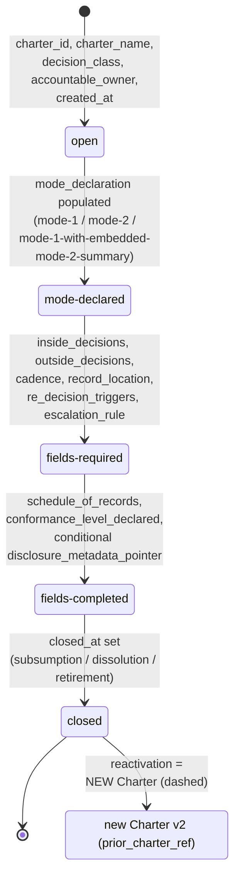


**Figure 3-1 — Charter Lifecycle State Machine.** A forward-only state machine in which each transition is gated by a named set of Charter fields; `closed` is terminal and reactivation creates a new Charter.

**Full description.** The Charter lifecycle is a forward-only state machine with five states: `open`, `mode-declared`, `fields-required`, `fields-completed`, and `closed`. Each transition requires a named set of Charter fields to be populated before it can be crossed: creation into `open` requires `charter_id`, `charter_name`, `decision_class`, `accountable_owner`, and `created_at`; `open` to `mode-declared` requires `mode_declaration` populated with one of `mode-1`, `mode-2`, or `mode-1-with-embedded-mode-2-summary`; `mode-declared` to `fields-required` requires `inside_decisions`, `outside_decisions`, `cadence`, `record_location`, `re_decision_triggers` (at least one outcome and one market trigger), and `escalation_rule`; `fields-required` to `fields-completed` requires `schedule_of_records`, `conformance_level_declared`, and a conditional `disclosure_metadata_pointer` when the mode is `mode-2` or `mode-1-with-embedded-mode-2-summary`; `fields-completed` to `closed` requires `closed_at` to be set on subsumption, dissolution, or explicit retirement. The `closed` state is terminal; a closed Charter cannot return to a prior state. Reactivation creates a new Charter carrying a `prior_charter_ref` back-pointer, shown as a dashed off-ramp from `closed` to a separate "new Charter v2" node, not a back-edge into any prior state. The `review-required` interrupt is deliberately absent here: it is a record-level state, not a Charter-level state (see Figure 5-1).

*Illustrates §3.3.*

---

### Figure 3-2 — Mode Dispatch Grammar and the Embedded-Mode-2 Edge Case

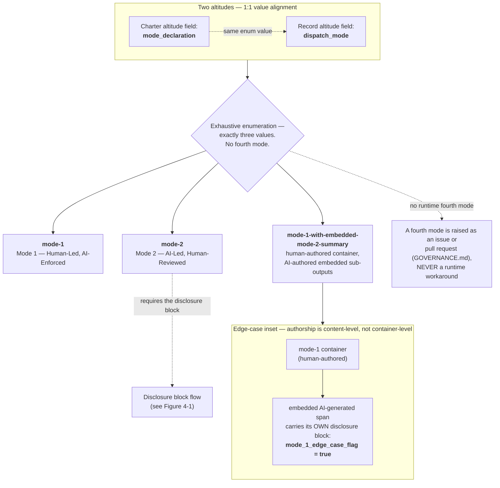


**Figure 3-2 — Mode Dispatch Grammar and the Embedded-Mode-2 Edge Case.** Mode is declared at two altitudes that align one-to-one, drawn from an exhaustive three-value enumeration; the third value handles content-level embedded authorship.

**Full description.** Mode is declared at two altitudes that align one-to-one: the Charter field `mode_declaration` and the decision-record field `dispatch_mode`. The enumeration is exhaustive with exactly three values: `mode-1` (Mode 1 — Human-Led, AI-Enforced), `mode-2` (Mode 2 — AI-Led, Human-Reviewed), and `mode-1-with-embedded-mode-2-summary` (Mode 1 with the embedded-Mode-2-summary edge case). A `mode-2` record requires the disclosure block (see Figure 4-1). The third value handles the edge case where a human-authored `mode-1` container holds an AI-authored embedded span; authorship is judged at the content level, not the container level, so that embedded span carries its own disclosure block at the embed point with `mode_1_edge_case_flag` set to `true`. No fourth mode exists; a fourth mode is raised as an issue or pull request under GOVERNANCE.md, never through a runtime workaround. The three token families are distinct and rendered verbatim: `mode-declared` is a Charter state, `mode_declaration` and `dispatch_mode` are fields, and `mode-1` / `mode-2` / `mode-1-with-embedded-mode-2-summary` are enum values.

*Illustrates §3.4, §4.4, §4.7.*

---

### Figure 4-1 — Disclosure Block Flow

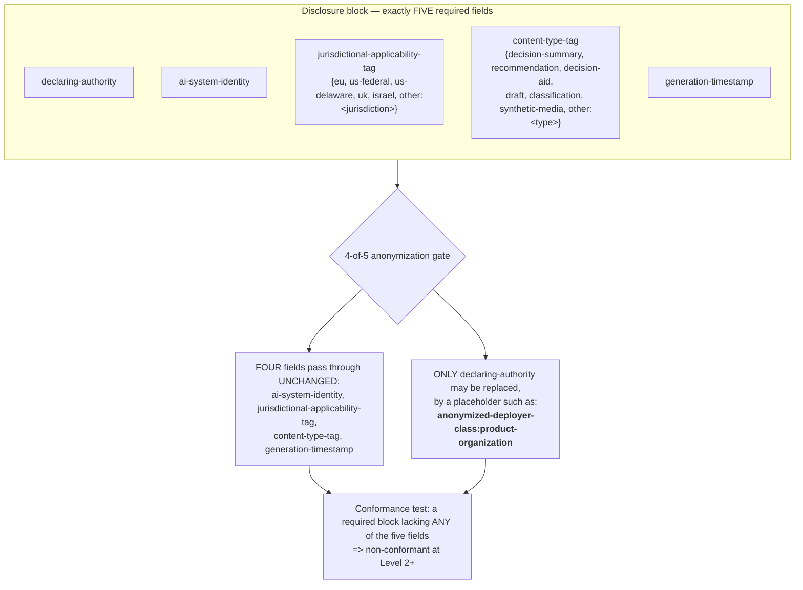


**Figure 4-1 — Disclosure Block Flow.** The disclosure block has exactly five required fields; under the 4-of-5 anonymization rule, four survive unchanged and only `declaring-authority` may be replaced by a placeholder.

**Full description.** The disclosure block has exactly five required fields: `declaring-authority`, `ai-system-identity`, `jurisdictional-applicability-tag`, `content-type-tag`, and `generation-timestamp`. Two fields carry controlled vocabularies: `jurisdictional-applicability-tag` takes a value from `{eu, us-federal, us-delaware, uk, israel, other:<jurisdiction>}`, recording where the artifact circulates; `content-type-tag` takes a value from `{decision-summary, recommendation, decision-aid, draft, classification, synthetic-media, other:<type>}`. Under the four-of-five anonymization rule, four fields survive anonymization unchanged and only `declaring-authority` may be replaced by a placeholder such as `anonymized-deployer-class:product-organization`. That placeholder contains the substring "product-organization" but is not framing text. A required block lacking any of the five fields makes the record non-conformant at Level 2 or above. A note states that the block is required for Mode 2 content and for AI-drafted content embedded in Mode 1, unless the Charter declares the exclusion (or was written before v1.1 and its outputs meet the test), and that whether Article 50 applies is for the deployer to determine.

*Illustrates §4.6.2, §4.6.3.*

---

### Figure 4-2 — Mode-Drift Four-Layer Composed Mitigation

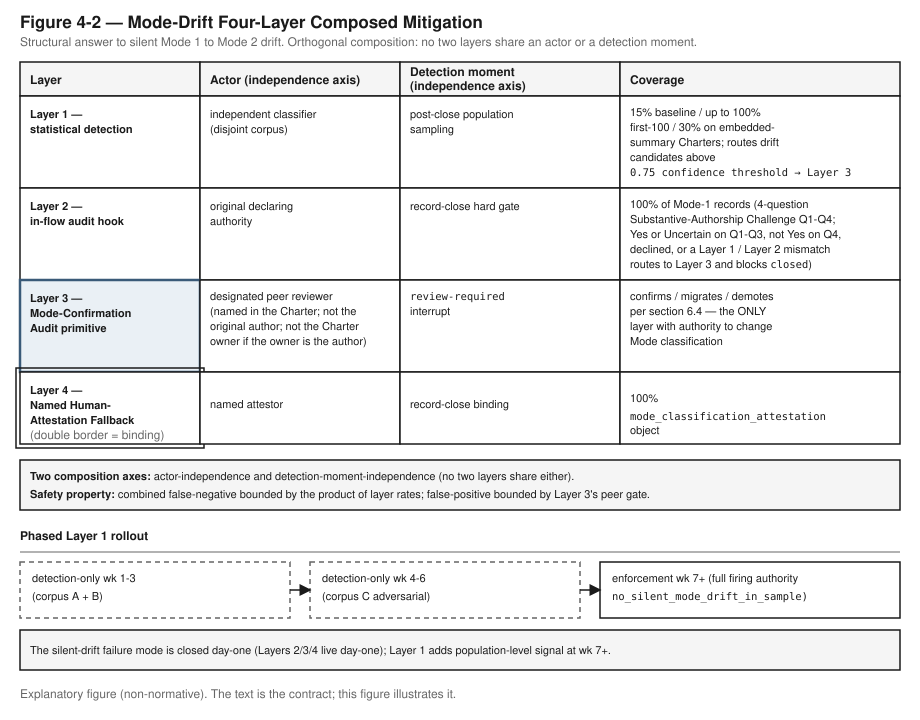

**Figure 4-2 — Mode-Drift Four-Layer Composed Mitigation.** Four orthogonal mitigation layers — no two sharing an actor or a detection moment — plus a phased Layer 1 rollout, structurally closing the silent-drift failure mode.

**Full description.** The Mode-Drift mitigation composes four orthogonal layers, no two sharing an actor or a detection moment. Layer 1, statistical detection, is run by an independent classifier on a disjoint corpus at a post-close population-sampling moment; its coverage is a 15% baseline, up to 100% on the first hundred records, and 30% on embedded-summary Charters, and it routes drift candidates above the `0.75 confidence threshold` to Layer 3. Layer 2, the in-flow audit hook, is run by the original declaring authority as a record-close hard gate, covering 100 percent of Mode-1 records through a four-question Substantive-Authorship Challenge (Q1–Q4); Yes or Uncertain on Q1–Q3, or not Yes on Q4, or a declined answer, or a Layer 1 / Layer 2 mismatch, routes to Layer 3 and blocks `closed`. Layer 3, the Mode-Confirmation Audit primitive, is run by a designated peer reviewer (named in the Charter; not the original author; not the Charter owner if the owner is the author) at the `review-required` interrupt; it confirms, migrates, or demotes per §6.4 and is the only layer with authority to change Mode classification. Layer 4, the Named Human-Attestation Fallback, is bound at record close by a named attestor at 100 percent coverage through the `mode_classification_attestation` object. The two composition axes are actor-independence and detection-moment-independence; the combined false-negative is bounded by the product of layer rates and the false-positive is bounded by Layer 3's peer gate. Layer 1 rolls out in phases: detection-only in weeks 1–3 (corpus A + B), detection-only in weeks 4–6 (corpus C adversarial), and enforcement from week 7 onward with full firing authority for `no_silent_mode_drift_in_sample`. The silent-drift failure mode is closed on day one because Layers 2, 3, and 4 are live on day one; Layer 1 adds population-level signal from week 7.

*Illustrates §4.8.1.*

---

### Figure 4-3 — Emission-Cadence by Semantic Class

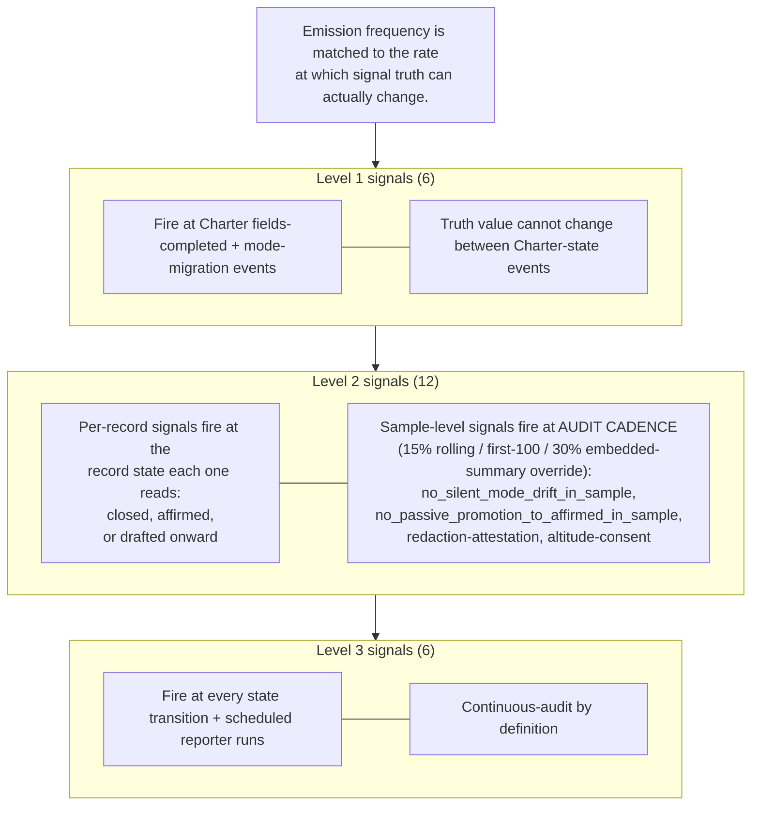


**Figure 4-3 — Emission-Cadence by Semantic Class.** Signal emission frequency is matched to the rate at which each signal's truth can actually change.

**Full description.** Conformance signals fire on a cadence matched to how fast their truth can change. The six Level 1 signals fire at Charter `fields-completed` and mode-migration events, because their truth value cannot change between Charter-state events. The twelve Level 2 signals split into per-record signals that fire at the record state each one reads (record `closed`, `affirmed`, or from `drafted` onward) and sample-level signals — `no_silent_mode_drift_in_sample`, `no_passive_promotion_to_affirmed_in_sample`, redaction-attestation, and altitude-consent — that fire on an audit cadence of 15% rolling with first-100 and 30%-embedded-summary overrides. The six Level 3 signals fire at every state transition and on scheduled reporter runs, being continuously auditable by definition. There are 24 signals in total: 6 Level 1, 12 Level 2, 6 Level 3.

*Illustrates §4.8.2.*

---

### Figure 5-1 — Decision-Record State Machine: Two Distinct State Families

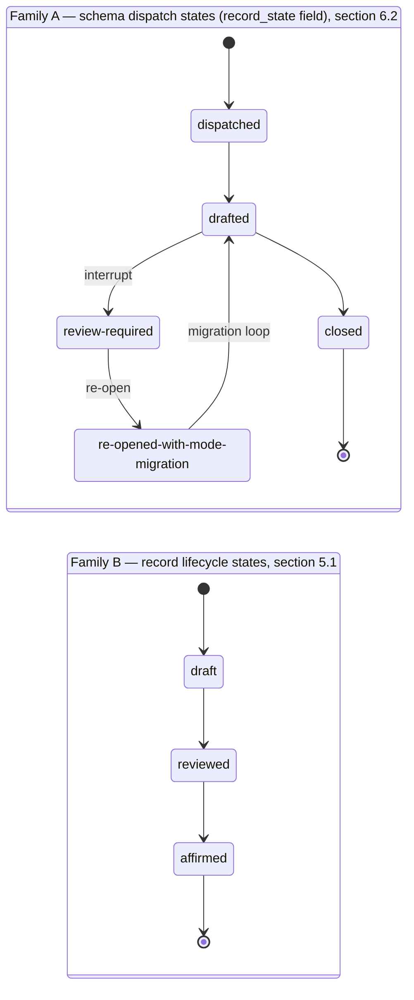


**Figure 5-1 — Decision-Record State Machine: Two Distinct State Families.** A decision record carries two deliberately distinct state families — schema dispatch and record lifecycle — that must not be conflated.

**Full description.** A decision record carries two deliberately distinct state families that must not be conflated, drawn as two separate lanes. Family A is the schema dispatch workflow carried on the `record_state` field: `dispatched`, then `drafted`, then `closed`, with a `review-required` interrupt branching off `drafted` and a `re-opened-with-mode-migration` path that loops from `review-required` back to `drafted`. This is the only place `review-required` legitimately appears; it is not a Charter state (contrast Figure 3-1). Family B is the record lifecycle, rendered as a separate track: `draft`, then `reviewed`, then `affirmed`. Family B is not a separate enum field — `affirmed` is reached when `affirmation_record` and `seal_hash` are populated per §5.1(3), and the record is sealed simultaneously. The past-tense schema state `drafted` (Family A) is distinct from the lifecycle state `draft` (Family B); conflating them is a conformance defect. Supersession is via `supersedes`, with the original retained in full; sealing is via `seal_hash`.

*Illustrates §5.1, §6.2.*

---

### Figure 6-1 — Artifact-Set Relationship Map

**Figure 6-1 — Artifact-Set Relationship Map.** A one-picture orientation showing how the standard's artifacts compose before the reader reaches the normative prose.

**Full description.** This orientation map shows how the standard's artifacts compose. A Charter governs a decision class, declares a Mode (Figure 3-2), commits a Schedule of Records, names an `accountable_owner`, and declares a `conformance_level_declared`. The Schedule of Records enumerates five required record types: Decision record, Re-decision record, Escalation record, Charter-amendment record, and Disclosure-review record (§6.3.1). A Decision Record is dispatched under a Charter, carries a `dispatch_mode`, transits the record lifecycle (Figure 5-1), and conditionally attaches a Disclosure Block (Figure 4-1) on Mode 2 and Mode-1 edge-case records. Conformance Signals are read off the Charter, record, lifecycle, and schedule (Figure 4-3) and grade the Conformance Levels (Figure 7-1). The standard points one-way, via a dashed neutral pointer, to the deploying organization's methodology; it does not depend on any named methodology and carries no branded node.

*Illustrates §3, §5, §6, §7 (orientation).*

---

### Figure 7-1 — The Three Conformance Levels: Cumulative Criteria

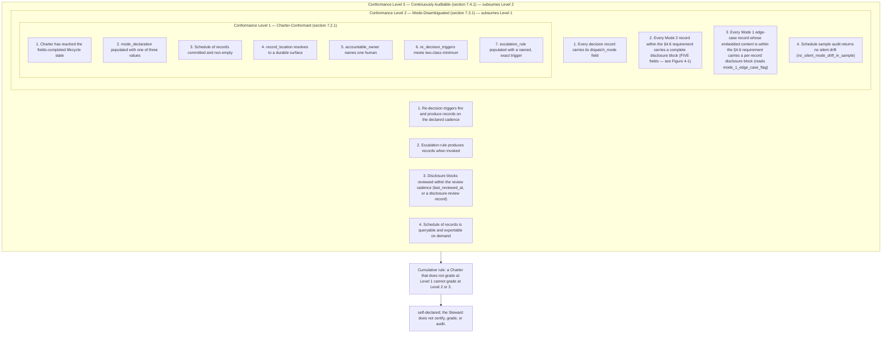


**Figure 7-1 — The Three Conformance Levels: Cumulative Criteria.** Three cumulative conformance levels drawn as nested bands; all are self-declared and the Steward does not certify, grade, or audit.

**Full description.** The three conformance levels are cumulative, drawn as nested bands with Level 1 innermost. Level 1, Charter-Conformant (§7.2.1), has seven structural criteria: the Charter has reached the `fields-completed` lifecycle state; `mode_declaration` is populated with one of the three enumerated values (`mode-1`, `mode-2`, `mode-1-with-embedded-mode-2-summary`); the schedule of records is committed and non-empty; `record_location` resolves to a durable surface; `accountable_owner` names one human; `re_decision_triggers` meets the two-class minimum; and `escalation_rule` is populated with a named, exact trigger. Level 2, Mode-Disambiguated (§7.3.1), subsumes Level 1 and adds four record-discipline criteria: every decision record carries its `dispatch_mode` field; every Mode 2 record within the §4.6 requirement carries a complete disclosure block of five fields (Figure 4-1); every Mode 1 edge-case record whose embedded content is within the §4.6 requirement carries a per-record disclosure block at the embed point reading `mode_1_edge_case_flag`; and the schedule-of-records sample audit returns no silent drift findings (`no_silent_mode_drift_in_sample`). Level 3, Continuously Auditable (§7.4.1), subsumes Level 2 and adds four criteria: re-decision triggers fire and produce records on the declared cadence; the escalation rule produces records when invoked; disclosure blocks are reviewed within the review cadence (`last_reviewed_at`, or a disclosure-review record); and the schedule of records is queryable and exportable for counsel and auditor review on demand. A Charter that does not grade at Level 1 cannot grade at Level 2 or 3. All levels are self-declared; the Steward does not certify, grade, or audit.

*Illustrates §7.2, §7.3, §7.4.*

---

*End of Companion D.*
